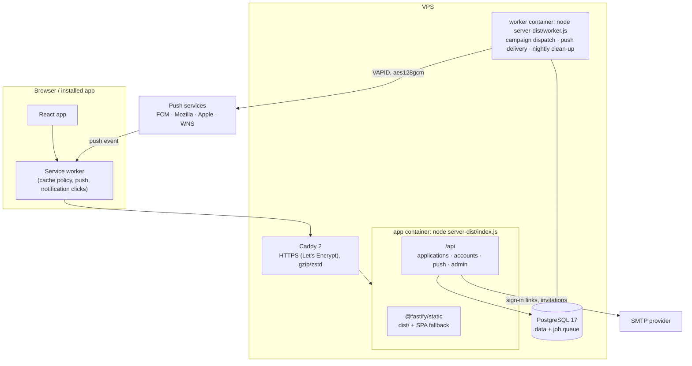

# 02 — Technical Requirements Document (TRD)

**Last updated:** 2026-09-29
**Architecture:** React single-page app (installable PWA with a service worker) + Fastify API, backed by **PostgreSQL**, with a **background worker** for notifications and clean-up, deployed on a **single VPS** behind Caddy (HTTPS).
**Origin:** Figma Make export (2026-09-25), rebuilt as a standalone project on 2026-09-26. The Figma Make tooling has been removed.

Related: [01-PRD](01-PRD.md) · [03-App-Flow](03-App-Flow.md) · [05-Backend-Schema](05-Backend-Schema.md) · [06-Implementation-Plan](06-Implementation-Plan.md) · [DEPLOYMENT](DEPLOYMENT.md) · [README](../README.md)

---

## 1. Tech stack

| Layer | Technology | Version | Notes |
|---|---|---|---|
| Runtime | Node.js | ≥ 22.22 | Pinned in `package.json` `engines` and `.mise.toml` |
| Package manager | pnpm | 11.4.0 | Pinned by `packageManager`; `pnpm-workspace.yaml` approves esbuild's install script |
| UI | React + React DOM | 19.3 | `<StrictMode>`. The account (`/account/*`) and admin (`/admin/*`) areas are lazy-loaded chunks |
| Routing | React Router | 8.4 (declarative mode) | Real URLs per screen ([03](03-App-Flow.md)) |
| Styling | Tailwind CSS v4 (`@tailwindcss/vite`) | 4.2 | Design tokens in `src/index.css` `@theme` ([04](04-UI-UX-Design-Brief.md)) |
| Fonts | `@fontsource/anton`, `@fontsource-variable/inter`, `@fontsource-variable/cormorant-garamond` | 5.3 | Self-hosted, bundled by Vite |
| Animation | `gsap` (core only) | 3.15 | The homepage hero's entrance timeline (`src/lib/heroMotion.ts`), in the first-load bundle so nothing waits on the network (+28.8 KB gzipped). Everything else animates with CSS ([04 §6](04-UI-UX-Design-Brief.md#6-motion)) |
| Web build | Vite | 8.0 | Output `dist/` with content-hashed assets. `scripts/vite-pwa.ts` builds the service worker after the site |
| Service worker | Hand-written (`src/sw/sw.ts`), bundled with esbuild | — | Caching policy in `src/sw/routing.ts` (pure, unit-tested). No Workbox |
| API server | Fastify | 5.12 | `@fastify/static`, `@fastify/helmet` (headers/CSP), `@fastify/rate-limit`, `@fastify/cookie` |
| Database driver | node-postgres (`pg`) | 8.23 | Pool, 15 s statement timeout |
| Database | PostgreSQL | 17 | Production. Migrations in `server/migrations/*.sql` (0001–0005) |
| Dev/test database | PGlite | 0.5 | PostgreSQL compiled to WASM, in-process: no install needed. **Single process only** (see §10) |
| Web Push | `web-push` | 3.6 | Only for VAPID signing and aes128gcm encryption; requests go through our own SSRF-safe transport |
| Email | `nodemailer` | 10.0 | SMTP; plus an in-memory test outbox for development and tests |
| Two-step verification | `otpauth` (TOTP), `qrcode` | 9.5, 1.5 | RFC 6238 codes; QR code for enrolment rendered on the server as a data URL |
| Password hashing | Node `crypto.scrypt` | built in | N = 2¹⁵, r = 8, p = 3; format `scrypt$15$8$3$salt$key` |
| Server build | esbuild | 0.28 | `scripts/build-server.mjs` → `server-dist/` (index, migrate, worker, admin, push-keys entry points) |
| Tests | Vitest | 5.0 | See §9 |
| Language | TypeScript | 5.9 | `strict`, `noUnused*`, `verbatimModuleSyntax`. `tsconfig.json` (app + server) and `tsconfig.sw.json` (service worker, WebWorker types) |
| Formatter | oxfmt | 0.2 | `pnpm format` |

**Dependency policy:** `dependencies` holds only what the **server needs at runtime** (Fastify and plugins, `pg`, `web-push`, `nodemailer`, `otpauth`, `qrcode`). Everything bundled into the browser and all build tooling is in `devDependencies`, so the production image installs only the server's packages.

**Authentication: why not an auth framework.** The brief asked for a maintained auth library or identity integration. Staff and applicant authentication are built on maintained primitives instead: Node's scrypt, `otpauth`, `@fastify/cookie`, Postgres-stored sessions. The reasons: two separate populations (staff with password + TOTP and roles; applicants with email links only); the embedded PGlite database used for development and tests; and keeping every table in our own SQL migrations. The pieces a framework would provide are implemented and tested explicitly (§5, [05 §6](05-Backend-Schema.md#6-security-and-privacy)). An identity provider (e.g. Google Workspace SSO for staff) can be added later without changing the role model.

## 2. Architecture



- **One origin:** the site, the API and the service worker share a domain. No CORS; `connect-src 'self'`; the service worker's scope is `/`.
- **Shared domain code:** [`src/shared/`](../src/shared/) holds option lists, validation, permissions, notification topics, the link allowlist and time-zone maths. The browser, the service worker and the server all import it.
- **Background work** runs from a PostgreSQL job queue ([05 §4](05-Backend-Schema.md)), inside the web process (`WORKER_MODE=inline`, the default) or as a separate process (`WORKER_MODE=off` on the web server + `node server-dist/worker.js`; Docker Compose does this).
- **SPA fallback:** extension-less `GET` paths outside `/api` get `index.html` (with `X-Robots-Tag: noindex` under `/admin` and `/account`); missing asset files get a real 404.

## 3. Progressive Web App

| Piece | Implementation |
|---|---|
| Manifest | `public/manifest.webmanifest`: `id` and `start_url` `/`, `scope` `/`, `display: standalone`, `theme_color #841d26` (brand burgundy), `background_color #f3f0e6` (brand cream), 192/512 icons in `any` and `maskable` versions, shortcuts (Apply, My application) |
| Icons | Resized from the brand mark in `design/brand/` by `scripts/brand-assets.py` (Python 3 + Pillow; outputs committed): `public/icons/*` (192/512 `any` and `maskable`, `badge-96.png` for Android's status bar), `favicon.ico` (16/32/48), `favicon-32.png`, `apple-touch-icon.png` (180 px, opaque). The header and footer logo lockups are two WebP files in `src/assets/brand/` ([04 §2](04-UI-UX-Design-Brief.md#brand-identity)) |
| HTML | `<link rel="manifest">`, `theme-color`, `apple-mobile-web-app-*` and `mobile-web-app-capable` metadata. The default `viewport-fit` keeps all content inside the safe areas (notch, home indicator) in portrait and landscape; fixed UI (the update prompt) also pads with `env(safe-area-inset-bottom)` |
| Service worker | `dist/sw.js`, built from `src/sw/sw.ts` by `scripts/vite-pwa.ts` with the precache list (app shell, offline page, manifest, icons, the two logo lockups, the first page load's JS and CSS) and the release id injected |
| Caching policy | `src/sw/routing.ts` ([03 §6](03-App-Flow.md#6-offline-and-updates)): **never** `/api/*`, non-GET requests, other origins, or anything under `/admin` or `/account`; public pages network-first with the cached shell offline; hashed assets cache-first; other static files network-first |
| Updates | A new version waits; the page offers **Update now** and reloads only when the person chooses. Other open tabs then say a newer version is available (**Reload**). The very first install takes control of the page silently: it is not an update, so nothing is offered. Old precaches are deleted on activation (their `/assets` files move to a small runtime cache for tabs still on the old version) |
| Release id | `BUILD_ID` (or a timestamp) is written to `dist/build-id.txt`; the server sends it as `X-App-Build` on API responses so an open page notices a new release |
| Rollback | A build with `SW_KILL_SWITCH=1` produces a worker that deletes every cache and unregisters itself, and a page that removes any registration ([DEPLOYMENT](DEPLOYMENT.md#service-worker-rollback)) |
| Registration | Production builds on secure origins only (`https`, or `localhost`) |
| Headers | `sw.js`, `manifest.webmanifest`, `offline.html`, `index.html`, `build-id.txt`: `Cache-Control: no-cache`; `sw.js` also `Service-Worker-Allowed: /`; icons 7 days; hashed assets 1 year immutable. CSP includes `worker-src 'self'` and `manifest-src 'self'` |

**Browser facts the design relies on** (checked September 2026 against Apple Support, Google Chrome Help, Microsoft Learn, MDN and the WebKit/Chromium documentation):

- Chromium installs a site with a manifest that has a name, 192 px and 512 px icons, a `start_url` and a standalone-type `display`, over HTTPS. `beforeinstallprompt` exists only in Chromium browsers and is non-standard.
- Safari has no install prompt API. iPhone/iPad: Share (in iOS 26: **•••** → Share) → **Add to Home Screen**, with **Open as Web App** on. Mac (macOS 14+): **File → Add to Dock**. Since iOS/iPadOS 16.4, Chrome, Edge and Firefox on iPhone can also add to the Home Screen.
- Firefox on computers doesn't install web apps without an add-on.
- **Web Push on iPhone/iPad needs iOS/iPadOS 16.4 or later and works only in the Home Screen web app**, after a permission request made from a user gesture. Safari requires every push to show a notification (no silent pushes) and may revoke permission otherwise. VAPID tokens for Apple: `sub` must be `mailto:` or `https:`, expiry at most 24 h, not refreshed more often than hourly.
- Safari on macOS supports Web Push from Safari 16 on macOS 13.

## 4. Source layout

```
src/            React app
  pages/        public pages, the form, Install, Notifications, Updates
  account/      applicant account area (lazy chunk)
  admin/        admin platform (lazy chunk): AdminApp, AuthPages, pages/*
  components/   layout, fields, ui.tsx kit, BrandLockup, InstallGuide, notifications/*, AppStatus (offline notice, update prompt)
  assets/       landing and success artwork, brand/ (logo lockups built by scripts/brand-assets.py)
  lib/          api (CSRF-aware client), pwa (registration/updates), install, push, account, config, events
  sw/           sw.ts (service worker), routing.ts (+ tests)
  shared/       application, validation, permissions, platform (topics, statuses, link allowlist), time
server/         app.ts, config.ts, crypto.ts, db.ts, http.ts, audit.ts, email.ts, settings.ts, analytics.ts, public.ts, index.ts, worker-cli.ts, admin-cli.ts, vapid-cli.ts
  auth/         sessions, guards (session → CSRF/origin → MFA → permission), tokens, staff-routes
  account/      applicant routes, account deletion
  admin/        applicants, accounts + cohorts, communications (campaigns, announcements, test devices), platform (staff, settings, audit, dashboard)
  push/         endpoint allowlist + public-address check, transport, VAPID service, subscriptions, routes
  jobs/         queue, worker
  notifications/  audience, dispatch
  migrations/   0001_init … 0005_notifications_jobs
scripts/        build-server.mjs, vite-pwa.ts, brand-assets.py
deploy/         install.sh (one-command VPS install), Caddyfile, backup.sh, school-of-purpose.service (systemd), nginx.conf.example
design/         brand/ (logo masters, palette, usage rules), landing-reference.webp
public/         manifest.webmanifest, icons/, offline.html, favicons, og-image.jpg, robots.txt
```

## 5. Security model (summary; details in [05 §6](05-Backend-Schema.md#6-security-and-privacy))

| Area | Implementation |
|---|---|
| Staff sign-in | Individual accounts; scrypt passwords (12–128 characters); TOTP second factor required in production (`STAFF_MFA_REQUIRED`), with 10 single-use recovery codes stored as SHA-256 hashes; TOTP replay protection (last used time step); lockout after 5 failures (15 min, doubling, max 24 h), wrong codes count too; generic error messages; per-IP rate limits |
| Staff roles | Owner, Programme admin, Reviewer, Communications, Read-only ([05 §6](05-Backend-Schema.md#roles-and-permissions)). Checked on **every** admin route; nobody can change their own role; the last owner can't be demoted or suspended; role changes sign the person out |
| Applicant sign-in | Passwordless: single-use links valid 15 minutes, stored hashed, generic responses, per-IP and per-email throttles, and a button press on the landing page so email scanners can't use the link. Linking an application needs the verified email to match and an explicit confirmation |
| Sessions | 256-bit random tokens in `HttpOnly`, `SameSite=Strict` cookies (`__Host-` prefix and `Secure` on HTTPS); only a SHA-256 hash is stored; absolute expiry and idle timeout; revocable per session and "everywhere" |
| CSRF | Every state-changing request needs the `X-CSRF-Token` header (HMAC of the session id) **and** an allowed `Origin` (the site's `SITE_URL` in production), plus `Sec-Fetch-Site` checks |
| Secrets | `APP_SECRET` (HKDF → separate HMAC and AES-256-GCM keys) encrypts TOTP secrets and push subscription endpoints/keys at rest. The VAPID private key stays in the server environment |
| Push SSRF | Endpoints must be `https` on port 443, no credentials, no IP literals, on the allowlisted push services; at connection time every resolved address must be public (private, loopback, link-local, CGNAT, NAT64/6to4/IPv4-mapped embeddings rejected); the socket connects to the checked address; no redirects; timeouts |
| Audit | Exports, decisions, publications, corrections, deletions, account changes, sends, staff and settings changes, and record views are logged with the actor (identifiers and field names only) |
| Logging | Request bodies are never logged; cookies, CSRF and authorisation headers are redacted; subscriptions and notification content are never logged (asserted in tests) |

## 6. Scripts

| Command | What it does |
|---|---|
| `pnpm dev` | Vite (:5173, HMR) + API via `tsx watch server/dev.ts` (:3000, `API_PORT`). Vite proxies `/api`. Uses PGlite unless `DATABASE_URL` is set. No service worker in development |
| `pnpm build` | `vite build` → `dist/` (+ `sw.js`, `build-id.txt`); esbuild → `server-dist/` (+ migrations copied) |
| `pnpm start` | `node server-dist/index.js`: production server |
| `pnpm worker` | `node server-dist/worker.js`: background jobs as a separate process |
| `pnpm admin …` | Staff bootstrap: `create-owner --email … --name …`, `reset-mfa --email …`, `list` (production: `node server-dist/admin.js …`) |
| `pnpm push:keys` | Prints a new VAPID key pair (production: `node server-dist/push-keys.js`) |
| `pnpm test` / `pnpm typecheck` / `pnpm check` | Tests / types (app + server, then service worker) / everything CI runs |
| `pnpm db:migrate` | Apply migrations without starting the server |

## 7. Configuration

Every variable is documented in [`.env.example`](../.env.example). The server loads `.env` itself (`process.loadEnvFile`); variables already set in the environment take precedence; invalid values stop startup with a clear message.

| Variable | Default | Purpose |
|---|---|---|
| `NODE_ENV` | development | `production` requires a real database, `SITE_URL` and `APP_SECRET`, and forbids the test email outbox |
| `SITE_URL` | — (required in production) | The public origin (`https://…`; `http://localhost` allowed in development). Used for email links, Origin checks and secure cookies; at build time also for absolute social-card URLs |
| `APP_SECRET` | dev placeholder (required in production, ≥ 32 characters) | CSRF signing and encryption at rest |
| `COOKIE_SECURE` | on for an https `SITE_URL` | Adds `Secure` and the `__Host-` cookie prefix |
| `PORT` / `HOST` | 3000 / 127.0.0.1 | Listen address (Docker sets `HOST=0.0.0.0`) |
| `DATABASE_URL` or `PG*` | — (dev: PGlite) | PostgreSQL connection |
| `DATABASE_SSL`, `DB_POOL_MAX` | false, 10 | Managed-DB TLS; pool size |
| `TRUST_PROXY` | false | Proxy addresses allowed to set `X-Forwarded-For` (`loopback`, `loopback,uniquelocal`). Hop counts are rejected |
| `SMTP_URL`, `EMAIL_FROM` | — | Email. Without them, production email is **off** (sign-in by email disabled, never faked) |
| `EMAIL_TRANSPORT` | smtp if `SMTP_URL`, else none (production) / outbox (development) | `outbox` is a local test adapter, refused in production |
| `VAPID_PUBLIC_KEY`, `VAPID_PRIVATE_KEY`, `VAPID_SUBJECT` | — | Web Push. Both keys or neither; subject `mailto:` or `https:`. Without keys, push is off |
| `PUSH_ENDPOINT_HOSTS` | — | Extra push-service hosts to allow |
| `WORKER_MODE`, `WORKER_POLL_MS` | inline, 2000 | Background jobs in-process, or `off` (separate worker) |
| `STAFF_MFA_REQUIRED` | true in production | Two-step verification for staff |
| `STAFF_SESSION_HOURS`, `STAFF_IDLE_MINUTES` | 12, 120 | Staff session lifetime and idle timeout |
| `APPLICANT_SESSION_DAYS`, `APPLICANT_IDLE_DAYS` | 30, 14 | Applicant session lifetime and idle timeout |
| `RATE_LIMIT_SUBMIT_MAX` / `…_WINDOW_MINUTES` | 20 / 10 | Submissions per visitor address |
| `RUN_MIGRATIONS`, `LOG_LEVEL` | true, info | |
| `VITE_CONTACT_EMAIL` *(build)* | — | Shows "Contact" links and the contact line |
| `BUILD_ID`, `SW_KILL_SWITCH` *(build)* | timestamp, off | Release id; emergency service-worker rollback |
| `API_PORT`, `PGLITE_DATA_DIR` *(dev)* | 3000, `.data/pglite` | |

`ADMIN_USERNAME`/`ADMIN_PASSWORD` (the old Basic-auth CSV export) are no longer used; if set, the server logs a warning. The old CSV address now redirects signed-in staff with export permission to the audited export.

## 8. Hosting & deployment

| Aspect | Decision |
|---|---|
| Host | **Single VPS** (Linode or similar), Ubuntu 24.04 |
| Recommended | **Docker Compose** ([`docker-compose.yml`](../docker-compose.yml)): `caddy:2-alpine` → app → `postgres:17-alpine` (volume), plus a **worker** container from the same image. App and worker containers are read-only, non-root, `no-new-privileges`; the app is health-checked and the worker waits for it (migrations) |
| Alternative | Bare metal: Node 22 + apt Postgres 17 + Nginx + certbot + systemd, with the worker inline ([`deploy/`](../deploy/)) |
| HTTPS | Required for the service worker, push, secure cookies and install prompts. Caddy automatic certificates (or certbot); HTTP → HTTPS redirect |
| Backups | [`deploy/backup.sh`](../deploy/backup.sh) nightly `pg_dump` + off-site copies. Back up `.env` separately (it holds `APP_SECRET` and the VAPID private key) |
| CI | GitHub Actions: typecheck, tests, build, Docker image build |
| Runbook | [DEPLOYMENT.md](DEPLOYMENT.md) |

## 9. Testing

| Level | What | How |
|---|---|---|
| Unit | Validation, config, CSV escaping, time zones (DST gaps and overlaps), service-worker routing and push-payload validation, install/platform detection | Vitest (`src/**/*.test.ts`, `server/config.test.ts`) |
| API / integration | Every endpoint and error path, migrations, rate limiting, static serving and headers | Vitest + Fastify `inject()` against in-memory PGlite (`server/app.test.ts`) |
| Auth | Generic errors, lockout (including wrong codes), MFA gate and replay, enrolment and recovery codes, IP rate limits, CSRF and Origin, suspended staff, single-use invitations, password reset needing TOTP, applicant links (generic, single-use, expiry, disabled without email), claim isolation, notes never exposed, account suspension and deletion | `server/auth.test.ts` |
| Admin | Permission matrix for all five roles on every area, reviewer isolation, allowed transitions and 409 on stale publication, publication → inbox + neutral push, CSV permission, formula escaping and audit, legacy CSV URL, staff safeguards, corrections, deletions, account deletion with application-topic devices | `server/admin.test.ts` |
| Push | Endpoint allowlist and public-address rules (IPv4/IPv6 and embedded forms), a real connection refused for a host resolving to loopback, encryption checked by decrypting with an independent RFC 8291 implementation, VAPID token reuse and claims, TTL/Urgency/Topic, outcome mapping (201/404/410/429/5xx/413/403/redirect/network), subscribe/status/topics/unsubscribe/rotate ownership, hijack refusal, pausing public sign-ups, encryption at rest, no endpoints or keys in logs | `server/push.test.ts` (fake push transport: no test contacts a real push service) |
| Jobs & campaigns | Idempotent enqueue, atomic claims, lease recovery and stale workers, retries with backoff and Retry-After, permanent failures, clean-up, shutdown hand-back, audience counts, idempotent creation, frozen content, audience-changed refusal, exactly-one delivery per device across repeated dispatch, consent and account re-checks before sending, 410 deactivation, rate-limit retry, retry exhaustion, expiry, cancellation (before and during sending, and a batch claimed before a cancel), time-zone scheduling, test sends only to staff devices, neutral urgent application updates | `server/jobs.test.ts` |
| Browser (automated) | Service worker registration and control, precache contents, Chrome's installability report, offline public pages from the cached shell, offline page for `/admin` and `/account`, API never answered from cache, no private data in caches, update prompt without forced reload, stale chunks served to an old tab after a deploy, cache clean-up after update, **a real push through Firebase Cloud Messaging** received, decrypted and shown by the service worker | Headless Google Chrome over the DevTools protocol against the built server (2026-09-26; scripts kept out of the repo). This is **desktop Chromium only**: not a phone |
| Browser (manual) | Install page, admin onboarding (invitation, password, TOTP enrolment, recovery codes), applicant sign-in by link, claiming, publication round trip, inbox, campaign editor, time-zone display, test-send guard | In-app browser against the built server (2026-09-26) |
| Deployment | Docker image + full Compose stack with the worker service | **Verified 2026-09-26** on real PostgreSQL 17 through Caddy HTTPS: migrations 0003–0005 applied over existing data, owner bootstrap from inside the container, invitation → password → TOTP → sign-in, `__Host-` secure cookies, MFA gate, existing applications listed, worker heartbeat from the separate container, CSV export, old CSV address closed |

**Not verified yet (needs real devices and a public HTTPS staging origin, see [DEPLOYMENT](DEPLOYMENT.md#staging-and-device-testing)):** installing and push on a physical iPhone/iPad (iOS 16.4+), Android phone (Chrome, Samsung Internet), Safari on macOS, Firefox, and Edge on Windows. The in-app browser used for manual checks blocks service workers and notifications, and desktop emulation says nothing about iOS.

## 10. Known constraints & gotchas

1. **Fastify 5 ignores numeric `trustProxy`** (hop counts are "fail closed"), so config rejects them. Use proxy addresses.
2. **`PORT` in development:** some launchers set `PORT` for the web dev server. `server/dev.ts` pins the API to `API_PORT` (default 3000).
3. **PGlite is single-process:** don't run `pnpm admin …` while `pnpm dev` holds the same `.data/pglite` directory. Stop the dev server first (or use Postgres).
4. **SQL parameters used twice need explicit casts** (`$2::delivery_status` in both places): Postgres must deduce one type per parameter. Tests catch this for every query they run.
5. **`ON DELETE SET NULL` runs table checks on the child row:** account deletion first drops application/training topics from the account's devices (`server/account/delete.ts`).
6. **Service worker changes** take effect after the person chooses "Update now" (or all tabs close). Never make `sw.js` cacheable. Emergency: the kill-switch build.
7. **Marketing pages:** the homepage hero and several editorial sections are still largely Figma output with separate mobile and desktop DOM trees ([04](04-UI-UX-Design-Brief.md)); most facts come from `src/config/programme.ts`.
8. **Consent wording:** `CONSENT_STATEMENT`/`CONSENT_VERSION` must match a row in `consent_versions` (new migration). Notification consent is separate: `NOTIFICATION_CONSENT_VERSION` in `src/shared/platform.ts`.
9. **Enum changes** need a new migration plus the matching change in `src/shared/`.
