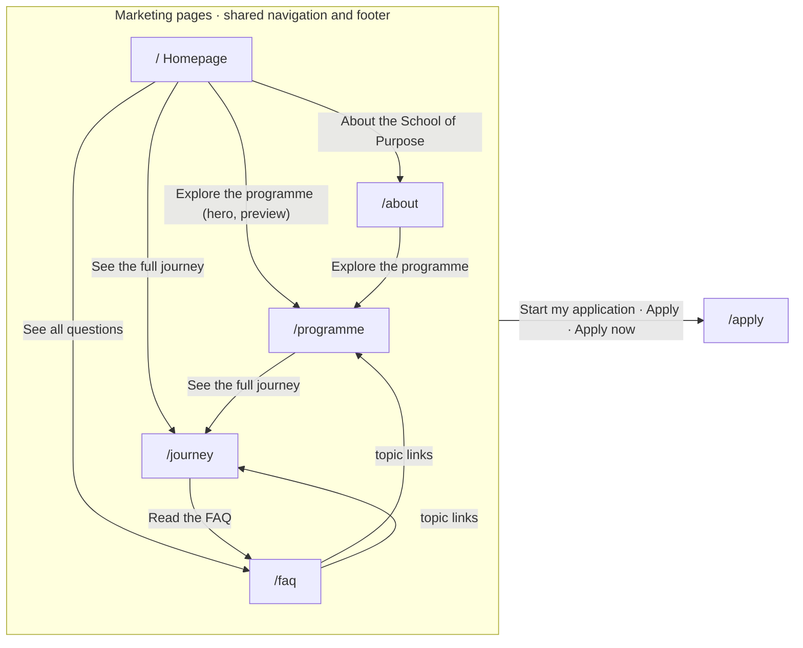
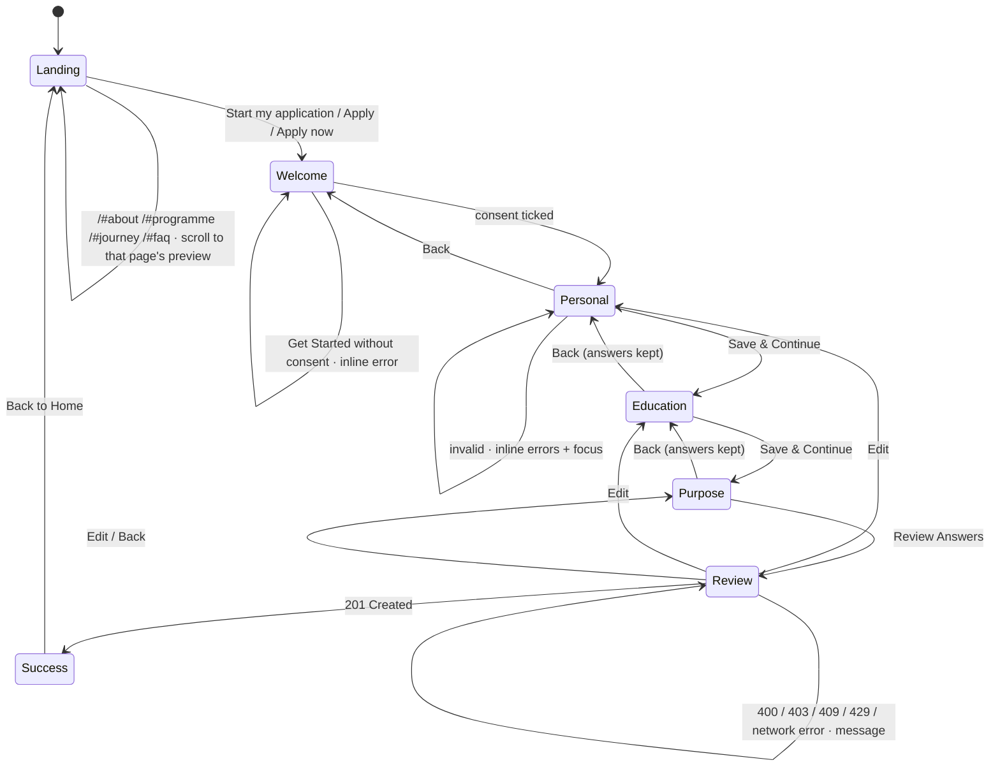
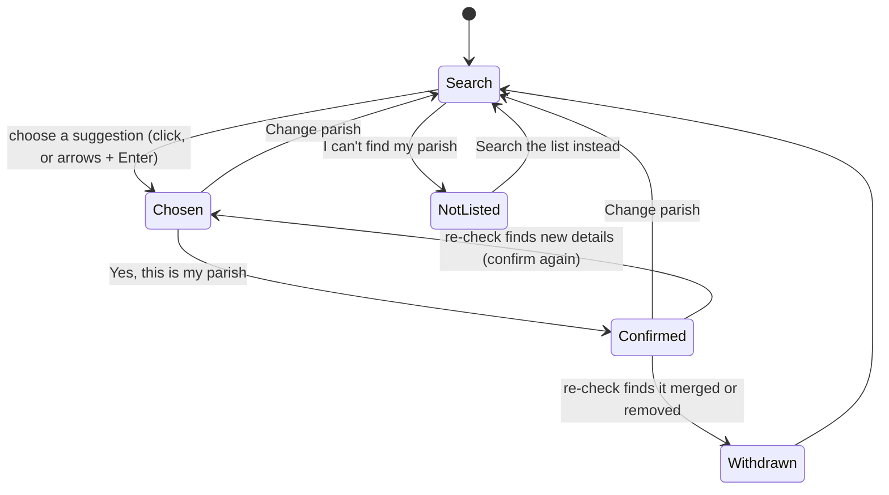
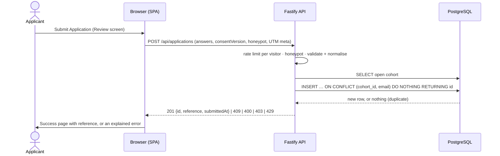
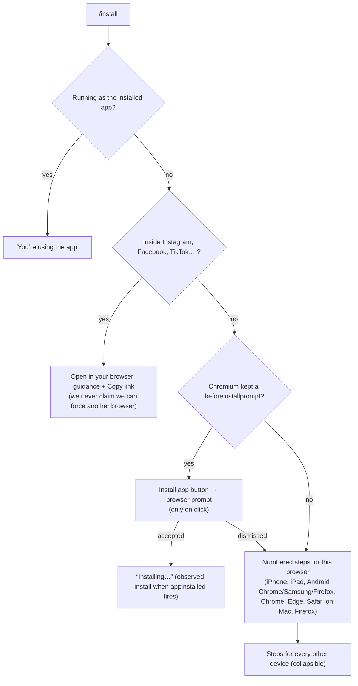
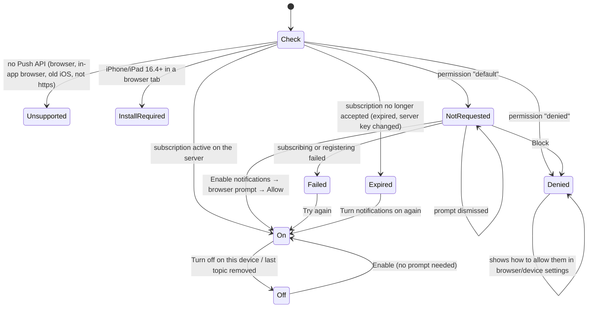
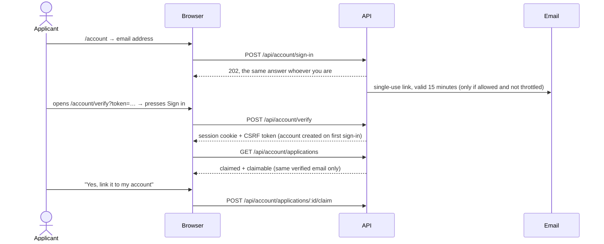
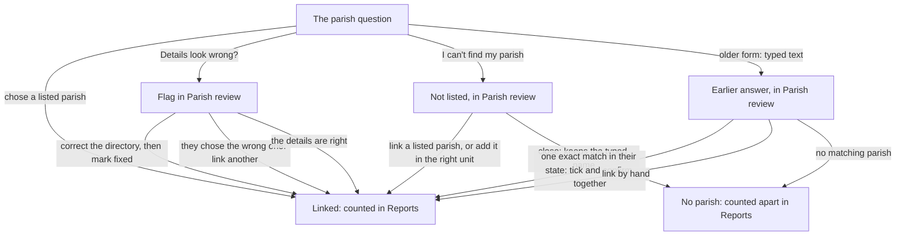

# 03 — App Flow

**Last updated:** 2026-09-30
**Status:** Built. Every screen has its own URL (React Router 8): the homepage, the marketing pages (About, Programme, Journey, FAQ), the application, the install/notification/updates pages, the optional applicant account area and the admin platform. Answers persist across refresh and Back, and submissions go to the API. The site is an installable web app with a service worker ([§6](#6-offline-and-updates)).

Related: [01-PRD](01-PRD.md) · [02-TRD](02-TRD.md) · [04-UI-UX-Design-Brief](04-UI-UX-Design-Brief.md) · [05-Backend-Schema](05-Backend-Schema.md)

---

## 1. Routes

Defined in [`src/App.tsx`](../src/App.tsx).

| Route | Screen | Component | Guard |
|---|---|---|---|
| `/` | Homepage | [LandingPage](../src/pages/LandingPage.tsx) | — |
| `/about` | About the School of Purpose | [AboutPage](../src/pages/AboutPage.tsx) | — |
| `/programme` | Purpose Boot Camp (the programme) | [ProgrammePage](../src/pages/ProgrammePage.tsx) | — |
| `/journey` | The Participant Journey | [JourneyPage](../src/pages/JourneyPage.tsx) | — |
| `/faq` | Frequently asked questions | [FaqPage](../src/pages/FaqPage.tsx) | — |
| `/apply` | Welcome & consent | [WelcomePage](../src/pages/WelcomePage.tsx) | — (shows "closed" if no cohort is open) |
| `/apply/personal` | Section 1: Personal Information | [PersonalInfoPage](../src/pages/PersonalInfoPage.tsx) | needs consent |
| `/apply/education` | Section 2: Education & Career | [EducationCareerPage](../src/pages/EducationCareerPage.tsx) | needs Section 1 valid |
| `/apply/purpose` | Section 3: Purpose & Self-Discovery | [PurposePage](../src/pages/PurposePage.tsx) | needs Section 2 valid |
| `/apply/review` | Review & submit | [ReviewPage](../src/pages/ReviewPage.tsx) | needs all sections valid |
| `/apply/success` | Confirmation (+ optional notification card and account prompt) | [SuccessPage](../src/pages/SuccessPage.tsx) | needs a submission receipt, else → `/` |
| `/install` | Install the app (device-aware steps) | [InstallPage](../src/pages/InstallPage.tsx) | — |
| `/notifications` | This device's notification settings | [NotificationsPage](../src/pages/NotificationsPage.tsx) | — (account topics need a signed-in applicant) |
| `/updates` | Public announcements | [UpdatesPage](../src/pages/UpdatesPage.tsx) | — |
| `/account/sign-in`, `/account/verify?token=…` | Applicant sign-in by emailed link | [SignIn](../src/account/SignIn.tsx) | off (with an explanation) when email isn't configured |
| `/account` | Account overview | [OverviewPage](../src/account/OverviewPage.tsx) | signed-in applicant, else the sign-in form in place |
| `/account/application` | Published status, messages, linking an application | [ApplicationPage](../src/account/ApplicationPage.tsx) | signed-in applicant |
| `/account/notifications` | Inbox, this device's notifications, the account's devices | [NotificationsPage](../src/account/NotificationsPage.tsx) | signed-in applicant |
| `/account/settings` | Details, sessions, sign out everywhere, delete account | [SettingsPage](../src/account/SettingsPage.tsx) | signed-in applicant |
| `/admin/login`, `/admin/setup?token=…`, `/admin/forgot`, `/admin/reset?token=…` | Staff sign-in (password + two-step verification), invitation set-up, password reset | [AuthPages](../src/admin/AuthPages.tsx) | — |
| `/admin` … | Dashboard, Applicants (`/admin/applicants`, `/admin/applicants/:id`), Accounts (`/admin/accounts`, `/:id`), Reports and analytics (`/admin/reports`, `/organisation?unit=…&level=…&view=table&sort=…&dir=…`, `/over-time?interval=day`, `/decisions`, `/parish-answers`, `/cohorts`, each with the shared filters `cohort`, `from`, `to`, `status`, `published`, `unit`, `direct`, `without`), Parish review (`/admin/parish-review?kind=…`), Parish directory (`/admin/directory?unit=…&parish=…`, `?tab=imports`, `?tab=changes`), Cohorts, Notifications (`/admin/campaigns`, `/new`, `/:id`), Announcements, Staff, Settings, Audit history, Your security | [AdminApp](../src/admin/AdminApp.tsx) and [`src/admin/pages/`](../src/admin/pages/) | signed-in staff with two-step verification; each page checks the role's permissions (the server enforces them) |
| `*` | 404 | [NotFoundPage](../src/pages/NotFoundPage.tsx) | — |

The account and admin areas are separate lazy-loaded bundles: people who only read the site or apply never download them.

**Marketing layout** ([`MarketingLayout`](../src/components/marketing/PageParts.tsx)): `/about`, `/programme`, `/journey`, `/faq`, `/install`, `/notifications`, `/updates` and the account area share one layout route. Its header (brand lockup linking home, the main navigation, **Apply**) stays mounted while moving between these four pages and, like the homepage's, stays at the top of the viewport while scrolling ([`StickyHeader`](../src/components/marketing/StickyHeader.tsx)); below it, each page and the footer form a fresh scroll-reveal root. The homepage keeps its own hero header, built from the same navigation components ([`src/components/marketing/`](../src/components/marketing/)).

**Active page:** the navigation links are `NavLink`s: the current page gets `aria-current="page"`, a bolder weight and a resting underline (desktop), gold text (phone/tablet menu) and white bold text (footer).

**Guards** ([`RequireStep`](../src/components/RequireStep.tsx)): a deep link or refresh on a later step redirects to the first unfinished step, so nobody can skip consent or a section.

**On every route change** ([`RouteEffects`](../src/components/RouteEffects.tsx)): the page scrolls to the top, keyboard/screen-reader focus moves to the visible `<h1>`, and the page title updates (e.g. "Journey · School of Purpose", "Step 2 of 3: Education & Career · School of Purpose"). In-page `#anchor` changes don't trigger this.

**Old homepage links:** `/#about`, `/#programme`, `/#journey` and `/#faq` still work. Each id now belongs to the homepage preview of that page, and the homepage scrolls to it after the first render. `/#what-to-expect` is unchanged. `/#blueprint` no longer has a target on the homepage (the Blueprint moved to `/about`), so it opens at the top.

**The server** returns `index.html` for any extension-less path, so every route can be bookmarked, refreshed and shared.

## 2. Navigation map

The header navigation (desktop), the menu (phone and tablet) and the footer link all five marketing pages; the diagram shows the in-page routes between them.



The application flow:



## 3. Screens

### `/` Homepage

A concise overview: the hero, "What to expect", one short preview per dedicated page, the closing invitation and the footer. The hero keeps separate mobile/tablet (< 1280 px) and desktop trees (≥ 1280 px, a 1440 px composition scaled with CSS `zoom`); only one is displayed. The other sections are single responsive trees.

| Section (`id`) | Content | Actions |
|---|---|---|
| Header / hero (`#top`) | The brand lockup (RCCG NYAYA School of Purpose) and nav; eyebrow "School of Purpose · First Edition"; headline (`<h1>`) "Discover your purpose. Prepare to lead."; one supporting sentence; one eligibility line ("For RCCG members aged 18–30"); photograph with the caption "The Called Generation" | Nav: Home · About · Programme · Journey · FAQ (+ Contact when `VITE_CONTACT_EMAIL` is set). **Start my application** → `/apply` (primary). **Explore the programme** → `/programme`. Header **Apply** → `/apply`. Mobile: menu button opens an accessible dialog (Escape closes it, focus stays inside) |
| What to expect (`#what-to-expect`) | Virtual training (8 weeks, online) → merit-based selection → physical boot camp (**if selected**: 10 fully sponsored days at Redemption City) → 12 months' mentorship, then two years in community. "Applying doesn’t guarantee a place at the boot camp." | See the full journey → `/journey` |
| About preview (`#about`) | The purpose statement, Vision and Mission (portrait from 1280 px) | About the School of Purpose → `/about` |
| Programme preview (`#programme`) | The Doctrine of Purpose and its three questions (photograph from 1280 px) | Explore the programme → `/programme` |
| Journey preview (`#journey`) | The six stages at a glance: number, name and one fact each; stage 04 marked "Selected participants only" | See the full journey → `/journey` |
| FAQ preview (`#faq`) | Three questions: who can apply, whether everyone is selected, what happens after submitting (native `<details>`); contact line if configured | See all questions → `/faq` |
| Closing invitation | Isaiah 58:12 | Start my application → `/apply` |
| Footer (`#contact`) | Organisation, contact email (if configured), footer nav | Links + Apply now |

Programme wording on every page, the Welcome screen and the FAQ comes from [`src/config/programme.ts`](../src/config/programme.ts).

### Dedicated pages (`/about`, `/programme`, `/journey`, `/faq`)

Each starts with the same compact **page intro** on burgundy (eyebrow, the page's single `<h1>`, a short lead) and ends with the **apply band** ("Discover your purpose. Prepare to lead.", "For RCCG members aged 18–30 · Apply in about 5 minutes", **Start my application** → `/apply` plus one related page), then the footer.

| Page | Sections, in order | Links out |
|---|---|---|
| `/about` | Intro: "About the School of Purpose", the calling. **Vision & Mission** (statement, Vision, Mission, portrait). **Who the programme serves**: RCCG members aged 18–30 (young adults and youth), eligibility confirmed at the start of the application, and the three spheres (Church, marketplace, nation). **The Biblical Blueprint**: Daniel, Joseph, Nehemiah, Paul, Deborah | Apply band: Explore the programme |
| `/programme` | Intro: "Purpose Boot Camp", First Edition · The Called Generation, the programme's purpose. **The Doctrine of Purpose** (three questions, Start my application). **How the programme runs**: virtual training (8 weeks · online · 16 live sessions · 32 contact hours), merit-based selection (transparent 100-point system; applying does not guarantee a place), the physical boot camp (**selected participants only**: 10 days, Redemption City, fully sponsored: accommodation, meals, transport, 24/7 support), mentorship (12 months, 200+ vetted senior mentors) and community (two years, eight pillar communities) | See the full journey, stage by stage; apply band: See the full journey |
| `/journey` | Intro: "The Participant Journey", with **Applying** (open to RCCG members aged 18–30; every application reviewed) set apart from **Being selected** (merit-based; sponsorship for selected participants only; no guaranteed place). **The six stages**, in order: a vertical timeline below 1280 px, the illustrated cascade from 1280 px; each stage shows its number and name, duration and format, what happens and how people move on | Apply band: Read the FAQ |
| `/faq` | Intro: "Frequently asked questions". All seven approved questions in three groups: **Applying**, **The programme**, **Selection and the boot camp** (native `<details>`); contact line only if configured | Per group: Start my application, Explore the programme, See the full journey; apply band: See the full journey |

UTM parameters (`?utm_source=whatsapp…`) and the referring site are captured on the first page view of the session and sent with the application.

### `/apply` Welcome

- The programme facts in three groups: **Eligibility** (RCCG members aged 18–30), **Your commitment** (8 weeks of virtual training; merit-based selection, with the 10 sponsored days only for selected participants; 12 months of mentorship, then two years in a pillar community) and **How applying works** (three sections + review; complete, honest answers; "Your answers are saved while this tab stays open.").
- Then the consent card: the full consent statement beside a native checkbox (never pre-ticked), **Get Started**, and "About 5 minutes" next to the button. One brief entrance, no delays.
- A contact line appears under the card when `VITE_CONTACT_EMAIL` is set. There is no privacy-notice link yet (open question Q9).
- **Get Started** without consent: inline error ("Tick the box to confirm before you continue"), focus moves to the checkbox.
- Calls `GET /api/cohorts/current`. If applications are closed, the consent card is replaced by a "currently closed" notice. On a network error the screen still lets people start; the server re-checks when they submit.

### `/apply/personal`, `/apply/education`, `/apply/purpose`

Shared chrome ([`FormLayout`](../src/components/FormLayout.tsx)):
- **Phones and tablets (< 1024 px):** a 60 px header, then one compact progress row: three markers (✓ done, filled current, outlined upcoming) and "Step N of 3 / *section name*". On Review it reads "All 3 sections complete / Review and submit". Not sticky.
- **Desktop:** a 356 px burgundy side panel (step list + reflection quote) next to the form (max 840 px).

Behaviour:
- Every change is saved to `sessionStorage` immediately (`sop.application.draft.v1`), so **refresh and Back never lose answers**. Answers are cleared when the tab closes or the application is submitted. Every step says so under its buttons: "Your answers are saved while this tab stays open." (Nothing is stored permanently, and answers can't be resumed on another device.)
- Guidance sits next to the question it's about (email: how it's used; phone: country code; age range: 18–30; parish: optional free text, or a search of the RCCG parish list while the directory is on: see below).
- **Save & Continue** validates with the shared rules ([05 §4](05-Backend-Schema.md#4-validation-rules)). Invalid: an "N answers need attention" alert, an inline message on each field, and focus on the first invalid field. Errors update live as answers are corrected.
- Section 1 contains a hidden honeypot field for bots.

#### The parish question (question 08) while the parish directory is on

Off by default; an owner switches it on once the RCCG list is imported (`/api/config` → `parishDirectory.enabled`). Until then question 08 stays optional free text. [`ParishPicker`](../src/components/ParishPicker.tsx), [`src/lib/parish.ts`](../src/lib/parish.ts):



- **Search:** at least 2 letters; suggestions 250 ms after typing stops, at most 10, parishes in the applicant's state (question 06) first. Each shows the parish (typed words in bold) and its province, region and continent. More than 10 matches: "Showing 10 of N, parishes in Lagos first. Add your province number to narrow the list." Typing "12" or "LP 12" narrows to that province. Nothing exact: "No exact match. Did you mean one of these?" with the closest spellings.
- **Chosen:** a card with the parish and its province, region and continent as read-only text ("None (directly under Region 14)" when there is no province). **Yes, this is my parish** confirms it; **Change parish** returns to the search with what was typed. **Details look wrong? Tell us** flags the details for staff (a toggle; the applicant can still continue).
- **Not listed:** the name as they know it (2–120 characters). The review says "Not on our list yet: the Programme team will check it."
- **Outside Nigeria** (question 06): a note that the list covers Nigeria only, pointing to "I can't find my parish".
- **Required:** Save & Continue needs a confirmed parish or a not-listed name; focus goes to **Yes, this is my parish** when only the confirmation is missing.
- **States:** "Searching…" only when slow (300 ms); no match (tips); error with **Try again**; offline ("Finish the other questions and choose your parish when you're back online", searching again when the connection returns); too many searches from one network.
- **Saved choices are re-checked** once per page load (`GET /api/parishes/:id`) while a draft holds one: renamed or moved means confirming again; merged or removed withdraws it with an explanation (and, for a merge, a button to search for the parish it became part of). Offline, the card says it will be checked when back online. The server checks again on submit; if it refuses the parish, the review links back to the Personal step, where the re-check shows why.
- The draft stores the choice (`parishMode`, `parish`) with the other answers in `sessionStorage`. Only in directory mode does the submission include `parish`; otherwise `parishName` is free text, as before.

### `/apply/review`

A summary of every answer, normalised the way it will be stored (e.g. phone `0801 234 5678`), with an **Edit** link per section and the consent statement. **Submit Application** shows a spinner and blocks double submission. Results:

| API result | What the applicant sees |
|---|---|
| 201 | Navigate to `/apply/success` (history entry replaced, so Back doesn't return to Review) |
| 400 `VALIDATION_FAILED` | List of problems, each linking to the right step |
| 409 `ALREADY_APPLIED` | "You've already applied…" (+ contact email if configured) |
| 403 `APPLICATIONS_CLOSED` | "Applications are closed…" |
| 429 `RATE_LIMITED` | "Too many attempts… wait a few minutes" |
| Network error / timeout | "We couldn't reach our server… your answers are still saved while this tab stays open" |

The error message is an `alert` region and receives focus. The draft is kept, so pressing Submit again retries.

### `/apply/success`

"Application received" / "Thank you. Your application is in." It states that this **is not an offer of a place** (every application is reviewed; the physical boot camp is for participants selected on merit). The **reference number** (e.g. `SOP-7F3A9C2B`) is selectable and has a **Copy reference** button: success is announced ("Reference copied."); if the clipboard is unavailable or refused, the reference is selected and the page says to copy it manually. "No confirmation email is sent, so keep a note of this reference." Then "What happens next" (review → email update → next-cohort details), Back to Home, and a contact line only when `VITE_CONTACT_EMAIL` is set. No response time is shown (none confirmed). On mount it clears the draft from the device; the receipt stays in the session so a refresh still shows the page.

Under the reference, two optional follow-ups, both shown without any entrance delay:
- **Get programme updates** ([NotificationCard](../src/components/notifications/NotificationCard.tsx)): "Receive important application and programme announcements. You can turn these off at any time." with **Enable notifications** / **Not now**. It asks for permission only after Enable. It shows nothing where notifications can't work, are already on, or are blocked, and nothing for 30 days after "Not now". On an iPhone or iPad browser tab it explains that notifications need the Home Screen app and links to `/install`.
- **Want to follow your application online?** a link to sign in (only when applicant accounts are available).

### `*` Not found

Branded 404 with **Apply now** and **Go to the home page**.

## 4. Submission sequence




## 5. Installing the app

Optional everywhere: nothing on the site needs installing. Entry points: **Install the app** in the footer and in the phone/tablet menu (hidden when the site is already running as an installed app), links from the notification card on iPhone/iPad, and `/install`.



- **Feature detection first:** the one-tap button appears only when the browser handed us an install prompt. The user agent only picks which instructions to show first, and the page says it may be wrong.
- **Honest benefits:** own icon and window, pages opened before still load on a weak connection, and on iPhone/iPad it's the only way to get notifications. Applying, signing in and the application status still need a connection.
- **What we can know:** an *observed install* (`appinstalled` fired on this page) and a *standalone launch* (the page runs in an app window). Neither says whether the app is installed on a device that isn't running it, and the page says so.
- **Not now:** the suggestions that can be dismissed remember it for 30 days (`localStorage`, a timestamp only). Nothing covers page controls: the install entries are ordinary links.

## 6. Offline and updates

The service worker ([`src/sw/`](../src/sw/)) follows one policy, unit-tested in [`routing.test.ts`](../src/sw/routing.test.ts):

| Request | What happens |
|---|---|
| `/api/*`, any non-GET request, other origins | Never touched or stored by the service worker |
| Public page (`/`, `/programme`, `/apply/…`) | Network first; offline (or 502/503/504 during a restart): the cached app shell, which renders the page from the bundled content |
| `/admin…`, `/account…` pages | Network only; offline: [`offline.html`](../public/offline.html) ("needs a connection"), never a cached copy |
| `/assets/*` (content-hashed) | Cache first (stored on first use; the first page load's files are precached) |
| Icons, manifest, offline page | Network first, stored copy offline |

Offline behaviour people see:
- A slim notice at the top of every page (in the page flow, never covering anything): "You're offline. Pages you've opened still work. Sending an application, signing in and notification settings need a connection."
- The form keeps its answers in `sessionStorage` as before. Submitting offline says **"You're offline, so your application hasn't been sent"**. Success is shown only after the server confirms. There is no background sync of applications and nothing personal is stored longer term.

```mermaid
sequenceDiagram
    participant P as Open page (version 1)
    participant B as Browser
    participant W as Service worker
    participant S as Server
    Note over S: Version 2 deployed
    P->>S: any API call
    S-->>P: X-App-Build: v2 ≠ v1
    P->>B: registration.update()
    B->>S: GET /sw.js (no-cache)
    B->>W: install v2 (precache; all-or-nothing)
    W-->>P: v2 waiting
    P->>P: “An update is ready. [Later] [Update now]”
    Note over P: Nothing reloads by itself (forms and admin edits are safe)
    P->>W: SKIP_WAITING (person pressed Update now)
    W->>W: activate v2: delete v1 precache (keep its /assets for old tabs), claim
    W-->>P: controllerchange → reload onto v2
```

Other tabs open on the old version switch service worker too; they say "A newer version of the site is available" with **Reload**, and never reload by themselves. On a first visit the new service worker takes control of the page without any offer: that isn't an update (until 2026-09-28 it was wrongly offered to every first-time visitor).

A lazily loaded part of the site that fails to download (removed by a deploy, or a dropped connection) shows "This page needs a refresh" instead of a broken screen. Emergency rollback: [DEPLOYMENT](DEPLOYMENT.md#service-worker-rollback).

## 7. Notifications

Separate from installing and from the application's contact consent. The settings live at `/notifications` (anyone) and `/account/notifications` (plus account topics and devices).



**Topics:** Programme announcements (anyone), Application updates and Training reminders (signed-in, verified applicants). Every change records the consent version, time and topics.

```mermaid
sequenceDiagram
    actor Staff
    participant A as Admin (/admin/campaigns)
    participant S as API
    participant Q as Job queue (Postgres)
    participant W as Worker
    participant P as Push service
    participant SW as Service worker
    Staff->>A: write title/body, topic, filters; preview + live counts
    Staff->>A: Send a test (own test devices only)
    Staff->>A: Final check: counts, time + zone, tick "I've checked…"
    A->>S: schedule (confirmDevices, confirmInbox)
    S->>S: counts changed? → 409 with fresh numbers
    S->>Q: freeze content, enqueue campaign.dispatch at the chosen time (UTC)
    W->>Q: claim (FOR UPDATE SKIP LOCKED)
    W->>S: message + one delivery per device (unique) + inbox copies
    W->>W: re-check consent, account status, audience before each send
    W->>P: encrypted payload (aes128gcm), VAPID, TTL, Urgency, Topic
    P-->>W: 201 accepted · 404/410 gone (device turned off) · 429/5xx retry later
    P->>SW: push
    SW->>SW: show notification (tag = message id, allowlisted link)
    SW-->>S: click recorded (when possible)
```

**Clicking a notification** focuses an open window and navigates it in place (no reload), or opens one at the allowlisted same-origin link. Links under `/account` ask the person to sign in if needed. Application updates always show the same neutral lock-screen text: "There is an update to your application. Open School of Purpose to view it."

## 8. Applicant accounts



The account shows **only published information**: the published status and its description, the Programme team's message and the date. Internal statuses, notes and reviewers are never sent to the browser. Sign-in is switched off (with an explanation) when email isn't configured; applying never needs an account.

## 9. Admin platform

**Signing in:** email + password → two-step verification (a code from an authenticator app, or a single-use recovery code). The first time: set up the authenticator (QR code or key), confirm a code, save 10 recovery codes (shown once). New staff join by a single-use invitation link (72 h) from an owner; the first owner comes from `admin.js create-owner` on the server ([DEPLOYMENT](DEPLOYMENT.md#first-admin)). Sessions end after 12 h, or 2 h idle.

| Area | What it's for | Needs |
|---|---|---|
| Dashboard | Applications by cohort and status; verified accounts; active subscriptions (devices, not people); notifications accepted/failed/expired/skipped; observed installs, launches from the installed app, opt-ins/outs, recorded clicks; queue health; recent admin actions; **applications by parish** (by continent, the busiest regions, those without a directory parish) | dashboard.view (the parish card: reports.view) |
| Applicants | Server-side search (name, email, town, parish, reference), filters (cohort, review status, published status, reviewer, account, parish answer, directory parish, submission dates, a province, region or continent), sort, pages; a Parish column with its province; CSV download of the current filter, with province, region and continent | applications.view_all / view_assigned (reviewers see only their assignments); export for CSV |
| Applicant | Details; the **parish panel** (the answer, the parish in today's directory with its chain, the chain as the applicant confirmed it, who linked it, reports; change or link the parish by searching the directory); internal notes; history; review status (allowed transitions only); **publishing** as a separate step with a preview of exactly what the applicant sees; reviewer assignment; corrections; deletion (type the reference) | note / review / publish / assign / edit |
| Reports and analytics | Six reports under one set of filters (period with quick choices or a date range in Lagos days, cohort, review status, published status, a continent/region/province; a sheet on phones), shown in words with removable chips and carried between reports and into Applicants. **Overview**: key figures (applications, with a comparison only when a start date gives an equal earlier period; unique applicants by email; with a directory parish; parishes represented), then a card per report (weekly trend chart, review status chart, busiest regions, parish answers with the Parish review backlog, cohorts) and the downloads (totals by place; applications with details for staff who may export). **Regions and parishes**: level tabs, breadcrumb drill-down continent → region → province → parish → applications (focus moves to the breadcrumb), search, sort (status orders only for roles that see exact counts), a comparison chart and place cards, or a sortable table (TanStack); "outside any region/province" groups so totals add up; CSV. **Over time** (weekly/daily tabs, chart with a table of every number), **Review and decisions** (charts and tables of review and published status), **Parish answers**, **Cohorts** (applications vs unique applicants). Every count opens the applicants behind it. Counts follow today's directory; 1–4 show as "fewer than 5" to roles without applicant details | reports.view (applicant links: applications.view_all; the details download: applications.export) |
| Parish review | Three lists: parishes applicants couldn't find, "details look wrong" flags, answers typed before the directory. Each shows the applicant and suggested parishes; staff link one, search the directory, add the parish (not listed), mark the directory fixed or close it. Earlier answers matching exactly one parish in the applicant's state can be ticked and linked together | applications.view_all + applications.edit + directory.manage |
| Parish directory | The tree from continents to parishes, with counts and markers (inactive, changed in 2026, corrected, added by staff); a side panel for a unit or parish with its details and history, and corrections: rename, move, set a province's state, deactivate/reactivate, merge, split, add a unit or parish. Tabs for the imports (counts and issues by type) and the 2026 changes (new units, in the directory or waiting for data) | directory.view · directory.manage (corrections) |
| Accounts | Search, status; detail with applications, devices, sessions; suspend, reactivate, sign out everywhere, delete (type the email) | accounts.view / manage |
| Cohorts | List with totals; create and edit (dates in a chosen zone, default Lagos); open/close | cohorts.manage |
| Notifications | Campaign list with truthful counts; editor with preview and live audience counts; test sends to your own test devices; schedule now or later with a time zone; final confirmation; cancel; your test devices | campaigns.manage / send |
| Announcements | Public (on `/updates`) and applicant notices (in account inboxes), draft → publish → archive | announcements.manage |
| Staff | Invite (email, or a link to share when email is off), roles, suspend, reset two-step verification, sign out everywhere | staff.manage (owners) |
| Settings | Support email, applicant accounts on/off, public notification sign-ups on/off, **the parish question from the directory on/off** (only once a list is imported) with the directory's readiness (active parishes, units, where the list came from, reviews waiting, corrections); integration health without secrets | settings.manage (owners) |
| Audit history | Who did what, when, filterable | audit.view |
| Your security | Password, recovery codes, sessions | everyone |

```mermaid
sequenceDiagram
    actor R as Reviewer / Programme admin
    participant A as Admin
    participant S as API
    actor U as Applicant
    R->>A: open applicant (view is audited)
    R->>A: add internal note, move to "Under review"
    A->>S: POST status (only allowed transitions; compare-and-set)
    R->>A: Review before publishing → sees exactly what the applicant will see
    R->>A: tick "I've checked…" → Publish
    A->>S: POST publish (expectedStatus: stale → 409)
    S->>S: published status + message, history, audit
    S-->>U: inbox entry + neutral push to devices with "Application updates"
```

**Parish review** turns every parish answer into a directory parish where one exists. The applicant's own answer (what they typed, or the chain they confirmed) never changes; the link is recorded with who made it.


