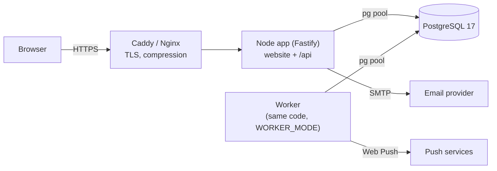
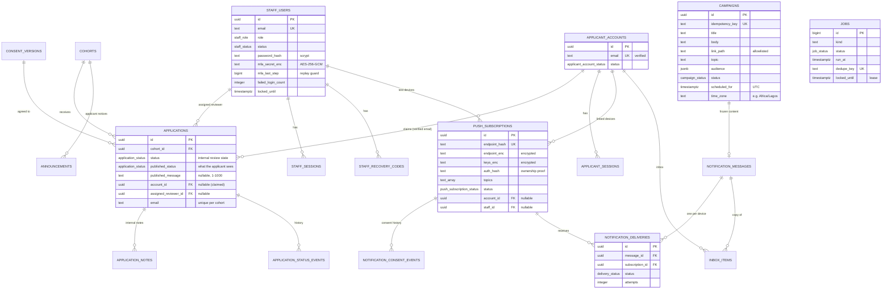
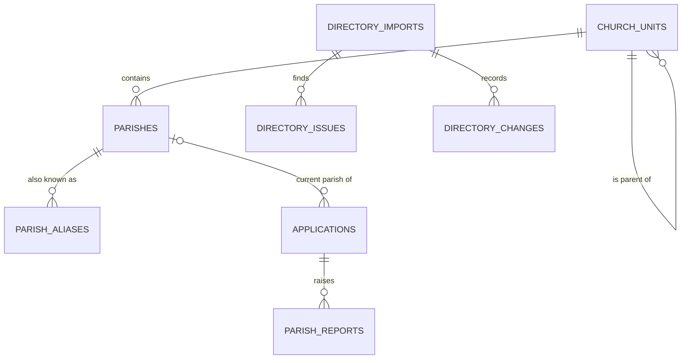
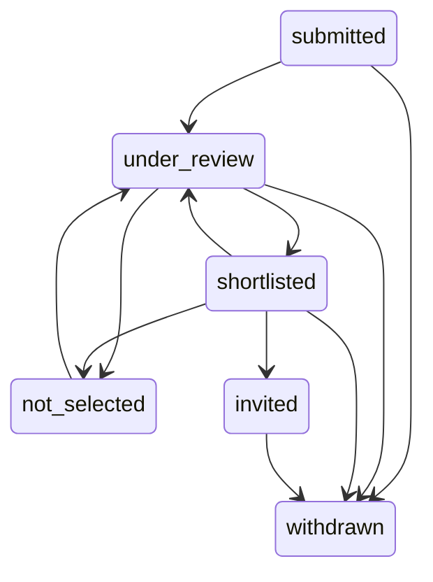

# 05 — Backend Schema & API

**Last updated:** 2026-09-30
**Status:** **Built.** Self-hosted PostgreSQL 17 + a Fastify API + a background worker. Source of truth: [`server/migrations/`](../server/migrations/) (schema) and the route modules in [`server/`](../server/) (API).

Related: [01-PRD §5 form content](01-PRD.md#5-form-content) · [02-TRD](02-TRD.md) · [03-App-Flow](03-App-Flow.md) · [DEPLOYMENT](DEPLOYMENT.md)

---

## 1. Overview

- **Production:** PostgreSQL on the same VPS (Docker container or apt package), configured with `DATABASE_URL` or the standard `PG*` variables.
- **Development and tests:** PGlite (PostgreSQL 17 compiled to WebAssembly) runs in-process. Dev data lives in `.data/pglite/`; tests use `memory://`. The same SQL migrations run on both.
- **Migrations** ([`server/migrate.ts`](../server/migrate.ts)) run at startup (or `pnpm db:migrate`), each in its own transaction, recorded in `schema_migrations`, under an advisory lock. **Never edit an applied migration**; add a new numbered file.

| Migration | Adds |
|---|---|
| `0001_init.sql` | cohorts, consent versions, applications, enums |
| `0002_seed_first_cohort.sql` | consent `2026-09-v1`, cohort `called-generation-1` |
| `0003_identity_audit.sql` | staff users, recovery codes, staff sessions, applicant accounts and sessions, single-use auth tokens, the application ↔ account link, audit events, settings, analytics events |
| `0004_review_workflow.sql` | reviewer assignment, published status and message, internal notes, status history |
| `0005_notifications_jobs.sql` | push subscriptions, notification consent history, announcements, campaigns, messages, deliveries, inbox, job queue |
| `0006_parish_directory.sql` | the RCCG parish directory: church units (continent → area), parishes, aliases, unit lineage, directory imports, issues and changes |
| `0007_parish_links.sql` | `pg_trgm`; parish search text and trigram indexes; applications' parish link (`parish_id`, `parish_status`, `parish_snapshot`); parish reports |
| `0008_parish_admin.sql` | staff corrections imports keep (`staff_fields`, `parishes.source_unit_id`); parishes staff link to applications (`parish_linked_by`, `parish_linked_at`); earlier typed answers staff reviewed (`parish_text_reviewed_at`) |
| `0009_suspend_invited_staff.sql` | a staff member can be suspended before accepting their invitation (the password check allows `invited` or `suspended` without one; suspending an invitation used to fail) |

Existing applications stay valid: new columns have defaults (`published_status = 'submitted'`, no account, no reviewer), and a person can claim an older application after signing in with the same email ([03 §8](03-App-Flow.md#8-applicant-accounts)). Verified on real PostgreSQL 17 over existing data (2026-09-26).

## 2. Data model

### Applications and cohorts (0001, 0002, 0003, 0004)

**`applications`**: one row per expression of interest.

| Column | Type | Constraint / notes |
|---|---|---|
| `id` | uuid | PK. Applicant reference = `SOP-` + first 8 hex chars |
| `cohort_id` | uuid | FK → `cohorts.id` |
| `status` | `application_status` | **internal** review state, default `submitted`. Changes only along allowed transitions (§7) |
| `status_changed_at` | timestamptz | last review change |
| `published_status` | `application_status` | **what the applicant sees**, default `submitted` ("Received"). Set only by an explicit publication |
| `published_message`, `published_at`, `published_by` | text (1–1000), timestamptz, FK → staff | the Programme team's message and who published it |
| `assigned_reviewer_id` | uuid | FK → `staff_users`, `on delete set null` |
| `account_id`, `claimed_at` | uuid, timestamptz | FK → `applicant_accounts`, `on delete set null`; both null or both set |
| `full_name`, `email`, `phone_e164`, `gender`, `age_range`, `state_of_residence`, `city`, `parish_name`, `education_level`, `current_status`, `purpose_clarity` | | the form's answers, as defined in [`0001_init.sql`](../server/migrations/0001_init.sql) with the rules in §5: `email` lower-case and `unique (cohort_id, email)`, phone E.164, `purpose_clarity` 1–5, `parish_name` optional (≤ 200 since 0007: the directory's name for a listed parish, otherwise what was typed) |
| `parish_id`, `parish_status`, `parish_snapshot` | uuid FK → `parishes`, `application_parish_status`, jsonb | 0007. `parish_status` is how the applicant answered: `listed` (chosen from the directory: `parish_id` and the snapshot set), `reported` ("I can't find my parish": the typed name, plus a parish report), `legacy_text` (the free-text question), `not_provided` (only applications stored before 2026-09-30, when the question became compulsory: kept as they are). The snapshot is the parish and its chain as the applicant confirmed them, with the import they came from; it never changes. `parish_id` is the **current** parish, which Reports count by: the applicant's choice, or since 0008 one staff linked to any answer (a `listed` answer always has one) |
| `parish_linked_by`, `parish_linked_at`, `parish_text_reviewed_at` | FK → staff (set null), timestamptz, timestamptz | 0008. Who set `parish_id` when staff did, and when. An earlier typed answer staff looked at and couldn't match leaves Parish review (`parish_text_reviewed_at`) |
| `consent_version`, `consent_at` | text FK, timestamptz | the application's contact consent (separate from notification consent) |
| `submission_meta` | jsonb | `{utmSource, utmMedium, utmCampaign, referrer}`; no IP addresses |
| `created_at` | timestamptz | |

Indexes: `(cohort_id, created_at desc)`, `(cohort_id, status)`, unique `(cohort_id, email)`, `(account_id)` partial, `(email)`, `(assigned_reviewer_id)` partial, `(parish_id)` partial.

**`parish_reports`** (0007; for staff in Parish review, never shown to applicants): `application_id` FK cascade, `kind` (`not_listed` with the `reported_name` they typed, or `details_wrong` with the listed `parish_id`), `status` (pending, then `linked` to a listed parish, `added` to the directory and linked, `fixed` in the directory, or `rejected`: closed with no change), `resolved_parish_id`, `resolved_by`, `resolved_at`; one of each kind per application. Linking the application's parish (from Parish review or the applicant's page) resolves its pending reports; removing a staff link reopens a `not_listed` report.

**`application_notes`** (staff only; never returned by any applicant endpoint): `application_id` FK cascade, `author_id` FK set null, `body` 1–4000, `created_at`.
**`application_status_events`**: `kind` review|publication, `from_status`, `to_status`, `actor_id`, `created_at`, one row per change or publication.
**`cohorts`** and **`consent_versions`**: unchanged ([`0001_init.sql`](../server/migrations/0001_init.sql)). A cohort is open when `is_accepting_applications` and now is within the optional open/close times. Cohorts are managed in the admin area.

### Identity (0003)

| Table | Key columns | Notes |
|---|---|---|
| `staff_users` | `email` unique lower-case, `display_name`, `role` (`staff_role`), `status` (invited/active/suspended), `password_hash` (scrypt), `mfa_secret_enc`, `mfa_pending_secret_enc`, `mfa_enabled_at`, `mfa_last_step`, `failed_login_count`, `locked_until`, `invited_by`, `last_login_at`, `suspended_at` | Checks: invited or suspended, or has a password (0009); MFA secret ⇔ enabled. `failed_login_count` is the attempt budget: every password or code attempt is counted before it's checked (§6) |
| `staff_recovery_codes` | `staff_id`, `code_hash` unique (HMAC-SHA-256 keyed from `APP_SECRET`; codes saved before the 2026-09-30 audit are plain SHA-256 and still work), `used_at` | 10 per staff member; single use |
| `staff_sessions` | `token_hash` unique (SHA-256), `staff_id`, `mfa_verified_at`, `mfa_attempts`, `last_seen_at`, `expires_at`, `revoked_at`, `device_label` | 12 h absolute, 2 h idle (configurable). An attempt is reserved in `mfa_attempts` before the code is checked; passing the second factor replaces the session with a new one |
| `applicant_accounts` | `email` unique (verified), `status` (active/suspended), `email_verified_at`, `last_login_at`, `suspended_at` | Created only by a successful sign-in link |
| `applicant_sessions` | like staff sessions | 30 days absolute, 14 days idle |
| `auth_tokens` | `purpose` (applicant_sign_in, staff_invite, staff_password_reset), `token_hash` unique, `email`, `staff_id`, `expires_at`, `used_at` | Single use (atomic `used_at`); sign-in 15 min, invitation 72 h, reset 30 min |

### Operations (0003)

- **`audit_events`**: `actor_type` staff/applicant/system, `actor_id`, `action` (`area.verb`), `target_type`, `target_id`, `details` (identifiers, counts and field names only: never personal data or message bodies).
- **`app_settings`**: owner-editable `support_email`, `applicant_accounts_enabled`, `public_notifications_enabled`, plus `heartbeat_worker`. Never secrets.
- **`analytics_events`**: an allowlisted `name` and coarse `properties` only (§8).

### Notifications and jobs (0005)

| Table | Key columns | Notes |
|---|---|---|
| `push_subscriptions` | `endpoint_hash` unique, `endpoint_enc`, `keys_enc`, `auth_hash`, `push_host`, `account_id` / `staff_id` (at most one), `topics` ⊆ {general, application, training}, `status` (active/expired/revoked), `device_label`, `expiration_time`, `consent_version`, `consent_at`, `last_seen_at`, `failure_count`, `deactivated_at`, `deactivated_reason` | Endpoint and keys encrypted at rest. Checks: application/training topics need an account; staff test devices have no topics; active ⇔ not deactivated. GIN index on active topics. `failure_count` counts refusals in a row (reset by an accepted send). Removing a device or suspending its account unlinks it (no account, no application/training topics); deleting the account also erases its push address, keys and hashes |
| `notification_consent_events` | `subscription_id`, `account_id`, `action` (opt_in/update/opt_out/expired/linked/unlinked), `topics`, `consent_version`, `created_at` | Notification consent history, separate from application consent |
| `announcements` | `audience` public/applicants, `cohort_id` (applicants only), `title` ≤ 120, `body` ≤ 5000, `status` draft/published/archived, `published_at` | Public ones on `/updates`; applicant ones in account inboxes |
| `campaigns` | `idempotency_key` unique, `title` ≤ 65, `body` ≤ 180, `link_path` (allowlisted pattern), `topic`, `audience` jsonb `{cohortIds, publishedStatuses}`, `also_inbox`, `ttl_seconds` 300–2 419 200, `status` (draft/scheduled/sending/sent/cancelled), `scheduled_for` (UTC), `time_zone`, `frozen_at`, `created_by`, `scheduled_by`, `dispatched_at`, `completed_at`, `cancelled_at`/`cancelled_by` | Content frozen when scheduled |
| `notification_messages` | `origin` campaign/application_update/test, `campaign_id` (unique for campaigns), `title`, `body`, `link_path`, `topic`, `expires_at` | What was actually sent |
| `notification_deliveries` | `message_id`, `subscription_id`, **unique together**, `account_id`, `status` (queued/accepted/failed/expired/skipped), `attempts`, `last_http_status`, `last_error` ≤ 60, `accepted_at` | One per device per message: no duplicate sends from repeated dispatch |
| `inbox_items` | `account_id` cascade, `kind` application_update/message, `title`, `body`, `link_path`, `message_id` (unique per account), `application_id`, `read_at` | Durable copy: push is only an optional alert |
| `jobs` | `kind`, `payload`, `status` (pending/running/succeeded/failed/cancelled), `run_at`, `attempts`, `max_attempts`, `locked_by`, `locked_until`, `last_error` ≤ 300, `dedupe_key` unique | The queue (§4) |

### Parish directory (0006, 0008)

The RCCG parish list, loaded with `pnpm directory import` ([`server/directory/`](../server/directory/), [DEPLOYMENT](DEPLOYMENT.md#parish-directory)) and corrected by staff in Admin → Parish directory ([`edits.ts`](../server/directory/edits.ts)). No applicant data: applications link to parishes (0007, above).

| Table | Key columns | Notes |
|---|---|---|
| `church_units` | `level` (continent/region/province/zone/area), `official_name`, `display_name`, `name_key`, `parent_id` + `parent_level`, `state` (provinces only), `external_id` (the RCCG API's ID, later), `status` (active/inactive/merged), `merged_into_id`, `origin` (import/staff), `staff_fields` (0008) | Every level above the parish, in one table. `(parent_id, parent_level)` references `(id, level)` and `parent_level < level`, so a unit can only sit under an earlier level. Continent, region and province `name_key`s are unique across the church; zone and area keys only within their parent. `staff_fields` lists what staff corrected (`display_name`, `parent`, `state`) |
| `parishes` | `unit_id`, `official_name`, `display_name`, `name_key` (unique per unit), `continent_id` / `region_id` / `province_id` / `zone_id` / `area_id`, `search_text`, `listed_rows`, `external_id`, `status`, `merged_into_id`, `origin`, `staff_fields` and `source_unit_id` (0008) | `unit_id` is the lowest level the source gives (the region or continent when there is no province). The five chain columns and `search_text` (name key, other spellings, province and region keys; trigram-indexed, 0007) are caches, rebuilt in the same transaction as every change and checked after it. `staff_fields` lists what staff corrected (`display_name`, `unit_id`, `status`); `source_unit_id` is where the source lists a parish staff moved |
| `parish_aliases` | `parish_id` cascade, `alias`, `alias_key`, `import_id` | Spellings merged at import, earlier names |
| `unit_lineage` | `level` + `new_key`, `source_level` + `source_key`, names, `approved_on` | Where new units came from (the 2026 changes), by name, so it can be loaded before they exist. Imports use it to recognise moved parishes |
| `directory_imports` | `source` (spreadsheet/api), `source_label`, `checksum`, `structure_as_at`, `status` (planned/applied/reverted/failed), `counts` jsonb, `error`, `via` (cli/admin/sync), `staff_id` | Every applied or failed import; dry runs aren't recorded |
| `directory_issues` | `import_id` cascade, `severity`, `code`, `line`, `message`, `details` | Same-name groups, parishes with no province, provinces with no state, ambiguous moves… Directory names only |
| `directory_changes` | `import_id` or `staff_id`, `via`, `entity` (unit/parish), `entity_id`, `change` (create/update/move/reactivate/deactivate/merge), `before`, `after` | Every change with the fields in full, so an import can be reverted and each entry's history shown |

How an import works ([`server/directory/plan.ts`](../server/directory/plan.ts)):

- A **source** (the spreadsheet now, the RCCG API later) gives rows of continent, region, province and parish. Other columns, such as attendance, are never read.
- Names are **cleaned** (web codes such as `&amp;amp;`, escaped apostrophes, spacing) and compared by **key**: `unitKey()` ignores capitals and punctuation, and `parishKey()` also a leading "RCCG" and a trailing "Parish" ([`src/shared/directory.ts`](../src/shared/directory.ts)). Changing a key function changes how imports recognise entries: recompute `name_key` for existing rows in the same change.
- A region or province that repeats the name of the level above isn't a level: the parish sits under the level above.
- Rows with the same unit and parish key are **one entry**. Entries the source no longer lists are **deactivated, never deleted**; entries staff added and merges staff made are left alone. A parish that reappears under the same name in a unit created from its old one (`unit_lineage`) is a **move** and keeps its ID.
- **Staff corrections are kept.** A name, place, parent, state or status in `staff_fields` stays as staff set it; the dry run lists each place the source differs (`staff_override`). A parish staff moved is still recognised where the source lists it (`source_unit_id`), and also where staff put it, in case the source catches up; listings of units staff merged count under the unit they were merged into.
- Applying is one transaction that ends with a **consistency check** (no chain mismatches, nothing active under an inactive unit). Only the latest applied import can be **reverted**, and not once staff have corrected the directory since.

Staff corrections ([`server/directory/edits.ts`](../server/directory/edits.ts), Admin → Parish directory and Parish review): add a continent, region, province or parish; rename; move a unit or parish; set a province's state; deactivate or reactivate a parish; merge a parish into another (its applications move with it, and its names become aliases, so search still finds it); merge a unit into another at the same level (everything under it moves, and a parish the other unit already lists is merged into that one); split a same-name entry into a second parish. Each is one transaction: the change goes to `directory_changes` (`via = 'staff'`), the caches of the parishes it touches are rebuilt and checked, and it's audited with IDs and field names only. Units aren't deactivated by hand: merge them instead.
- The current RCCG list (dry run, 2026-09-30): 50,107 rows → 6 continents, 67 regions, 469 provinces, **48,479 parish entries** (1,521 same-name groups covering 3,149 rows), 181 parishes with no province, 22 provinces whose name has no state. Nigeria only; it predates the August 2026 changes.

### Enums

| Enum | Values |
|---|---|
| `gender`, `age_range`, `education_level`, `current_status` | unchanged ([`src/shared/application.ts`](../src/shared/application.ts)) |
| `application_status` | `submitted` · `under_review` · `shortlisted` · `invited` · `not_selected` · `withdrawn` |
| `staff_role` | `owner` · `programme_admin` · `reviewer` · `communications` · `read_only` |
| `staff_status`, `applicant_account_status` | invited/active/suspended · active/suspended |
| `auth_token_purpose` | `applicant_sign_in` · `staff_invite` · `staff_password_reset` |
| `push_subscription_status`, `campaign_status`, `delivery_status`, `job_status` | see the tables above |
| `church_level` | `continent` · `region` · `province` · `zone` · `area` (in this order; [`src/shared/directory.ts`](../src/shared/directory.ts)) |
| `directory_status`, `directory_origin`, `directory_source`, `directory_import_status` | active/inactive/merged · import/staff · spreadsheet/api · planned/applied/reverted/failed |

## 3. API

JSON everywhere, `Cache-Control: no-store`, `X-App-Build: <release id>`. Errors: `{ "code", "message", "fieldErrors"? }`. **Every state-changing request** from a signed-in area needs the `X-CSRF-Token` header and an allowed `Origin`; public POSTs check `Origin`. Rate limits are per visitor IP: the address from `X-Forwarded-For` as set by a trusted proxy (`TRUST_PROXY`). When the website is on Vercel ([DEPLOYMENT §C](DEPLOYMENT.md#c-website-on-vercel-api-on-the-vps)), its middleware adds `x-edge-client-ip` and `x-edge-proxy-secret`; with the right secret (`EDGE_PROXY_SECRET`) that address is used, and such responses leave `X-App-Build` to Vercel, which adds its own release. Both headers are removed from every request before anything else sees them.

### Public

| Method & path | Limit | Purpose |
|---|---|---|
| `GET /api/health` | — | DB check |
| `GET /api/cohorts/current` | 120/min | Open cohort |
| `POST /api/applications` | 20/10 min | Submit an application (also records `application_submitted`); the parish answer is described below |
| `GET /api/config` | 120/min | `{accounts:{enabled}, push:{enabled, publicKey}, supportEmail, buildId, parishDirectory:{enabled}}` (the directory is enabled when switched on in Settings and the list has active parishes) |
| `GET /api/parishes/search?q=&state=&limit=` | 240/min | 404 while the directory is switched off (an imported list may still be under review). Otherwise, active parishes whose name, province or region has every typed word at the start of a word (2–60 characters; "LP 12" = Lagos Province 12; "RCCG" and "Parish" ignored). Best first: words in the name, whole words, the applicant's `state`, then name and province order; the closest spellings (`fuzzy: true`) when nothing matches. `{results: [{id, name, chain, inState}], total, fuzzy}`, at most 10. Names and units only |
| `GET /api/parishes/:id` | 240/min | One parish as it stands (`status` active/inactive/merged, `mergedInto`, `chain`), to re-check a saved draft; 404 if unknown |
| `GET /api/announcements` | 120/min | Published public announcements |
| `POST /api/events` | 60/min | Client analytics event (allowlisted names and properties only) |
| `GET /api/dev/outbox` | — | **Development with the test outbox only**, and only to this computer (404 for other addresses or anything a proxy passed on): the emails that would have been sent |

### Push (`/api/push`, 30/min)

| Method & path | Body | Result |
|---|---|---|
| `POST /subscribe` | `{subscription, topics, consentVersion}` | 201/200 `PushDeviceState`. Anonymous devices: `general` only (and only while public sign-ups are on). Signed-in applicants may add `application`/`training` and the device is linked. 409 if the endpoint exists with a different auth secret |
| `POST /status` | `{endpoint, auth}` | The device's state, or `{status:"unknown"}`; updates last seen (reconciliation on app open) |
| `POST /topics` | `{endpoint, auth, topics}` | Changes topics; account topics only by the signed-in owner; no topics → turned off |
| `POST /unsubscribe` | `{endpoint, auth}` | Turns the device off |
| `POST /rotate` | `{oldEndpoint, oldAuth, subscription}` | From the service worker's `pushsubscriptionchange`: moves topics, account link and the original consent (version and time) to the new subscription. Only for a live subscription: a removed or switched-off one gets 404 |

### Applicant account (`/api/account`)

`POST /sign-in` (5/10 min; always 202 with the same message; 503 `ACCOUNTS_UNAVAILABLE` when email is off) · `POST /verify` (a used link voids the address's other links) · `GET /me` · `POST /logout` · `GET /applications` (claimed with published status/message; claimable by the same verified email) · `POST /applications/:id/claim` · `GET /inbox` (items + applicant notices) · `POST /inbox/:id/read` · `GET /devices` · `POST /devices/link` · `POST /devices/:id/remove` · `GET /sessions` · `POST /sessions/:id/revoke` · `POST /sessions/revoke-others` · `POST /delete` (`{confirm: email}`). While applicant accounts are switched off in Settings, `/verify` and every signed-in route answer 503 `ACCOUNTS_UNAVAILABLE`: switching them off also closes existing sessions. Removing a device unlinks it from the account.

### Admin (`/api/admin`), every route guarded (session → active → Origin/CSRF → MFA → permission)

| Area | Routes | Permission |
|---|---|---|
| Sign-in | `GET /session` · `POST /login` (10/5 min) · `POST /mfa/verify` (15/5 min; a new session and CSRF token) · `POST /mfa/enrol/start` · `POST /mfa/enrol/confirm` (likewise; the member's other sessions that hadn't passed two-step verification are revoked) · `POST /mfa/recovery-codes` · `POST /logout` · `POST /me/password` · `GET /me/sessions` · `POST /me/sessions/:id/revoke` · `POST /me/sessions/revoke-others` · `POST /setup/check` · `POST /setup/complete` · `POST /password/forgot` · `POST /password/reset` | signed in (or the token) |
| Dashboard | `GET /dashboard` (a failed job's error text only for settings.manage or audit.view) | dashboard.view |
| Applicants | `GET /applicants?q&cohort&status&published&reviewer&claimed&from&to&unit&direct&without&parish&parishStatus&sort&page&pageSize` (`from`/`to`: Lagos days; `unit`: anywhere under a church unit, or with `direct=1` directly under it; `without=region\|province`: a linked parish with no unit at that level; `parish`: an ID, `any` or `none`; each row has its `parish`) · `GET /applicants/export.csv?…` · `GET /applicants/:id` (with `parish`: the answer, the current parish and chain, the chain as confirmed, who linked it, reports) · `POST …/:id/notes` · `POST …/:id/assign` · `POST …/:id/status` · `POST …/:id/publish` (`expectedStatus`, 409 if stale) · `POST …/:id/correct` · `POST …/:id/parish` (`parishId`, or null to remove a staff link; resolves pending parish reports) · `POST …/:id/delete` (`confirm` = reference) · `GET /reviewers` | view_all or view_assigned (reviewers: assignments only) · note · assign · review · publish · export · edit |
| Reports | Every report takes the Applicants filters (`cohort`, `from`, `to`, `status`, `published`, `unit`, `direct`, `without`, `parish`). A `unit` or `parish` that doesn't exist is 404; a parish outside its `unit` (directly under it with `direct=1`), or a `level` not below the unit, is 400. `GET /reports/summary` (applications; unique applicants by email; review and published status; the parish answers, each split linked/not linked; linked by staff; without a directory parish; with no region/province; parishes represented out of active ones; the Parish review backlog; the period and, with a start date, the equal period before; the place, with `parish`: its status, what it was merged into, its unit and its chain from the continent; and the directory version) · `GET /reports/units?level=continent\|region\|province\|parish&q&sort=applications\|name\|parishes\|<review status>&dir=asc\|desc&include=all\|applications&page&pageSize` (≤ 48; the drill-down: every continent by default, every unit at a level, the units under `unit`, or parishes; units and parishes with no applications are listed unless `include=applications`; each unit card has `children` (the active units directly under it, per level, with how many have applications) and its active parishes and how many have applications; a parish card's `drill` opens its own view; `extras` so totals add up: parishes directly under the unit or with no region/province, and at the top the **Unassigned** applications with no directory parish; status and parish orders only for roles that see exact counts) · `GET /reports/units.csv?…` (the whole listing, totals only, with the period and directory version; ≤ 50,000 rows; 10/min; audited as `reports.exported`) · `GET /reports/trend?interval=day\|week&…` (Lagos days; weeks start Monday; empty periods filled; 30 days or 12 weeks without dates) · `GET /reports/cohorts?…` · `GET /reports/overview` (dashboard card) | reports.view |
| Parish directory | `GET /directory/overview` · `GET /directory/browse?unit&q&page&show=all` · `GET /directory/search?q&kind=unit\|parish&level` · `GET /directory/units/:id` · `GET /directory/parishes/:id` (details, aliases, applications count, history) · `GET /directory/imports` · `GET /directory/imports/:id?code&page` · `GET /directory/lineage` · `POST /directory/units` · `PATCH /directory/units/:id` (`displayName`, `parentId`, `state`) · `POST …/units/:id/merge` · `POST /directory/parishes` · `PATCH /directory/parishes/:id` (`displayName`, `unitId`, `status`) · `POST …/parishes/:id/merge` · `POST …/parishes/:id/split` | directory.view · directory.manage (changes) |
| Parish review | `GET /parish-review?kind=not_listed\|details_wrong\|earlier_text&page` (with counts and suggested parishes; for earlier answers, the one exact match in the applicant's state) · `POST /parish-review/reports/:id/resolve` (`action`: `link` + `parishId`, `add` + `unitId` + `name`, `fixed`, `reject`; 409 once resolved) · `POST /parish-review/earlier/:id/link` · `POST …/earlier/:id/dismiss` · `GET /parish-review/earlier/matches` · `POST /parish-review/earlier/confirm` (`items`, up to 500; each re-checked; 64 KB body) | applications.view_all **and** applications.edit **and** directory.manage |
| Accounts | `GET /accounts` · `GET /accounts/:id` · `POST …/:id/suspend` · `…/reactivate` · `…/revoke-sessions` · `…/delete` (`confirm` = email) | accounts.view · accounts.manage |
| Cohorts | `GET /cohorts` · `POST /cohorts` · `PATCH /cohorts/:id` (local times + `timeZone`) | cohorts.manage (list also for viewers) |
| Campaigns | `GET/POST /campaigns` (`idempotencyKey`) · `GET/PATCH /campaigns/:id` (drafts only) · `POST /campaigns/audience-preview` · `POST /campaigns/:id/test` · `POST /campaigns/:id/schedule` (`when`, `localTime`, `timeZone`, `confirmDevices`, `confirmInbox`; 409 with fresh counts if they changed) · `POST /campaigns/:id/cancel` · `GET/POST /test-devices` · `POST /test-devices/:id/remove` | campaigns.manage · campaigns.send (schedule, cancel) |
| Announcements | `GET/POST /announcements` (a `cohortId` must name a cohort) · `PATCH /announcements/:id` · `POST …/:id/publish` · `POST …/:id/archive` | announcements.manage |
| Staff | `GET /staff` · `POST /staff` (invite) · `POST /staff/:id/role` · `…/suspend` (also voids their invitation and reset links) · `…/reactivate` · `…/reset-mfa` · `…/resend-invite` · `…/revoke-sessions` · `…/unlock` (ends a sign-in lock; 409 if not locked; audited) | staff.manage |
| Settings | `GET/PATCH /settings` (with integration health, no secrets, and the parish directory's readiness: counts per level, the latest import, corrections, reviews waiting) | settings.manage |
| Audit | `GET /audit?action&actor&targetType&targetId&page` | audit.view |
| Legacy | `GET /applications.csv` → 303 to the audited export for signed-in exporters; 401 otherwise | applications.export |

**CSV export** (`/api/admin/applicants/export.csv`): UTF-8 BOM, `Content-Disposition: attachment`, `Cache-Control: no-store`, WAT times; columns Reference, Submitted (WAT), Cohort, **Review status**, **Published status**, Full name, Email, Phone, Gender, Age range, State, City/Town, RCCG parish, Parish answer, Parish (directory), Province, Region, Continent (today's directory), Highest education, Current status, Purpose clarity, Consent version, UTM source/medium/campaign, Referrer. Every field is quoted (a `;` never starts a new cell in spreadsheets set to semicolons), and formula-like cells are prefixed with `'`. Every export is audited with the row count and the names of the filters used (known filter names only). The Reports CSV's period comes only from dates that were applied.

Query strings are read one value per field (the first, as the browser's `URLSearchParams.get`); `from`/`to` must be real calendar days.

**Reports** count applications where their parish is in today's directory (D-32: the current `parish_id` and that parish's current chain; the chain the applicant confirmed stays in `parish_snapshot` but isn't counted; when staff move or merge a parish, its applications move with it), with the Applicants list's filters ([`application-filters.ts`](../server/admin/application-filters.ts)): each count opens exactly those applications there, and each total is the sum of its cards (tested). *Applications* are rows; *unique applicants* are distinct email addresses (one person can apply once per cohort). A comparison is given only when `from` is set: the same number of days just before (D-40). For roles without applications.view_all, counts from 1 to 4 come back as `null` and show as "fewer than 5" (totals of 5 or more are shown), and listings keep to name and applications orders (D-41). Units touched by the August 2026 changes (`unit_lineage`) are marked. Nothing in scope is left out: at the top, every listing adds up to all the applications (the Unassigned group holds those with no directory parish), and inside a unit, its cards and groups add up to that unit's card (tested at every level, with and without filters). Roles that see "fewer than 5" also see each unit's "with applications" counts masked.

### `POST /api/applications`

See [§5 validation](#5-validation-rules) and the status table: 201 `{id, reference, submittedAt}`, 400 `VALIDATION_FAILED`, 403 `APPLICATIONS_CLOSED`, 409 `ALREADY_APPLIED`, 413, 415, 429 `RATE_LIMITED`. The honeypot field returns a normal-looking 201 and stores nothing.

**The parish answer.** A form that uses the parish directory sends `parish`: `{kind: 'listed', id, confirmed: true, detailsWrong?}` or `{kind: 'not_listed', name}`. The parish question is compulsory (D-52). While the directory is on, `parish` is the only answer: a body without it, or with typed text only, is refused with a field error ("Please search for and select your parish to continue."). While it's off, `parishName` is required (2–120 characters, with a letter) and stored as `legacy_text`. The server checks a listed parish is still active (a merged or deactivated one gets a field error asking the applicant to search again), fills in the chain itself from the parish ID, ignoring any names or IDs of units the browser sends, and stores the application and any parish report in one statement. A listed parish the directory doesn't place under a continent is stored as the directory has it (nothing is filled in) with a `details_wrong` report for staff.

## 4. Jobs, campaigns and delivery

**Queue** ([`server/jobs/queue.ts`](../server/jobs/queue.ts)): jobs are claimed with `UPDATE … WHERE id IN (SELECT … FOR UPDATE SKIP LOCKED)` and a lease (`locked_until`, 2 min, kept alive while running). A job whose worker dies is claimed again when its lease runs out, and the stale worker can no longer complete it. Retries back off exponentially (30 s, 1 min, 2 min… capped at 1 h, ±20 % jitter, never sooner than a push service's `Retry-After`). `dedupe_key` makes enqueueing idempotent. On shutdown, running jobs get up to 10–20 s and are then handed back without counting the attempt.

| Job | What it does |
|---|---|
| `campaign.dispatch` | At `scheduled_for`: compare-and-set the campaign to `sending`, freeze one message, insert one delivery per eligible device (unique) and the inbox copies, enqueue delivery batches of 100 with deterministic dedupe keys |
| `push.deliver` | For each queued delivery in the batch: **re-check** consent, topic, account status, audience and that the campaign wasn't cancelled; send (6 at a time); record the outcome; re-queue retryable ones as a smaller batch (up to 5 attempts, then `failed`/`retries_exhausted`); expired messages become `expired` |
| `maintenance.cleanup` | Daily at 02:00 UTC (03:00 Lagos): retention (§8) |

**Recipient semantics:** a campaign reaches **devices** (active, not a staff test device, opted in to the topic, and if linked to an account, that account is active). Cohort and status filters need an account with a claimed application in those cohorts/published statuses, so anonymous devices only get unfiltered announcements. **Inbox copies** go to every matching active account whether or not it has a device. Counts are always shown as devices and accounts separately.

**No exactly-once promise:** a push can be sent twice if a worker crashes between sending and recording. The unique delivery per device, the message id as the notification `tag` (a repeat replaces the earlier one on the device) and the push `Topic` header keep duplicates rare and invisible.

**Outcomes:** 201/202 → `accepted` ("accepted by the push service": not "delivered" or "read"); 404/410 → `failed` + the subscription is deactivated as expired; 429/5xx/timeouts → retried; 413/403/401/other 4xx → `failed`. A subscription refused as malformed (400 or unreadable keys) 3 times in a row is switched off (`rejected`); 401/403 are counted but never switch a device off, since they follow from this server's own keys. Clicks are what devices reported: a lower bound (not every report gets through) and unverified (anyone holding a message id could report one).

**Application updates:** publishing a decision writes an inbox entry and, for devices with "Application updates" on, a push with the fixed neutral text ("There is an update to your application. Open School of Purpose to view it."), urgency high, valid for 7 days.

## 5. Validation rules

Implemented once in [`src/shared/validation.ts`](../src/shared/validation.ts) (form) and [`src/shared/platform.ts`](../src/shared/platform.ts) (topics, statuses, link allowlist, campaign limits); the server enforces them and database CHECKs are the backstop. Form field rules are unchanged:

| Field | Rule |
|---|---|
| Every text field | control characters and unpaired surrogates removed (`cleanText`), whitespace collapsed; lengths in characters (code points), as the database's `char_length` counts them |
| Full name | required; 2–120 characters; contains a letter |
| Email | required; trimmed + lower-cased; `x@y.z`, without spaces, invisible characters or `, ; : < > ( ) [ ] " \` (mail software reads those as address syntax); ≤ 254. Sent to nodemailer as one address object, never a string it could split |
| Phone | required; normalised to E.164 (Nigerian formats accepted) |
| Gender / Age range / Education / Status | one of the enum values |
| State of residence | one of 36 states, "FCT (Abuja)" or "Outside Nigeria" |
| City/Town | required; 2–80 chars; contains a letter |
| RCCG parish | required. While the directory is on: a listed parish, confirmed, or the name of one that isn't listed (2–120, contains a letter); typed text alone doesn't count. While it's off: the parish's name (2–120, contains a letter) |
| Purpose clarity | integer 1–5 |
| Link tags (`meta`) | `utmSource`, `utmMedium`, `utmCampaign`, `referrer` only; cleaned; ≤ 120 characters each, cut on character boundaries. The browser applies the same rule when it captures them, so a crafted link can't make the application too large or unstorable |
| Consent version | must exist in `consent_versions` |
| Notification link | one of: `/`, `/about`, `/programme`, `/journey`, `/faq`, `/updates`, `/install`, `/notifications`, `/account`, `/account/application`, `/account/notifications` (checked again by the service worker) |
| Campaign | title ≤ 65, body ≤ 180, topic known, TTL 1 h–28 days, scheduled 1 min–90 days ahead |
| Staff password | 12–128 characters |

## 6. Security and privacy

- **Least privilege:** the public can insert applications and manage their own device's notifications; everything else needs a session. Postgres is never exposed to the internet.
- **Sessions and CSRF:** random 256-bit tokens in `HttpOnly`, `SameSite=Strict` cookies (`__Host-` + `Secure` on HTTPS), stored as SHA-256 hashes, with absolute and idle expiry and revocation. State changes need the per-session CSRF header and an allowed `Origin` (`SITE_URL` in production) and pass a `Sec-Fetch-Site` check.
- **Staff:** scrypt passwords; TOTP with replay protection, 5 attempts per session, and wrong codes counting towards the account lockout (5 failures → 15 min, doubling to 24 h). Every password, two-step and reset-code attempt is counted in one atomic update **before** it is checked, so concurrent guesses can't exceed the limits, and after a lock ends one wrong attempt locks again. Passing two-step verification starts a new session (new cookie and CSRF token). Recovery codes are stored as a keyed HMAC and used once. Generic sign-in errors; "forgot password" answers before looking the address up (the email goes out in the background), so response times don't reveal staff addresses. Invitations and resets by single-use links: a new reset link voids earlier ones, and a reset, password change, suspension or two-step reset voids them all; suspension also voids an invitation. Password reset also needs a current code when two-step verification is on. Owners can unlock a locked account. Suspension and role changes revoke sessions; nobody changes their own role; the last active owner is protected in one statement under a row lock; first owner only from the server shell (`admin.js create-owner`), no default credentials.
- **Applicants:** passwordless single-use links (15 min, hashed, generic answers, per-IP and per-email throttles, button press to use; using one voids the address's other links); claiming needs the verified email to match plus confirmation; suspended accounts are signed out and their devices stop and are unlinked; switching applicant accounts off in Settings also closes existing sessions.
- **Link tokens** (sign-in, invitation, reset) are taken out of the address bar as soon as the page has read them (`useLinkToken`), so they don't stay in history or reach later `Referer` headers.
- **Push:** VAPID private key only in the server environment; endpoints/keys encrypted at rest; ownership proven with the subscription's auth secret; SSRF protection ([02 §5](02-TRD.md#5-security-model-summary-details-in-05-6)); no silent pushes; every payload has an allowlisted same-origin link, an id and an expiry; lock-screen text for application updates is neutral.
- **Headers:** strict CSP (`script-src 'self'`, `worker-src 'self'`, `manifest-src 'self'`, `frame-ancestors 'none'`), HSTS, `nosniff`, `X-Frame-Options: DENY`, `Referrer-Policy: strict-origin-when-cross-origin`, `Permissions-Policy` (camera, microphone, geolocation, payment, USB, serial and Topics off), `X-Robots-Tag: noindex` for `/admin` and `/account`. The same headers in `vercel.json` (tested). Static files never include dotfiles.
- **Logs:** request bodies and query strings never logged (request logs record the path only: searches carry typed names and states); auth, cookie and CSRF headers redacted; no endpoints, keys, notification content, emails or names (checked in tests and in the end-to-end run). Errors are logged without the values a database error carries (`detail`, `where`, the query and its parameters; `errorForLog`); a Postgres data error (class 22, such as text it can't store) answers 400 and logs only its code; SMTP failures log only their codes.
- **Development safety:** a server not in production mode refuses to start on a network interface (`HOST` other than loopback) or with a public `SITE_URL`: its settings (the published development secret, the readable outbox, optional two-step verification) are only safe on the developer's computer. In production, `TRUST_PROXY=true`, `COOKIE_SECURE=false` with an https site and `STAFF_MFA_REQUIRED=false` are allowed but logged as warnings at every start. SMTP over `smtp://` must upgrade to TLS (STARTTLS), except for a relay on the same computer.
- **Imports:** the XLSX reader refuses references beyond Excel's own limits (column XFD, row 1,048,576) and scans tags linearly, so a damaged or hostile workbook can't exhaust memory or time.
- **Service worker:** never caches `/api`, account or admin pages, or any non-GET request (tested).

### Roles and permissions

| Permission | Owner | Programme admin | Reviewer | Communications | Read-only |
|---|:-:|:-:|:-:|:-:|:-:|
| dashboard.view | ✓ | ✓ | ✓ | ✓ | ✓ |
| applications.view_all | ✓ | ✓ | | | |
| applications.view_assigned | ✓ | ✓ | ✓ | | |
| applications.note / review | ✓ | ✓ | ✓ | | |
| applications.assign / publish / export / edit | ✓ | ✓ | | | |
| accounts.view / manage | ✓ | ✓ | | | |
| cohorts.manage | ✓ | ✓ | | | |
| announcements.manage, campaigns.manage, campaigns.send | ✓ | ✓ | | ✓ | |
| audit.view | ✓ | ✓ | | | |
| reports.view, directory.view, directory.manage | ✓ | ✓ | | | |
| staff.manage, settings.manage | ✓ | | | | |

Source: [`src/shared/permissions.ts`](../src/shared/permissions.ts). The UI hides what a role can't do; the server enforces it on every route (tested for all five roles). Parish review needs applications.view_all, applications.edit and directory.manage together (`staffGuard(…, { allOf })`): it shows applicants' names and changes the directory. Any other role later given reports.view sees counts from 1 to 4 as "fewer than 5" (D-32).

## 7. Review workflow

Allowed review transitions (anything else is refused, and concurrent changes use compare-and-set):

Publishing copies the current review status (and an optional message) to `published_status`, which is all the applicant sees: Received, Under review, Shortlisted, Invited to the next stage, Not selected, Withdrawn, each with a short neutral description. Notes, reviewers and the internal status are never sent to applicant endpoints (tested).

## 8. Analytics, retention and deletion

**Analytics (proportionate, anonymous):** only these event names, with at most a coarse platform (android/ios/desktop/other), display mode (browser/standalone) and a campaign message id: `application_submitted`, `install_prompt_available` (once per session), `install_prompt_accepted`, `install_prompt_dismissed`, `app_installed` (**observed** installs), `standalone_launch` (**inferred** from display mode, once per session), `push_opt_in`, `push_opt_out`, `notification_click` (as devices reported them: a lower bound, and unverified). No identifiers, cookies, IP addresses, user agents, free text, fingerprinting, session replay, keystrokes, location or background tracking. No demographic or religious data in analytics or notification payloads.

**Retention** (nightly clean-up, [`server/jobs/worker.ts`](../server/jobs/worker.ts)):

| Data | Kept |
|---|---|
| Used or expired sign-in/invitation/reset tokens | 7 days after expiry |
| Ended sessions (revoked or expired) | 30 days after creation |
| Analytics events | 13 months |
| Finished jobs / failed jobs | 30 / 90 days |
| Notification deliveries; non-campaign messages | 180 days |
| Turned-off push subscriptions | 180 days after deactivation (subscriptions past the expiry their browser gave are switched off by the clean-up) |
| Applications, notes, status history, audit events, consent history | **Not yet decided** ([01-PRD Q11](01-PRD.md#8-open-questions)): kept until a retention period is agreed |

**Deletion:** an applicant can delete their account (sessions and inbox go; applications stay, unlinked; devices stop, and their push address, keys and the hashes that would recognise the browser are erased at once: what remains is a revoked row with the push service's name, for campaign counts, beside an anonymous consent record). Staff can delete an account or an application from the admin area (typed confirmation, audited). Deleting an application also deletes its notes and history.

**Consent:** the application's contact consent (`consent_versions`, per application) and the notification consent (`NOTIFICATION_CONSENT_VERSION`, stored per subscription change in `notification_consent_events`) are separate, and each records its version and time.
