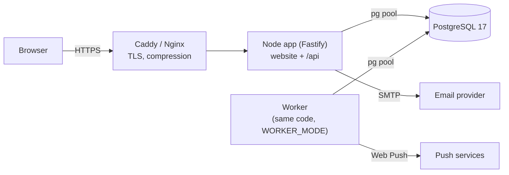
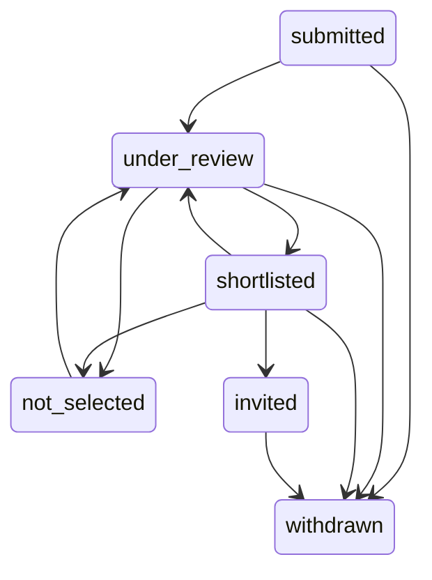

# 05 — Backend Schema & API

**Last updated:** 2026-09-26
**Status:** **Built.** Self-hosted PostgreSQL 17 + a Fastify API + a background worker. Source of truth: [`server/migrations/`](../server/migrations/) (schema) and the route modules in [`server/`](../server/) (API).

Related: [01-PRD §5 form content](01-PRD.md#5-form-content) · [02-TRD](02-TRD.md) · [03-App-Flow](03-App-Flow.md) · [DEPLOYMENT](DEPLOYMENT.md)

---

## 1. Overview

- **Production:** PostgreSQL on the same VPS (Docker container or apt package), configured with `DATABASE_URL` or the standard `PG*` variables.
- **Development and tests:** PGlite (PostgreSQL 17 compiled to WebAssembly) runs in-process. Dev data lives in `.data/pglite/`; tests use `memory://`. The same SQL migrations run on both.
- **Migrations** ([`server/migrate.ts`](../server/migrate.ts)) run at startup (or `pnpm db:migrate`), each in its own transaction, recorded in `schema_migrations`, under an advisory lock. **Never edit an applied migration**; add a new numbered file.

| Migration | Adds |
|---|---|
| `0001_init.sql` | cohorts, consent versions, applications, enums |
| `0002_seed_first_cohort.sql` | consent `2026-09-v1`, cohort `called-generation-1` |
| `0003_identity_audit.sql` | staff users, recovery codes, staff sessions, applicant accounts and sessions, single-use auth tokens, the application ↔ account link, audit events, settings, analytics events |
| `0004_review_workflow.sql` | reviewer assignment, published status and message, internal notes, status history |
| `0005_notifications_jobs.sql` | push subscriptions, notification consent history, announcements, campaigns, messages, deliveries, inbox, job queue |

Existing applications stay valid: new columns have defaults (`published_status = 'submitted'`, no account, no reviewer), and a person can claim an older application after signing in with the same email ([03 §8](03-App-Flow.md#8-applicant-accounts)). Verified on real PostgreSQL 17 over existing data (2026-09-26).

## 2. Data model

### Applications and cohorts (0001, 0002, 0003, 0004)

**`applications`**: one row per expression of interest.

| Column | Type | Constraint / notes |
|---|---|---|
| `id` | uuid | PK. Applicant reference = `SOP-` + first 8 hex chars |
| `cohort_id` | uuid | FK → `cohorts.id` |
| `status` | `application_status` | **internal** review state, default `submitted`. Changes only along allowed transitions (§7) |
| `status_changed_at` | timestamptz | last review change |
| `published_status` | `application_status` | **what the applicant sees**, default `submitted` ("Received"). Set only by an explicit publication |
| `published_message`, `published_at`, `published_by` | text (1–1000), timestamptz, FK → staff | the Programme team's message and who published it |
| `assigned_reviewer_id` | uuid | FK → `staff_users`, `on delete set null` |
| `account_id`, `claimed_at` | uuid, timestamptz | FK → `applicant_accounts`, `on delete set null`; both null or both set |
| `full_name`, `email`, `phone_e164`, `gender`, `age_range`, `state_of_residence`, `city`, `parish_name`, `education_level`, `current_status`, `purpose_clarity` | | the form's answers, as defined in [`0001_init.sql`](../server/migrations/0001_init.sql) with the rules in §5: `email` lower-case and `unique (cohort_id, email)`, phone E.164, `purpose_clarity` 1–5, `parish_name` optional |
| `consent_version`, `consent_at` | text FK, timestamptz | the application's contact consent (separate from notification consent) |
| `submission_meta` | jsonb | `{utmSource, utmMedium, utmCampaign, referrer}`; no IP addresses |
| `created_at` | timestamptz | |

Indexes: `(cohort_id, created_at desc)`, `(cohort_id, status)`, unique `(cohort_id, email)`, `(account_id)` partial, `(email)`, `(assigned_reviewer_id)` partial.

**`application_notes`** (staff only; never returned by any applicant endpoint): `application_id` FK cascade, `author_id` FK set null, `body` 1–4000, `created_at`.
**`application_status_events`**: `kind` review|publication, `from_status`, `to_status`, `actor_id`, `created_at`, one row per change or publication.
**`cohorts`** and **`consent_versions`**: unchanged ([`0001_init.sql`](../server/migrations/0001_init.sql)). A cohort is open when `is_accepting_applications` and now is within the optional open/close times. Cohorts are managed in the admin area.

### Identity (0003)

| Table | Key columns | Notes |
|---|---|---|
| `staff_users` | `email` unique lower-case, `display_name`, `role` (`staff_role`), `status` (invited/active/suspended), `password_hash` (scrypt), `mfa_secret_enc`, `mfa_pending_secret_enc`, `mfa_enabled_at`, `mfa_last_step`, `failed_login_count`, `locked_until`, `invited_by`, `last_login_at`, `suspended_at` | Checks: invited or has a password; MFA secret ⇔ enabled |
| `staff_recovery_codes` | `staff_id`, `code_hash` unique (SHA-256), `used_at` | 10 per staff member; single use |
| `staff_sessions` | `token_hash` unique (SHA-256), `staff_id`, `mfa_verified_at`, `mfa_attempts`, `last_seen_at`, `expires_at`, `revoked_at`, `device_label` | 12 h absolute, 2 h idle (configurable) |
| `applicant_accounts` | `email` unique (verified), `status` (active/suspended), `email_verified_at`, `last_login_at`, `suspended_at` | Created only by a successful sign-in link |
| `applicant_sessions` | like staff sessions | 30 days absolute, 14 days idle |
| `auth_tokens` | `purpose` (applicant_sign_in, staff_invite, staff_password_reset), `token_hash` unique, `email`, `staff_id`, `expires_at`, `used_at` | Single use (atomic `used_at`); sign-in 15 min, invitation 72 h, reset 30 min |

### Operations (0003)

- **`audit_events`**: `actor_type` staff/applicant/system, `actor_id`, `action` (`area.verb`), `target_type`, `target_id`, `details` (identifiers, counts and field names only: never personal data or message bodies).
- **`app_settings`**: owner-editable `support_email`, `applicant_accounts_enabled`, `public_notifications_enabled`, plus `heartbeat_worker`. Never secrets.
- **`analytics_events`**: an allowlisted `name` and coarse `properties` only (§8).

### Notifications and jobs (0005)

| Table | Key columns | Notes |
|---|---|---|
| `push_subscriptions` | `endpoint_hash` unique, `endpoint_enc`, `keys_enc`, `auth_hash`, `push_host`, `account_id` / `staff_id` (at most one), `topics` ⊆ {general, application, training}, `status` (active/expired/revoked), `device_label`, `expiration_time`, `consent_version`, `consent_at`, `last_seen_at`, `failure_count`, `deactivated_at`, `deactivated_reason` | Endpoint and keys encrypted at rest. Checks: application/training topics need an account; staff test devices have no topics; active ⇔ not deactivated. GIN index on active topics |
| `notification_consent_events` | `subscription_id`, `account_id`, `action` (opt_in/update/opt_out/expired/linked/unlinked), `topics`, `consent_version`, `created_at` | Notification consent history, separate from application consent |
| `announcements` | `audience` public/applicants, `cohort_id` (applicants only), `title` ≤ 120, `body` ≤ 5000, `status` draft/published/archived, `published_at` | Public ones on `/updates`; applicant ones in account inboxes |
| `campaigns` | `idempotency_key` unique, `title` ≤ 65, `body` ≤ 180, `link_path` (allowlisted pattern), `topic`, `audience` jsonb `{cohortIds, publishedStatuses}`, `also_inbox`, `ttl_seconds` 300–2 419 200, `status` (draft/scheduled/sending/sent/cancelled), `scheduled_for` (UTC), `time_zone`, `frozen_at`, `created_by`, `scheduled_by`, `dispatched_at`, `completed_at`, `cancelled_at`/`cancelled_by` | Content frozen when scheduled |
| `notification_messages` | `origin` campaign/application_update/test, `campaign_id` (unique for campaigns), `title`, `body`, `link_path`, `topic`, `expires_at` | What was actually sent |
| `notification_deliveries` | `message_id`, `subscription_id`, **unique together**, `account_id`, `status` (queued/accepted/failed/expired/skipped), `attempts`, `last_http_status`, `last_error` ≤ 60, `accepted_at` | One per device per message: no duplicate sends from repeated dispatch |
| `inbox_items` | `account_id` cascade, `kind` application_update/message, `title`, `body`, `link_path`, `message_id` (unique per account), `application_id`, `read_at` | Durable copy: push is only an optional alert |
| `jobs` | `kind`, `payload`, `status` (pending/running/succeeded/failed/cancelled), `run_at`, `attempts`, `max_attempts`, `locked_by`, `locked_until`, `last_error` ≤ 300, `dedupe_key` unique | The queue (§4) |

### Enums

| Enum | Values |
|---|---|
| `gender`, `age_range`, `education_level`, `current_status` | unchanged ([`src/shared/application.ts`](../src/shared/application.ts)) |
| `application_status` | `submitted` · `under_review` · `shortlisted` · `invited` · `not_selected` · `withdrawn` |
| `staff_role` | `owner` · `programme_admin` · `reviewer` · `communications` · `read_only` |
| `staff_status`, `applicant_account_status` | invited/active/suspended · active/suspended |
| `auth_token_purpose` | `applicant_sign_in` · `staff_invite` · `staff_password_reset` |
| `push_subscription_status`, `campaign_status`, `delivery_status`, `job_status` | see the tables above |

## 3. API

JSON everywhere, `Cache-Control: no-store`, `X-App-Build: <release id>`. Errors: `{ "code", "message", "fieldErrors"? }`. **Every state-changing request** from a signed-in area needs the `X-CSRF-Token` header and an allowed `Origin`; public POSTs check `Origin`. Rate limits are per visitor IP.

### Public

| Method & path | Limit | Purpose |
|---|---|---|
| `GET /api/health` | — | DB check |
| `GET /api/cohorts/current` | 120/min | Open cohort |
| `POST /api/applications` | 20/10 min | Submit an application (unchanged; also records `application_submitted`) |
| `GET /api/config` | 120/min | `{accounts:{enabled}, push:{enabled, publicKey}, supportEmail, buildId}` |
| `GET /api/announcements` | 120/min | Published public announcements |
| `POST /api/events` | 60/min | Client analytics event (allowlisted names and properties only) |
| `GET /api/dev/outbox` | — | **Development with the test outbox only**: the emails that would have been sent |

### Push (`/api/push`, 30/min)

| Method & path | Body | Result |
|---|---|---|
| `POST /subscribe` | `{subscription, topics, consentVersion}` | 201/200 `PushDeviceState`. Anonymous devices: `general` only (and only while public sign-ups are on). Signed-in applicants may add `application`/`training` and the device is linked. 409 if the endpoint exists with a different auth secret |
| `POST /status` | `{endpoint, auth}` | The device's state, or `{status:"unknown"}`; updates last seen (reconciliation on app open) |
| `POST /topics` | `{endpoint, auth, topics}` | Changes topics; account topics only by the signed-in owner; no topics → turned off |
| `POST /unsubscribe` | `{endpoint, auth}` | Turns the device off |
| `POST /rotate` | `{oldEndpoint, oldAuth, subscription}` | From the service worker's `pushsubscriptionchange`: moves topics and account link to the new subscription |

### Applicant account (`/api/account`)

`POST /sign-in` (5/10 min; always 202 with the same message; 503 `ACCOUNTS_UNAVAILABLE` when email is off) · `POST /verify` · `GET /me` · `POST /logout` · `GET /applications` (claimed with published status/message; claimable by the same verified email) · `POST /applications/:id/claim` · `GET /inbox` (items + applicant notices) · `POST /inbox/:id/read` · `GET /devices` · `POST /devices/link` · `POST /devices/:id/remove` · `GET /sessions` · `POST /sessions/:id/revoke` · `POST /sessions/revoke-others` · `POST /delete` (`{confirm: email}`).

### Admin (`/api/admin`), every route guarded (session → active → Origin/CSRF → MFA → permission)

| Area | Routes | Permission |
|---|---|---|
| Sign-in | `GET /session` · `POST /login` (10/5 min) · `POST /mfa/verify` (15/5 min) · `POST /mfa/enrol/start` · `POST /mfa/enrol/confirm` · `POST /mfa/recovery-codes` · `POST /logout` · `POST /me/password` · `GET /me/sessions` · `POST /me/sessions/:id/revoke` · `POST /me/sessions/revoke-others` · `POST /setup/check` · `POST /setup/complete` · `POST /password/forgot` · `POST /password/reset` | signed in (or the token) |
| Dashboard | `GET /dashboard` | dashboard.view |
| Applicants | `GET /applicants?q&cohort&status&published&reviewer&claimed&sort&page&pageSize` · `GET /applicants/export.csv?…` · `GET /applicants/:id` · `POST …/:id/notes` · `POST …/:id/assign` · `POST …/:id/status` · `POST …/:id/publish` (`expectedStatus`, 409 if stale) · `POST …/:id/correct` · `POST …/:id/delete` (`confirm` = reference) · `GET /reviewers` | view_all or view_assigned (reviewers: assignments only) · note · assign · review · publish · export · edit |
| Accounts | `GET /accounts` · `GET /accounts/:id` · `POST …/:id/suspend` · `…/reactivate` · `…/revoke-sessions` · `…/delete` (`confirm` = email) | accounts.view · accounts.manage |
| Cohorts | `GET /cohorts` · `POST /cohorts` · `PATCH /cohorts/:id` (local times + `timeZone`) | cohorts.manage (list also for viewers) |
| Campaigns | `GET/POST /campaigns` (`idempotencyKey`) · `GET/PATCH /campaigns/:id` (drafts only) · `POST /campaigns/audience-preview` · `POST /campaigns/:id/test` · `POST /campaigns/:id/schedule` (`when`, `localTime`, `timeZone`, `confirmDevices`, `confirmInbox`; 409 with fresh counts if they changed) · `POST /campaigns/:id/cancel` · `GET/POST /test-devices` · `POST /test-devices/:id/remove` | campaigns.manage · campaigns.send (schedule, cancel) |
| Announcements | `GET/POST /announcements` · `PATCH /announcements/:id` · `POST …/:id/publish` · `POST …/:id/archive` | announcements.manage |
| Staff | `GET /staff` · `POST /staff` (invite) · `POST /staff/:id/role` · `…/suspend` · `…/reactivate` · `…/reset-mfa` · `…/resend-invite` · `…/revoke-sessions` | staff.manage |
| Settings | `GET/PATCH /settings` (with integration health, no secrets) | settings.manage |
| Audit | `GET /audit?action&actor&targetType&targetId&page` | audit.view |
| Legacy | `GET /applications.csv` → 303 to the audited export for signed-in exporters; 401 otherwise | applications.export |

**CSV export** (`/api/admin/applicants/export.csv`): UTF-8 BOM, `Content-Disposition: attachment`, `Cache-Control: no-store`, WAT times; columns Reference, Submitted (WAT), Cohort, **Review status**, **Published status**, Full name, Email, Phone, Gender, Age range, State, City/Town, RCCG parish, Highest education, Current status, Purpose clarity, Consent version, UTM source/medium/campaign, Referrer. Formula-like cells are prefixed with `'`. Every export is audited with the row count and the filters used.

### `POST /api/applications`

Unchanged: see [§4 validation](#4-validation-rules) and the status table: 201 `{id, reference, submittedAt}`, 400 `VALIDATION_FAILED`, 403 `APPLICATIONS_CLOSED`, 409 `ALREADY_APPLIED`, 413, 415, 429 `RATE_LIMITED`. The honeypot field returns a normal-looking 201 and stores nothing.

## 4. Jobs, campaigns and delivery

**Queue** ([`server/jobs/queue.ts`](../server/jobs/queue.ts)): jobs are claimed with `UPDATE … WHERE id IN (SELECT … FOR UPDATE SKIP LOCKED)` and a lease (`locked_until`, 2 min, kept alive while running). A job whose worker dies is claimed again when its lease runs out, and the stale worker can no longer complete it. Retries back off exponentially (30 s, 1 min, 2 min… capped at 1 h, ±20 % jitter, never sooner than a push service's `Retry-After`). `dedupe_key` makes enqueueing idempotent. On shutdown, running jobs get up to 10–20 s and are then handed back without counting the attempt.

| Job | What it does |
|---|---|
| `campaign.dispatch` | At `scheduled_for`: compare-and-set the campaign to `sending`, freeze one message, insert one delivery per eligible device (unique) and the inbox copies, enqueue delivery batches of 100 with deterministic dedupe keys |
| `push.deliver` | For each queued delivery in the batch: **re-check** consent, topic, account status, audience and that the campaign wasn't cancelled; send (6 at a time); record the outcome; re-queue retryable ones as a smaller batch (up to 5 attempts, then `failed`/`retries_exhausted`); expired messages become `expired` |
| `maintenance.cleanup` | Daily at 02:00 UTC (03:00 Lagos): retention (§8) |

**Recipient semantics:** a campaign reaches **devices** (active, not a staff test device, opted in to the topic, and if linked to an account, that account is active). Cohort and status filters need an account with a claimed application in those cohorts/published statuses, so anonymous devices only get unfiltered announcements. **Inbox copies** go to every matching active account whether or not it has a device. Counts are always shown as devices and accounts separately.

**No exactly-once promise:** a push can be sent twice if a worker crashes between sending and recording. The unique delivery per device, the message id as the notification `tag` (a repeat replaces the earlier one on the device) and the push `Topic` header keep duplicates rare and invisible.

**Outcomes:** 201/202 → `accepted` ("accepted by the push service": not "delivered" or "read"); 404/410 → `failed` + the subscription is deactivated as expired; 429/5xx/timeouts → retried; 413/403/401/other 4xx → `failed`. Clicks are counted only when the service worker could report them.

**Application updates:** publishing a decision writes an inbox entry and, for devices with "Application updates" on, a push with the fixed neutral text ("There is an update to your application. Open School of Purpose to view it."), urgency high, valid for 7 days.

## 5. Validation rules

Implemented once in [`src/shared/validation.ts`](../src/shared/validation.ts) (form) and [`src/shared/platform.ts`](../src/shared/platform.ts) (topics, statuses, link allowlist, campaign limits); the server enforces them and database CHECKs are the backstop. Form field rules are unchanged:

| Field | Rule |
|---|---|
| Full name | required; whitespace collapsed; 2–120 chars; contains a letter |
| Email | required; trimmed + lower-cased; `x@y.z`; ≤ 254 |
| Phone | required; normalised to E.164 (Nigerian formats accepted) |
| Gender / Age range / Education / Status | one of the enum values |
| State of residence | one of 36 states, "FCT (Abuja)" or "Outside Nigeria" |
| City/Town | required; 2–80 chars; contains a letter |
| RCCG parish | optional; ≤ 120 |
| Purpose clarity | integer 1–5 |
| Consent version | must exist in `consent_versions` |
| Notification link | one of: `/`, `/about`, `/programme`, `/journey`, `/faq`, `/updates`, `/install`, `/notifications`, `/account`, `/account/application`, `/account/notifications` (checked again by the service worker) |
| Campaign | title ≤ 65, body ≤ 180, topic known, TTL 1 h–28 days, scheduled 1 min–90 days ahead |
| Staff password | 12–128 characters |

## 6. Security and privacy

- **Least privilege:** the public can insert applications and manage their own device's notifications; everything else needs a session. Postgres is never exposed to the internet.
- **Sessions and CSRF:** random 256-bit tokens in `HttpOnly`, `SameSite=Strict` cookies (`__Host-` + `Secure` on HTTPS), stored as SHA-256 hashes, with absolute and idle expiry and revocation. State changes need the per-session CSRF header and an allowed `Origin` (`SITE_URL` in production) and pass a `Sec-Fetch-Site` check.
- **Staff:** scrypt passwords; TOTP with replay protection, 5 attempts per session, and wrong codes counting towards the account lockout (5 failures → 15 min, doubling to 24 h); recovery codes hashed and single use; generic sign-in errors; invitations and resets by single-use links; password reset also needs a current code when two-step verification is on; suspension and role changes revoke sessions; nobody changes their own role; the last owner is protected; first owner only from the server shell (`admin.js create-owner`), no default credentials.
- **Applicants:** passwordless single-use links (15 min, hashed, generic answers, per-IP and per-email throttles, button press to use); claiming needs the verified email to match plus confirmation; suspended accounts are signed out and their devices stop.
- **Push:** VAPID private key only in the server environment; endpoints/keys encrypted at rest; ownership proven with the subscription's auth secret; SSRF protection ([02 §5](02-TRD.md#5-security-model-summary-details-in-05-6)); no silent pushes; every payload has an allowlisted same-origin link, an id and an expiry; lock-screen text for application updates is neutral.
- **Headers:** strict CSP (`script-src 'self'`, `worker-src 'self'`, `manifest-src 'self'`, `frame-ancestors 'none'`), HSTS, `nosniff`, `X-Frame-Options: DENY`, `Referrer-Policy: strict-origin-when-cross-origin`, `X-Robots-Tag: noindex` for `/admin` and `/account`.
- **Logs:** request bodies never logged; auth, cookie and CSRF headers redacted; no endpoints, keys, notification content, emails or names (checked in tests and in the end-to-end run).
- **Service worker:** never caches `/api`, account or admin pages, or any non-GET request (tested).

### Roles and permissions

| Permission | Owner | Programme admin | Reviewer | Communications | Read-only |
|---|:-:|:-:|:-:|:-:|:-:|
| dashboard.view | ✓ | ✓ | ✓ | ✓ | ✓ |
| applications.view_all | ✓ | ✓ | | | |
| applications.view_assigned | ✓ | ✓ | ✓ | | |
| applications.note / review | ✓ | ✓ | ✓ | | |
| applications.assign / publish / export / edit | ✓ | ✓ | | | |
| accounts.view / manage | ✓ | ✓ | | | |
| cohorts.manage | ✓ | ✓ | | | |
| announcements.manage, campaigns.manage, campaigns.send | ✓ | ✓ | | ✓ | |
| audit.view | ✓ | ✓ | | | |
| staff.manage, settings.manage | ✓ | | | | |

Source: [`src/shared/permissions.ts`](../src/shared/permissions.ts). The UI hides what a role can't do; the server enforces it on every route (tested for all five roles).

## 7. Review workflow

Allowed review transitions (anything else is refused, and concurrent changes use compare-and-set):

Publishing copies the current review status (and an optional message) to `published_status`, which is all the applicant sees: Received, Under review, Shortlisted, Invited to the next stage, Not selected, Withdrawn, each with a short neutral description. Notes, reviewers and the internal status are never sent to applicant endpoints (tested).

## 8. Analytics, retention and deletion

**Analytics (proportionate, anonymous):** only these event names, with at most a coarse platform (android/ios/desktop/other), display mode (browser/standalone) and a campaign message id: `application_submitted`, `install_prompt_available` (once per session), `install_prompt_accepted`, `install_prompt_dismissed`, `app_installed` (**observed** installs), `standalone_launch` (**inferred** from display mode, once per session), `push_opt_in`, `push_opt_out`, `notification_click` (a lower bound). No identifiers, cookies, IP addresses, user agents, free text, fingerprinting, session replay, keystrokes, location or background tracking. No demographic or religious data in analytics or notification payloads.

**Retention** (nightly clean-up, [`server/jobs/worker.ts`](../server/jobs/worker.ts)):

| Data | Kept |
|---|---|
| Used or expired sign-in/invitation/reset tokens | 7 days after expiry |
| Ended sessions (revoked or expired) | 30 days after creation |
| Analytics events | 13 months |
| Finished jobs / failed jobs | 30 / 90 days |
| Notification deliveries; non-campaign messages | 180 days |
| Turned-off push subscriptions | 180 days after deactivation |
| Applications, notes, status history, audit events, consent history | **Not yet decided** ([01-PRD Q11](01-PRD.md#8-open-questions)): kept until a retention period is agreed |

**Deletion:** an applicant can delete their account (sessions and inbox go; applications stay, unlinked; devices stop and keep only an anonymous, revoked consent record). Staff can delete an account or an application from the admin area (typed confirmation, audited). Deleting an application also deletes its notes and history.

**Consent:** the application's contact consent (`consent_versions`, per application) and the notification consent (`NOTIFICATION_CONSENT_VERSION`, stored per subscription change in `notification_consent_events`) are separate, and each records its version and time.
