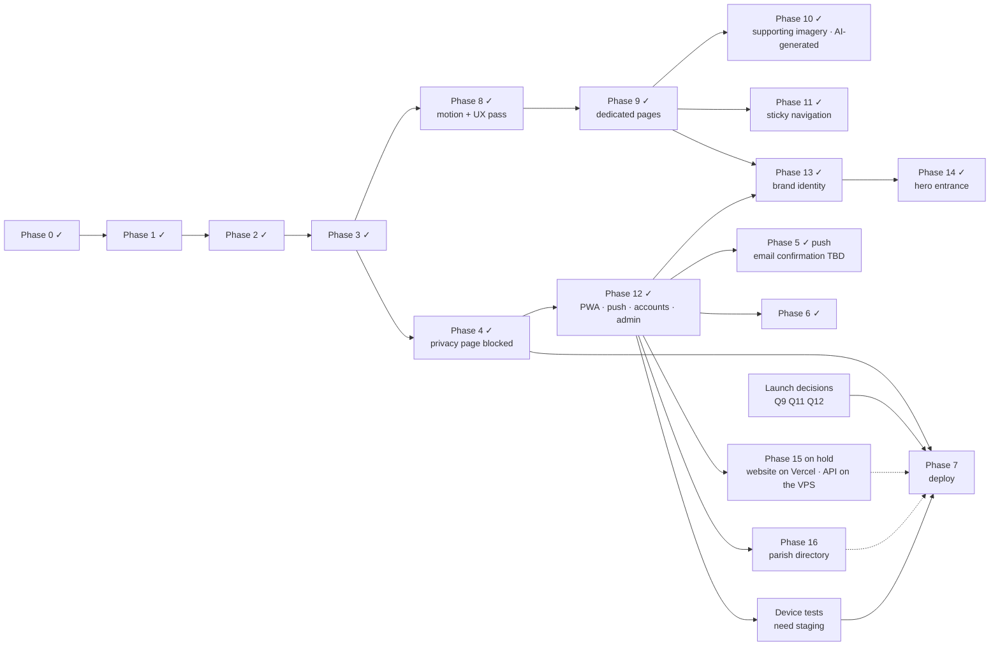

# 06 — Implementation Plan

**Last updated:** 2026-09-30
**Overall status:** Phases 0–6, 8, 9, **10 (supporting imagery, AI-generated)**, 11, **12 (installable app, notifications, applicant accounts, admin platform)**, **13 (brand identity)**, **14 (homepage hero entrance)**, **17 (admin component system, Reports and analytics)** and **18 (reports drill-down from continents to a parish's applications)** are **done**; 7 (launch) and **16 (parish directory: the RCCG directory API is live on the Droplet, synced to release 2026.1; the look-alike choice, 16.10, and switching the question on remain)** are in progress, and **15 (website on Vercel)** is on hold (D-49). **The whole site is live at https://nyayasop.org** (2026-09-30): website, API, worker and database on one DigitalOcean Droplet, installed with `deploy/install.sh` (7.10), with email through Resend (D-50). The earlier Vercel copy (https://school-of-purpose-two.vercel.app, whose `/api` answers 503) is no longer needed. 544 automated tests pass (after the 2026-09-30 security audit, 7.12, the drill-down, 18, the compulsory parish question, 16.9, the RCCG directory API, 16.8, and look-alike parishes, 16.10), plus browser checks in real Chrome (service worker, offline, updates, a real push through Firebase Cloud Messaging) and a production-mode Docker run on real PostgreSQL. **Next:** finish production (the owner's account and two-step verification, a firewall, off-server backups: [next steps](#next-steps-in-order)), ship the look-alike choice (16.10) and switch the parish question on, deploy a staging origin, test on real iPhones and Android phones, and settle the launch content (privacy notice, retention, contact email; see "Content needed").

Status labels: **Done** · **In progress** · **Not started** · **Blocked** (waiting on a decision) · **On hold** (not needed for now) · **TBD** (scope not confirmed)

Related: [01-PRD](01-PRD.md) · [02-TRD](02-TRD.md) · [03-App-Flow](03-App-Flow.md) · [04-UI-UX-Design-Brief](04-UI-UX-Design-Brief.md) · [05-Backend-Schema](05-Backend-Schema.md) · [DEPLOYMENT](DEPLOYMENT.md)

---

## Snapshot

| Area | Status |
|---|---|
| Marketing site | ✅ Homepage (hero, What to expect, previews) plus dedicated `/about`, `/programme`, `/journey` and `/faq` pages with shared header, menu and footer; sticky navigation; responsive 320–1920 px, active-page navigation, accessible menu, optimised images, motion system |
| Application form (consent → 3 steps → review → success) | ✅ Validation, saved progress, route guards, clear errors, compact mobile progress, copyable reference |
| API + database | ✅ Fastify + PostgreSQL, migrations, rate limits, honeypot, duplicate protection |
| Programme team access | ✅ Admin platform at `/admin`: staff accounts with two-step verification and five roles; applicants (search, review, notes, assignment, explicit publication, corrections, deletion, audited CSV); accounts; cohorts; notification campaigns; announcements; staff; settings; audit history; dashboard |
| Applicants after applying | ✅ Optional account (email link): published status, messages, notification settings, devices, sessions, delete · ✅ on since 2026-09-30 (email through Resend, D-50) |
| Installable app + offline | ✅ Manifest, icons, service worker (offline public pages, private pages never cached), update prompt, install guidance per device · ⏳ real-device checks |
| Notifications | ✅ Web Push by topic with consent history, campaigns via a Postgres job queue and worker, neutral application-update alerts, in-app inbox · ⏳ needs VAPID keys; real-device checks |
| Deployment | ✅ Dockerfile, Compose (Caddy HTTPS, app, **worker**, Postgres), backups, bare-metal alternative, CI, verified locally with Docker · ✅ **live at https://nyayasop.org** on a DigitalOcean Droplet, `www` redirected (7.10) · ✅ website-on-Vercel option (`vercel.json` + `/api` middleware, Phase 15; on hold, D-49) · ✅ email through Resend (D-50) · ⏳ firewall, off-server backups |
| Launch content | ⏳ Privacy notice, contact email, cohort dates (see [01-PRD §8](01-PRD.md#8-open-questions)); domain settled: nyayasop.org (Q13) |
| Brand | ✅ Official lockup in every header, menu, footer and the admin area; brand palette; favicons, app icons and social card from the brand mark ([04 §2](04-UI-UX-Design-Brief.md#brand-identity)) |
| Parish directory | ✅ Import command (16.1, dry-run tested on the RCCG list), parish search and application links (16.2), the parish question in the form (16.3, off until switched on), admin screens: Parish review, Parish directory, Reports, parish filters and panels (16.4–16.6) · ✅ the RCCG directory API as the only source (16.8, D-53): a synchronised copy of its releases, freshness checks at submission, the handover from the spreadsheet; tested against a fake of the contract · ✅ checked live read-only (full sync of release 2026.1: 50,081 parishes) · ⏳ the production key on the server · ✅ production key set and first sync done on the Droplet (release 2026.1, 50,081 parishes) · ⏳ look-alike choice (16.10, D-55) before switching the question on · ~~rollout of the spreadsheet (16.7)~~, superseded |
| Admin interface | ✅ shadcn/ui primitives adapted to the brand under the account/admin kit; card-first **Reports and analytics** (six reports, shared filters, Recharts charts, drill-down, comparison table), kept out of public bundles (Phase 17) |
| Photography | ✅ AI-generated supporting photographs: fifteen, one per placement, reviewed, recorded and disclosed ([IMAGERY.md](IMAGERY.md)); hero, brand artwork and Blueprint paintings unchanged |

## Phases

### Phase 0: Prototype import (**Done**)

| # | Task | Status |
|---|---|---|
| 0.1 | Unzip the Figma Make export | Done (2026-09-26) |
| 0.2 | Create the six core docs | Done (2026-09-26) |

### Phase 1: Project foundation (**Done**)

| # | Task | Status |
|---|---|---|
| 1.1 | Git repository | Done: private repository `E310-Tech-Team/nyaya-sop` (GitHub Actions CI in `.github/workflows/ci.yml`) |
| 1.2 | Move the 15 MB reference render out of `src/` | Done: `design/` (compressed copy committed, original ignored) |
| 1.3 | Hosting decision | Done: VPS (D-2) |
| 1.4 | Real metadata: title, description, OG image, favicons | Done |
| 1.5 | Self-host fonts; replace Figma font classes with tokens | Done (127 classes → `font-sans/display/serif`) |
| 1.6 | Design tokens in `@theme` | Done |
| 1.7 | Typecheck script + CI | Done (`pnpm check`, GitHub Actions). ESLint not added (strict TypeScript + tests instead) |
| 1.8 | Remove unused assets | Done (6 unused images dropped; `public/assets/` and `.figma/` removed) |

### Phase 2: Frontend architecture (**Done**)

| # | Task | Status |
|---|---|---|
| 2.1 | Router with a URL per screen | Done: React Router 8 |
| 2.2 | Shared components | Done: `SiteHeader`, `FormLayout`, `Fields`, `Buttons`, … |
| 2.3 | Single form store + saved draft | Done: context + reducer + `sessionStorage` |
| 2.4 | Base-path-aware assets | Done: images imported via Vite (hashed) |
| 2.5 | Remove interpolated Tailwind class names | Done |

### Phase 3: Form correctness, content & accessibility (**Done**)

| # | Task | Status |
|---|---|---|
| 3.1 | Shared validation (client + server) | Done: `src/shared/validation.ts` |
| 3.2 | Back on Step 1 | Done |
| 3.3 | Review screen | Done |
| 3.4 | Design/copy inconsistencies D1–D10 | Done except D2 (org-name variants kept; confirm) |
| 3.5 | Accessibility A1–A14 | Done: 0 axe violations on all screens |
| 3.6 | Full state list | Done (confirm "Outside Nigeria") |
| 3.7 | 16 px inputs on mobile | Done |

### Phase 4: Backend & submission (**Done**)

| # | Task | Status |
|---|---|---|
| 4.1 | Database schema + seed (first cohort, consent v1) | Done: `server/migrations/` |
| 4.2 | `POST /api/applications`: validation, normalisation, rate limit, honeypot, 409 duplicates | Done (CAPTCHA not added) |
| 4.3 | Frontend submit with every error state | Done |
| 4.4 | Accurate success copy + reference number | Done |
| 4.5 | Privacy notice page | **Blocked**: needs wording from the Programme team (Q9) |
| 4.6 | `GET /api/cohorts/current` + closed state | Done |
| 4.7 | CSV export for the Programme team | Done; since Phase 12 the audited admin export (`/api/admin/applicants/export.csv`, export permission); the old Basic-auth address only redirects signed-in exporters |

### Phase 5: Notifications (**Done** for push; email confirmation **TBD**)

| # | Task | Status |
|---|---|---|
| 5.1 | Applicant confirmation email (provider, sender domain with SPF/DKIM, template) | TBD (PRD F10). The email transport now exists (sign-in links, invitations); a confirmation template can use it |
| 5.2 | Web Push: topics, consent, campaigns, application-update alerts, inbox | Done (Phase 12) |

### Phase 6: Reviewer tools (**Done**, Phase 12)

| # | Task | Status |
|---|---|---|
| 6.1 | Reviewer login, list/filter, status updates, notes | Done: the admin platform |
| 6.2 | Cohort open/close UI | Done: Admin → Cohorts |

### Phase 7: Hardening & launch (**In progress**)

| # | Task | Status |
|---|---|---|
| 7.1 | Responsive fix 768–1280 px | Done: verified 320–1920 px |
| 7.2 | Image optimisation | Done: 11.6 MB → 1.3 MB WebP, lazy loading |
| 7.3 | Reduced motion | Done |
| 7.4 | Working nav / "See how it works" | Done |
| 7.5 | Analytics | Done: proportionate, anonymous first-party events only ([05 §8](05-Backend-Schema.md#8-analytics-retention-and-deletion)); UTM attribution captured with applications |
| 7.6 | Tests | Done: 292 Vitest tests in 19 files (unit, API/DB, auth, admin, push, jobs, service-worker policy, time zones, platform detection) + scripted Chrome checks · *Planned:* committed Playwright E2E, Lighthouse CI |
| 7.7 | SEO | Done: indexable, OG image, favicons (set `SITE_URL`) |
| 7.8 | Deployment artifacts | Done: Dockerfile, Compose + Caddy, backups, systemd/Nginx alternative, runbook |
| 7.9 | Verify the Docker image and stack | Done (2026-09-26): built and run locally against real PostgreSQL 17 through Caddy HTTPS; submissions, CSV export, backup/restore and graceful shutdown verified; re-verified the same day with the worker service, migrations 0003–0005 over existing data, owner bootstrap in the container and staff sign-in with two-step verification |
| 7.10 | Deploy to the VPS | **Done** (2026-09-30): https://nyayasop.org on a DigitalOcean Droplet (Frankfurt; Ubuntu 24.04, 1 vCPU, 1 GB RAM plus the installer's 2 GB swap), installed from `main` with `deploy/install.sh`: Caddy HTTPS, app, worker, Postgres 17, VAPID keys, the first owner invited (setup link handed over privately), nightly backups at 02:30 UTC (one taken and checked); unattended security updates on, SSH by key only. Checked live: `/api/health` ok, security headers, HTTP → HTTPS, pages, release id. `www.nyayasop.org` redirects to it (`WWW_REDIRECT`, added the same day: Caddy only serves `www` when its DNS points at the server). Email through Resend from the same day (SMTP on port 2465, D-50): the key accepted, applicant sign-in on. Still to do: a Cloud Firewall, off-server backup copies, an uptime monitor |
| 7.11 | Real-device QA (low-end Android, iOS Safari, VoiceOver/TalkBack), including install and push on iPhone/iPad 16.4+ and Android | Not started: needs the staging origin ([DEPLOYMENT](DEPLOYMENT.md#staging-and-device-testing)) |
| 7.12 | Security audit and fixes (2026-09-30) | Done, locally (the detailed report stays with the maintainers, outside the repository and deployments). Hardened: sign-in attempt limits counted before each check (password, two-step and reset codes), a new session after two-step verification, keyed recovery-code hashes, link tokens voided on security events and taken out of the address bar, an owner "unlock" action, the last-owner rule in one locked statement, background "forgot password" emails; removed devices unlinked from accounts and not re-linked by rotation; the applicant-accounts switch closes sessions; the Vercel middleware pinned to `API_ORIGIN`; development servers refuse to run on a network; text cleaned of unstorable characters; single-valued query strings; CSV fields all quoted; a bounded, linear XLSX reader; database errors logged without their values and data errors answered with 400; `Permissions-Policy`; dotfiles never served; push subscriptions refused as malformed switched off; device identifiers erased on account deletion; install script (fresh base images, stop on a failed backup, secrets off the command line), bare-metal backups, least-privilege CI. Migration 0009. 38 regression tests; `pnpm check`, `pnpm audit` (no known vulnerabilities) and a headless-Chrome pass of the changed screens |
| 7.13 | Database roles: migrations with an owner role, the app and worker with a data-only role (and no rights to rewrite the audit history) | Not started ([DEPLOYMENT](DEPLOYMENT.md#database-roles)) |
| 7.14 | Backups encrypted and copied off the server automatically, with failure alerts | Not started: an operational choice (storage provider, keys) |
| 7.15 | CI: pin third-party actions to commit SHAs and keep them current (Dependabot or Renovate) | Not started |

### Phase 8: Motion & UX refinement (**Done**, 2026-09-26)

| # | Task | Status |
|---|---|---|
| 8.1 | Motion system: tokens, hero entrance, scroll reveals, drawer, button feedback, form-state transitions, Success choreography, reduced motion (CSS + JS) | Done: [04 §6](04-UI-UX-Design-Brief.md#6-motion), `src/lib/motion.ts` |
| 8.2 | Hero: at-a-glance summary + "Start my application" / "Explore the programme" | Done (primary is the light pill; stacked on phones) |
| 8.3 | "What to expect" section between the hero and the editorial sections | Done (single responsive tree, `.landing-scale`) |
| 8.4 | Participant journey hierarchy (number + name, duration/format, what happens, next) | Done: mobile timeline; desktop cascade kept (positions, sizes, route lines) |
| 8.5 | FAQ before the final CTA | Done: 7 native `
` items, verified copy only |
| 8.6 | Welcome: three groups, time estimate by the button, no delayed entrance | Done |
| 8.7 | Compact mobile form chrome + honest Review state | Done: 60 px header + one-row progress; first question ≈ 240 px higher on a 390 px phone |
| 8.8 | Saved-progress message (matches `sessionStorage`) | Done |
| 8.9 | Success: "not an offer" wording, Copy reference with announced result + manual fallback, no confirmation-email claim | Done |
| 8.10 | Programme copy in one place | Done: `src/config/programme.ts` |
| 8.12 | Motion upgrade: section choreography (groups on authored timelines), photography depth, Blueprint deck deal, directional Journey route lines, animated FAQ disclosure, transition-based menu that reverses mid-close, refined buttons/nav underline; reduced motion live; verified pixel-identical settled UI | Done (2026-09-26): [04 §6](04-UI-UX-Design-Brief.md#6-motion) |
| 8.13 | Hero simplified: eyebrow, "Discover your purpose. / Prepare to lead.", one sentence, one eligibility line, two CTAs; edition panel and checklist removed; "The Called Generation" kept as a caption; photograph higher on phones | Done (2026-09-26) |
| 8.11 | Fixes found while verifying | Done: 320 px horizontal scroll (Vision eyebrow); menu slide-in cancelled by focus scrolling its container; hero entrance replaying after keyboard focus left it; Success page scrollable sideways by focus/selection; header lockup clipped at 320 px; desktop Vision headline descenders clipped; stale Figma utilities in the CSS bundle (docs now excluded from Tailwind scanning) |

### Phase 9: Dedicated marketing pages (**Done**, 2026-09-26)

| # | Task | Status |
|---|---|---|
| 9.1 | Routes `/about`, `/programme`, `/journey`, `/faq` under one layout route (`MarketingLayout`): header stays mounted, each page and the footer re-arm scroll reveals; titles "About · School of Purpose" etc. | Done |
| 9.2 | Shared marketing chrome (`src/components/marketing/`): header, desktop nav (light on the homepage hero, dark on the other pages), phone/tablet menu, footer, page intro, apply band, CTA pills, "read more" link, eyebrow | Done |
| 9.3 | About: calling, Vision & Mission, **Who the programme serves**, Biblical Blueprint. Programme: Purpose Boot Camp, Doctrine of Purpose, **How the programme runs** (virtual training, merit selection, boot camp for selected participants with sponsorship, mentorship and community). Journey: applying set apart from being selected, six stages in order. FAQ: seven approved questions in three topic groups with links onwards | Done: verified copy only (`src/config/programme.ts`) |
| 9.4 | Homepage shortened: hero and What to expect kept; the long editorial sections replaced by four previews (ids `about`, `programme`, `journey`, `faq` kept, so old `/#…` links still land on the right topic); closing invitation kept; hero **Explore the programme** → `/programme` | Done |
| 9.5 | Active page: `NavLink` + `aria-current="page"` in the header nav, menu and footer; bold weight and a resting underline | Done |
| 9.6 | Fix found while verifying: the homepage hero's photograph and ring covered the desktop nav, so mouse clicks on Home/About/Programme/Journey/FAQ did nothing (present since the Figma export; keyboard worked) | Done: `pointer-events: none` on both layers; every link, button and FAQ question is now hit-tested at every width |
| 9.7 | Verification | Done: 5 pages × 7 widths automated (overflow, clipping, one `<h1>`, heading levels, active nav, links, images, duplicate ids, hit-testing); navigation incl. Back/Forward/refresh; menu; hash links; keyboard FAQ; skip link; reduced motion; axe 0 violations; all 49 application screen captures pixel-identical to before; contact links checked with and without `VITE_CONTACT_EMAIL` |

### Phase 10: Supporting imagery (**Done**, 2026-09-29)

First a search for authentic NYAYA photos (2026-09-26), which stalled on permission; then, on 2026-09-29, the owner authorised AI-generated supporting photographs instead (D-27).

| # | Task | Status |
|---|---|---|
| 10.1 | Audit the supporting photographs (hero, Blueprint paintings and artwork out of scope) | Done (2026-09-26): all were prototype stock/AI images; `journey-04` (invented Redemption City banner) and `journey-06` (invented summit banner) the priority |
| 10.2 | Find and verify official RCCG NYAYA photo sources | Done: RISE (NYAYA's skills initiative) was the only source with suitable real photos ([IMAGERY A1](IMAGERY.md#a1-sources-checked-2026-09-26)) |
| 10.3 | Shortlist candidates per section | Done: 7 candidates, all watermarked "RISE 30", none with reuse terms ([IMAGERY A2](IMAGERY.md#a2-candidates-still-without-permission)) |
| 10.4 | Written permission from NYAYA / RISE | Superseded by D-27; still an option (C13) |
| 10.5 | AI-generated supporting photographs | Done (2026-09-29): nine photorealistic images generated by the owner with Codex's image tool (`design/imagery/2026-09-29/prompts.json`), each reviewed (all passed), masters committed, site files built by `scripts/imagery-assets.py` (WebP q80, at most 1200 px, same file names), a crop focus per slot, new alt text, and a disclosure in the footer and on the success page. Hero, brand artwork and Blueprint paintings unchanged ([IMAGERY.md](IMAGERY.md)) |
| 10.6 | Verification | Done: every photo checked in its containers at 320, 390, 768, 1280, 1440 and 1920 px in headless Chrome, with normal and reduced motion: all load at full opacity, faces stay in every crop, no overflow, no layout shift on the marketing pages. The homepage hero is pixel-identical to `main` at 390/768/1440/1920 px. `pnpm check`. The success page's small shift (0.013 at 768 px) comes from its API-driven cards, not the images (0 with the API unavailable, as on the live site). **Not yet:** real devices |

**2026-09-30 refinement:** Removed six cross-page photo reuses with six newly generated dedicated assets (two homepage previews and four Programme cards). Each supporting editorial placement now has a unique image. Generation records: `design/imagery/2026-09-30/prompts.json`; policy and placements: IMAGERY §6. Hero unchanged. Validation: `pnpm check`; all 15 supporting image files have distinct SHA-256 hashes, and `imagery.test.ts` checks that no placement shares a photo and that the card photos' alt text claims no real participants or events. Browser check (headless Chrome, local production build, 320–1920 px plus 600/639/700/767 px where the `/programme` cards are widest): each photo appears on exactly one page, loads fully, keeps every face in view, with no overflow or layout shift. The `/programme` focus values were raised to 22–30% for headroom in those crops and to keep the boot camp badge clear of heads. `PHASE_ART` moved to `src/components/landing/programmePhotos.ts` (a page module shouldn't export data), and `scripts/imagery-assets.py` builds both batches from one table (outputs byte-identical).

### Phase 11: Sticky navigation (**Done**, 2026-09-26)

| # | Task | Status |
|---|---|---|
| 11.1 | Marketing header sticky on every marketing page and width (`StickyHeader`, `position: sticky`); application pages unchanged | Done |
| 11.2 | Homepage desktop header moved out of the zoomed hero (it would have been trapped by the hero's clipping and height) into a sticky header laid out on the same 1440 px frame: identical at the top, 16 px sticky offset so the scrolled bar is 96 px | Done |
| 11.3 | Scrolled look from a 1 px IntersectionObserver sentinel: opaque burgundy, hairline + soft shadow, homepage nav switches to the dark tone (180 ms cross-fade, Apply pill keeps its size, arrows cross-faded); reduced motion instant | Done |
| 11.4 | Scroll offsets: `scroll-margin-top` on anchor targets and focusable content (header height + 16 px). `scroll-padding-top` was tried and rejected: focusing inside the sticky header made the page jump ≈ 450 px | Done |
| 11.5 | Menu: returns focus without scrolling; panel scrolls on short/landscape screens (its 615 px of content was cut off below ≈ 620 px tall); closes itself above 1280 px so a resize can't leave a hidden drawer holding the scroll lock | Done |
| 11.6 | Verification | Done: top of every page pixel-identical to before at 320–1024 px (desktop: sub-pixel antialiasing only, geometry identical); 67 sticky checks at 7 widths (both scroll directions, no layout jump, scaling at 1280 px, anchors and deep links, route changes, keyboard focus never under the header, menu at the top and mid-page, 375–480 px tall screens, resize with the menu open, skip link, reduced motion); earlier interaction suite and 35-combination sweep re-run; application screens 49/49 identical; axe 0 violations |

### Phase 12: Installable app, notifications, accounts and admin platform (**Done**, 2026-09-26)

Built in the brief's six working phases; each has its tests.

| # | Phase | What landed | Status |
|---|---|---|---|
| 12.1 | Architecture, schema, authentication | Migrations 0003–0005; staff accounts (scrypt + TOTP + recovery codes, lockout, invitations, reset), five roles checked on every route, applicant email-link sign-in, sessions + CSRF, audit trail, settings, analytics allowlist; `admin.js create-owner` bootstrap | Done · tests: `auth`, `admin` |
| 12.2 | PWA foundation, install guidance, offline | Manifest + icons, service worker built by `scripts/vite-pwa.ts`, caching policy (tested), offline page, update prompt, stale-asset handling, kill switch, `/install` with per-browser steps, in-app browser advice, install entries in footer and menu | Done · tests: `routing`, `install`; Chrome checks |
| 12.3 | Accounts, notification onboarding, preferences | `/account` area (overview, application with claiming, messages & notifications, settings), notification card on Success, `/notifications` settings with every state, topics, devices, inbox, `/updates` | Done · browser walk-through |
| 12.4 | Web Push, jobs, scheduling, delivery | SSRF-safe transport, VAPID with token reuse, encrypted payloads, subscription ownership and rotation, Postgres queue with leases and retries, worker (inline or separate), campaigns with frozen content and time zones, delivery re-checks, 404/410 deactivation, retry/expiry, reconciliation on app open | Done · tests: `push`, `jobs`, `time`; real FCM push in Chrome |
| 12.5 | Admin dashboard, applicant management, campaigns | Dashboard with truthful labels; applicants (search/filter/sort/pages, detail, notes, assignment, transitions, explicit publication, corrections, deletion, audited CSV); accounts; cohorts; campaign editor (preview, live counts, tests, schedule, confirmation, cancel); announcements; staff; settings with integration health; audit history; own security | Done · tests: `admin`; browser walk-through |
| 12.6 | Security, privacy, docs, final verification | Log privacy checks, account-deletion fix (FK + CHECK), dispatch race fixes, SQL parameter typing fix, docs 02–06 + DEPLOYMENT + AGENTS, Compose worker service, production-mode Docker run | Done |

**Verified vs not verified:** everything above is verified by automated tests and in desktop Chrome/Chromium. **Not yet verified:** real phones and tablets (iOS/iPadOS Home Screen install and push, Android Chrome and Samsung Internet), Safari on macOS, Firefox, Edge on Windows, screen readers, and axe-core on the new screens. **Not configured yet:** an SMTP provider (so applicant sign-in is off in production) and VAPID keys (so push is off) until they are set on the server.

### Phase 13: Brand identity (**Done**, 2026-09-28)

From the brand guideline ("School of Purpose 4.pdf": lockups, rationale, palette) and the 4× logo exports supplied with it.

| # | Task | Status |
|---|---|---|
| 13.1 | Brand masters | Done: moved out of `public/` (they would have shipped, 4 MB, spaces in the URLs) to [`design/brand/`](../design/brand/README.md) with clear names; two byte-identical copies dropped; README with the palette, rationale and usage rules |
| 13.2 | Official lockup instead of the "SOP" text monogram | Done: `BrandLockup` in the homepage and marketing headers, phone menu, footer, application header (cream on burgundy, colour on paper), admin sidebar and staff sign-in; offline page shows the mark |
| 13.3 | Favicons, app icons, notification badge | Done: `scripts/brand-assets.py` resizes the mark (favicon `.ico` + 32 px PNG, `any` and maskable 192/512, iOS 180 px, Android badge); `favicon.svg` and `scripts/generate-icons.mjs` retired |
| 13.4 | Brand palette | Done: `#841D26` / `#F3F0E6` / `#B69B63` replace the prototype's colours in the tokens, the Figma-export arbitrary values and `rgba()` tints, manifest, theme colour, offline page and emails. Hero photo and artwork files unchanged. Contrast recomputed ([04 §2](04-UI-UX-Design-Brief.md#brand-palette-adopted-2026-09-28)) |
| 13.5 | Social card | Done: new `og-image.jpg` captured from the production hero with the lockup; the old Figma crop still showed the prototype headline |
| 13.6 | Fix found while verifying | Done: the first service-worker install claimed the page and every first-time visitor was offered "A newer version of the site is available". The first claim is now silent; the real update flow was re-checked end to end |
| 13.7 | Verification | Done: `pnpm check` (265 tests); production build in headless Chrome, 30/30 (icons served and decoded at their sizes, installable, lockups precached, offline page, first visit silent, two-tab update flow); text-contrast scan of 13 pages at 390 and 1440 px (no failures); UI walk-through at 375, 1280 and 1440 px. **Not yet:** the new icons on real devices (Android maskable shape and status-bar badge, iOS Home Screen) |

### Phase 14: Homepage hero entrance (**Done**, 2026-09-29)

The first step of the animation work (branch `feat/animation`). The rest of the motion plan (scroll storytelling, Journey route drawing, page transitions, Three.js, micro-interactions) waits for decisions on 3D placement, the new path line, the budgets and Safari testing.

| # | Task | Status |
|---|---|---|
| 14.1 | Baseline | Done: bundle sizes, frame pacing, load metrics and 104 settled screenshots (13 pages × 4 widths × motion/reduced) of the build before any change. Headless Chrome here runs at 60 Hz, so the old "p95 9.2 ms" (120 Hz) was re-baselined. Found on the way: Chrome's full-page capture restarts entrance animations mid-shot, so captures now grow the viewport height instead |
| 14.2 | Hero entrance | Done: one GSAP timeline per layout (`src/lib/heroMotion.ts`, timing tables tested), ≈ 2.3 s on desktop and ≈ 2 s on phones instead of ≈ 1 s ([04 §6](04-UI-UX-Design-Brief.md#homepage-hero-gsap-2026-09-29)). The photograph is decoded before it appears (it froze the phone entrance for ≈ 360 ms) |
| 14.3 | Extras | Done: the glow breathes after the entrance (CSS, paused off-screen); on desktop the participants drift and recede as the page scrolls away (CSS scroll-driven, attached only once scrolled, feet always inside the frame) |
| 14.4 | Verification | Done: `pnpm check` (269 tests); settled hero equals the page without motion pixel for pixel at 390–1920 px and every other page matches the previous build; entrance 0 dropped frames; LCP 676 ms (390 px, 4× CPU) and 64 ms (1440 px); first-load JS +28.8 KB gzipped. **Not yet:** real phones, Safari (automation not enabled), Firefox (no scroll-driven animations: no drift there, by design) |

### Phase 15: Website on Vercel, API on the VPS (**On hold** since 2026-09-30, D-49)

Vercel (the owner's personal team "Zacchaeus' projects", project `school-of-purpose`) serves the website; the VPS keeps the API, worker and database ([DEPLOYMENT §C](DEPLOYMENT.md#c-website-on-vercel-api-on-the-vps), D-26). Since 2026-09-30 the whole site runs on the DigitalOcean Droplet instead (D-49), so the split isn't used; its code stays, tested, in case the website moves to Vercel later.

| # | Task | Status |
|---|---|---|
| 15.1 | `vercel.json`: build (`pnpm run build:web`, pinned pnpm through Corepack), the server's security headers, cache rules and SPA fallback | Done: Vercel routing phases, so long caching applies only to existing files (404s uncached, like the server). `server/vercel-config.test.ts` compares every header and cache rule with the server and rejects two rules setting one header |
| 15.2 | `/api` → VPS | Done: `middleware.ts` (Vercel Routing Middleware, Node.js) forwards to `API_ORIGIN` with the visitor's address and `EDGE_PROXY_SECRET`; 503 in the API's error format until both are set |
| 15.3 | Per-visitor rate limits and logs behind Vercel | Done: `server/edge-proxy.ts` checks the secret (constant time) before Fastify logs the request or works out its address, and always removes both headers; `EDGE_PROXY_SECRET` config checks; `SITE_URL` can differ from `DOMAIN` in Compose |
| 15.4 | Release ids | Done: Vercel builds are named after the commit; API responses through Vercel carry Vercel's release (the VPS leaves its own out), so update offers follow website deploys; Settings shows both ids when they differ |
| 15.5 | Deploy | Done: production at https://school-of-purpose-two.vercel.app (`school-of-purpose.vercel.app` was taken), deployed with the CLI from a clean export of this branch. Checked live: headers and caching for every kind of path equal the server's, deep links, 404s, `/api` 503; headless Chrome shows no CSP violations or errors and the service worker installs |
| 15.6 | Connect the VPS | On hold (D-49): only if the website moves to Vercel. Then `API_ORIGIN` in Vercel, `SITE_URL` + `EDGE_PROXY_SECRET` on the VPS (the secret is in the gitignored `.env.edge-proxy` on the machine that set up Vercel), and DEPLOYMENT §C3's checks |
| 15.7 | Git deploys | On hold (D-49): `main` has `vercel.json` and the middleware, so the repository can be connected in Vercel whenever the split is wanted; until then deploys are made with the CLI |

### Phase 16: Parish directory (**In progress**, 2026-09-30)

Applicants will choose their RCCG parish from the RCCG list instead of typing it: they type only the parish, and province, region and continent fill in and are locked. Staff get parish-based filters and reports. The reviewed plan, with the screens and metrics: [Parish Directory Plan](https://claude.ai/artifact/KQSCTs4DYDpe6Vgr3du8Hz) (D-28 to D-34; D-35 to D-39 settle how the admin screens work). Data: the RCCG parish list (50,107 rows; Nigeria only; no zone, area or codes; before the August 2026 changes) and the 2026 list of new regions and provinces. Since 16.8 (D-53) the RCCG directory API is the source, and the spreadsheet is no longer used. Schema and import rules: [05 §2](05-Backend-Schema.md#parish-directory-0006-0008); running an import: [DEPLOYMENT](DEPLOYMENT.md#parish-directory).

| # | Task | Status |
|---|---|---|
| 16.1 | Schema (0006) and `pnpm directory import / revert / lineage / status`: a swappable source (spreadsheet now, API later) with a built-in .xlsx reader, name cleaning, same-name rows listed once, parishes with no province, moves detected through `unit_lineage`, one-transaction apply ending with a consistency check, revert, an issues CSV for RCCG | Done: 50 tests (PGlite, including apply → re-apply → revert and a fake API source). A dry run of the RCCG list takes about 3 s: 48,479 entries, 1,521 same-name groups, 181 parishes with no province, 22 provinces with no state. Nothing imported yet |
| 16.2 | Public parish search (the applicant's state first, province words, "LP 12"), lookup and submit validation; `applications` link columns; Settings switch (off) | Done: migration 0007 (`pg_trgm`, search text, `parish_id`/`parish_status`/`parish_snapshot`, `parish_reports`); `GET /api/parishes/search` and `/:id`; submit accepts a confirmed listed parish or "I can't find my parish" and still takes older forms' free text; `parishDirectory.enabled` in `/api/config`; the Settings switch (API only; refused until a list is imported); request logs no longer include query strings. 19 API tests; at 48,000 synthetic parishes most searches take 8–42 ms in PGlite |
| 16.3 | The form: suggestions, prefilled and locked province, region and continent, confirmation, "I can't find my parish", "Details look wrong?", draft re-checks, offline, accessibility; the question becomes required | Done: `ParishPicker` (ARIA combobox, confirmation card, not-listed name), draft `parishMode`/`parish` with a once-per-load re-check, review summary, submit only sends `parish` in directory mode. 14 unit tests; walked through in Chromium with made-up parishes (keyboard, announcements, focus, validation, not listed, outside Nigeria, rename and removal re-checks, 375 px). Screen-reader pass on devices still to do |
| 16.4 | Admin: Applicants list and detail, Parish review, Settings | Done: migration 0008 (staff links on applications, earlier answers reviewed); the Applicants list's Parish column and filters (parish answer, directory parish, dates, any unit), the export's province, region and continent; the applicant's parish panel with "change parish"; Parish review (link, add, fixed, close; exact matches confirmed together, each re-checked); Settings switch with the directory's readiness; permissions reports.view, directory.view, directory.manage (owners and programme admins) and `staffGuard` `allOf` |
| 16.5 | Parish directory screen: the tree, the Imports tab, splitting a same-name group | Done: staff corrections ([`edits.ts`](../server/directory/edits.ts)): add, rename, move, state, deactivate/reactivate, merge (parishes and units; applications follow), split; each recorded, cache-checked and audited. Imports keep them (`staff_fields`, `source_unit_id`) and list where the source differs; an import can't be reverted once staff have corrected the directory since. The screen: tree with counts and markers, entry panel with history, Imports and 2026 changes tabs |
| 16.6 | Reports by continent, region, province and parish; dashboard card; totals export | Done: drill-down with a "No province" row and the answers with no parish, review and published status views, parishes represented, a weekly/daily trend, CSV of the totals (audited, directory version on each row), dashboard card; filters shared with the Applicants list so every count opens those applicants (tested); "fewer than 5" for roles without applicant details. 41 new tests (421 in all); checked in Chromium on a local build with made-up parishes, at 1280 and 375 px |
| 16.7 | Rollout with the current list: back up, dry run, apply, switch the question on | **Superseded** (2026-09-30, D-53): the live site goes straight to the RCCG directory API (16.8). The spreadsheet was never imported there, so there's nothing to hand over; the import commands remain for a database without the API |
| 16.8 | Connect the RCCG directory API | **Built, and checked live read-only** (D-53). **Contract:** verified from the provider's published OpenAPI description: bearer keys per environment, immutable releases with paged change feeds, lookup by canonical code, no webhooks. **Built:** the client (fixed production/sandbox addresses, response checks, timeouts, bounded retries honouring `Retry-After`); the worker's polling sync (release chain replayed into the hierarchy, matched by provider ID, one transaction with history and the consistency check; only a retirement deactivates); freshness (a stale copy makes submissions confirm the parish live, 503 rather than accepting it unverified); the handover (spreadsheet rows retired, exact-match report, nothing relinked); the API as the authority (imports and staff edits refused); Settings (release, freshness, last problem, Check now); `pnpm directory sync / api-status / legacy-report`; `deploy/directory-key.sh`. **Tests:** migration 0010 and 34 new tests (536 in all), against an in-memory fake of the contract; CI never uses a key. **Checked live (2026-09-30), read-only, with the production key, from a developer computer:** release `2026.1` ("17th August 2026 approved list", effective at Lagos midnight on 17 August); paging, search, lookup by code, a missing code, and a wrong key refused; a full sync into a scratch database took 255 requests in 7.8 minutes with no rate limiting, and built 6 continents, 73 regions, 489 provinces and 50,081 parishes, with no data problems, a clean consistency check, and a second sync that changed nothing. **The provider's data:** **1,500 groups of same-named parishes within one unit** (3,102 parishes), each with its own code but nothing to tell them apart (handled by 16.10, D-55); one parish name with a phone number in it; 29 provinces whose name gives no state; its published sandbox host doesn't resolve in DNS. **Live on the Droplet (2026-09-30):** the production key was set with `deploy/directory-key.sh`, and the worker's first sync applied release `2026.1` (50,081 parishes, 568 units, 0 issues). The parish question stays off until 16.10 ships |
| 16.9 | The parish question compulsory in every layer (reported 2026-09-30: "not enforced", "region, province and continent not working") | Done, locally (D-52). Causes: production had no directory switched on, so the form asked the old optional free-text question and never showed a province, region or continent; while the directory was on, the server still accepted a body without `parish` (typed text or nothing), and a draft started while it was off reached the review and submitted with no parish, because only the Personal step read the setting. Fixed: shared rule (the directory's answer while on, the name while off), server refusal of bodies without it, every step following the setting (`useParishQuestion`), loading/failed states that block the step, stale search results ignored, a parish with no continent reported instead of filled in, honest "details look wrong" note, clearer messages, the review showing the chain level by level. 14 new tests (502 in all); reproduced and re-checked in the browser against the real list (48,479 parishes) in a scratch database. **The live form keeps asking for the name until 16.7 switches the list on** |
| 16.10 | Look-alike parishes: same-named parishes in one unit offered as one choice (D-55) | **Built, locally** (branch `feat/parish-lookalikes`; not merged or deployed). **Search and form:** search returns each group once, as its first parish by code, with how many it stands for; the form's options, the chosen card and the review say so. **Submission:** it links the group's first parish (so unit counts are right), keeps the group in the snapshot, and raises a `lookalike` report. **Parish review:** a "Which parish?" list shows each candidate's RCCG code and applications, and links the right one. The reports backlog and the applicant page count and show it. **Data and tests:** migration 0012; 8 new tests (544 in all). Not yet checked in a browser |

### Phase 17: Admin component system and Reports and analytics (**Done**, 2026-09-30)

The admin's reports become card-first on a shared component system: [shadcn/ui](https://ui.shadcn.com) primitives adapted to the brand tokens, with the account/admin kit built on them ([04 §5](04-UI-UX-Design-Brief.md#5-components-srccomponents), [§10](04-UI-UX-Design-Brief.md#10-app-account-and-admin-surfaces-2026-09-26)). D-40 to D-43.

| # | Task | Status |
|---|---|---|
| 17.1 | shadcn/ui set-up without global changes: `components.json`, `cn`, primitives in `src/components/ui/` (Button, Card, Badge, Alert, Input, Select, Popover, Calendar, Tabs, Sheet, Skeleton, Table, Breadcrumb, Chart) on the brand tokens; the kit (`ui/index.tsx`) rebuilt on them with its API unchanged; `ui/basic.tsx` for what public pages use | Done: public bundles unchanged in libraries (their first load is ≈ 4 KB smaller); `bundles.test.ts` guards it; other admin and account screens checked for regressions |
| 17.2 | Card-first Reports and analytics: Overview, Regions and parishes, Over time, Review and decisions, Parish answers, Cohorts; shared filters in the URL (quick periods and a Lagos-day calendar, Radix selects, place finder; a sheet on phones) with the period and chips in words | Done: every figure from the report endpoints, applications told from unique applicants, comparisons only with a real earlier period; loading skeletons, error with retry, empty and no-results states |
| 17.3 | Charts (shadcn Chart + Recharts): weekly/daily trend, status breakdowns, place and cohort comparisons; ranked bar lists and category bars after Tremor's patterns; each with its numbers in text | Done: Recharts, the calendar and the table download only when shown |
| 17.4 | Regions and parishes: drill-down with breadcrumb focus, level tabs, cards or a TanStack table with server-side sorting by name, applications, parishes or any review status (both directions) | Done: `sort`/`dir` on `/reports/units` and its CSV; status and parish orders withheld from masked roles (D-41) |
| 17.5 | Tests and checks | Done: model tests (Lagos days, presets, comparisons with zero and hidden baselines, series), sorting and masking tests, bundle boundaries: 443 tests in all (444 with the publication fix from the security audit). Headless Chrome at 390, 834 and 1440 px (no overflow, no console errors), keyboard (tab order, visible focus, popover Escape, selects, table sorting, drill focus) |

### Phase 18: Reports drill-down, continents to a parish's applications (**Done**, 2026-09-30)

Reports open on one card per continent, and every level opens the one below: continent → region → province → parish → that parish's applications. Built on the Phase 17 report (`reportListing`, the place cards, the URL filters); D-47 and D-48.

| # | Task | Status |
|---|---|---|
| 18.1 | Check the supplied RCCG list and schema first | Done: the real list imported into a scratch database (never the repository): 6 continents (Continent 1, 2, 3, 11, 12 and "Special Continents": designations, not geography, kept as the list writes them), 67 regions (one named "Continent Emeritus"), 469 provinces, 48,479 parishes. Every parish has a continent (the importer skips rows missing any column, and none were skipped); 27 parishes sit straight under a continent and 154 straight under a region; no provinces sit straight under a continent. No zones or areas |
| 18.2 | API | Done: continents first; `children` per level with how many have applications; the Unassigned group at the top so totals equal all applications; units and parishes with no applications listed unless `include=applications`; a parish's own view in `/reports/summary` (`parish`: status, merge, unit, chain); every report endpoint refuses unknown IDs (404) and a parish, unit or level that don't belong together (400); the Applicants list matches nothing for a malformed `unit`/`parish` instead of everything |
| 18.3 | Screens | Done: the Overview's continent cards; one drill-down layout for every level (heading naming the place, breadcrumbs, "Back to …", level tabs at the top, search, sort, "With applications only", cards or table, the groups outside any unit, pagination); the parish view (figures, review and published status, its applications for staff who can see applicants, "Open in Applicants", CSV with export permission); "Place not found" with a way back for a bad link; the parish in the URL filters, cleared when the place above it changes |
| 18.4 | Tests | Done: 6 new API tests (continents and the Unassigned group, child counts, each level adding up to the card above with and without date and status filters, zero-application units, unknown and mismatched IDs, permissions for figures, applicants and exports, masking); the Phase 17 report tests updated for the new defaults. 488 tests in all |
| 18.5 | Browser checks | Done: headless Chrome against the real hierarchy with 800 made-up applicants: sign-in through the form, All continents → Continent 1 → Region 13 → Edo Province 1 (96 parishes, page 2) → a parish; each level's cards add up to the card above; browser Back and Forward, refresh, filters carried through every level, "With applications only", a mismatched link, keyboard (visible focus, Enter opens); 390, 834 and 1440 px with no overflow and no console errors |

## Content needed from the Programme team

The UX pass only uses facts already in the site copy. These need an owner's answer before they can be added:

| # | Question | Where it would appear |
|---|---|---|
| C1 | **Privacy notice** wording (Q9): what's collected, who sees it, retention (Q11), deletion requests | Link beside the consent checkbox; FAQ |
| C2 | **Public contact email** (Q12) | Set `VITE_CONTACT_EMAIL`: contact lines appear on the landing footer/FAQ, Welcome, Review errors and Success |
| C3 | **Response time** after applying | Success page, FAQ ("What happens after submitting") |
| C4 | Is admission to the **virtual training** selective? (The success copy says "If selected, your email will include virtual training details"; the journey says "Open to all RCCG young adults and youth aged 18–30".) The pages therefore say only that the Programme team reviews every application | What to expect, Journey ("Applying"), Programme, FAQ |
| C5 | Virtual training **schedule and platform**; attendance expectations | FAQ "How does virtual training work?" |
| C6 | Boot camp **dates**, full **location** details and anything sponsorship doesn't cover | FAQ "Where…" and "What does sponsorship cover?" |
| C7 | **Confirmation email** (F10): when it exists, remove "No confirmation email is sent" from Success and the FAQ | Success page, FAQ |
| C8 | What the **100-point merit system** assesses (criteria, weighting) and how results are communicated | Programme ("Merit-based selection"), Journey stage 03, FAQ |
| C9 | The **eight pillar communities**: their names and what each covers | Programme ("Mentorship and community"), Journey stage 06 |
| C10 | **Mentorship format**: how often groups meet, online or in person, group size | Programme, Journey stage 05 |
| C11 | **About the organisation**: anything beyond the vision and mission (history, leadership, how the School of Purpose relates to other RCCG YAYA programmes), and descriptions of the three spheres | About page |
| C12 | **Cohort facts**: number of places at the boot camp, application deadline and programme start date | Homepage, Programme, Journey, FAQ |
| C14 | **Email provider** and sender address (with SPF/DKIM on the domain) for sign-in links and staff invitations. ✅ **Settled** (2026-09-30): Resend, `School of Purpose <no-reply@nyayasop.org>`, DKIM/SPF/DMARC in DNS (D-50) | `SMTP_URL`, `EMAIL_FROM` |
| C15 | **Contact for push services**: a monitored mailbox for `VAPID_SUBJECT` | Server configuration |
| C16 | **Staff list**: who gets which role (owner, programme admin, reviewer, communications, read-only) | Admin → Staff |
| C17 | **Retention periods** for applications, notes, audit history and consent records, and who handles deletion requests | Retention job, privacy notice ([05 §8](05-Backend-Schema.md#8-analytics-retention-and-deletion)) |
| C18 | Whether **Training reminders** will be used, and the wording of published statuses and messages | Notification topics, publication messages |
| C13 | **Photography permission** (optional since 2026-09-29: the supporting photos are AI-generated, D-27): written approval from NYAYA (or RISE) to use its event photos, the credit line required, and the original unwatermarked files, only if real photos should replace the generated ones | About, Programme, Journey (see [IMAGERY.md](IMAGERY.md)) |

## Next steps (in order)

1. **Content decisions:** privacy notice wording (Q9), retention periods (Q11, C17), contact email (Q12), staff roles (C16), confirm "SOP"/org naming (Q8) and the state list (Q4), plus C3–C6.
2. **Deploy a staging origin** (e.g. `staging.<domain>` with its own database and VAPID keys) and run the device tests in [DEPLOYMENT](DEPLOYMENT.md#staging-and-device-testing): iPhone/iPad (Home Screen install + push), Android (Chrome, Samsung Internet), Safari on Mac, Firefox, Edge.
3. **Finish production** (live at https://nyayasop.org since 2026-09-30, 7.10): the owner opens the setup link (valid 72 hours) and sets up two-step verification; send yourself a sign-in link at `/account` to confirm email delivery (Resend, D-50); back up the server's `.env` privately; add a DigitalOcean Cloud Firewall (TCP 22, 80, 443; UDP 443); arrange encrypted off-server backup copies; run the [production checklist](DEPLOYMENT.md#production-checklist).
4. **Before announcing:** submit and delete a test application, set up nightly backups + off-site copies, add an uptime monitor, invite staff.
5. **Parish directory (Phase 16):** connect the RCCG directory API (16.8, [DEPLOYMENT](DEPLOYMENT.md#rccg-directory-api)).
   1. Merge and deploy the look-alike choice (16.10), then switch the parish question on in Settings.
   2. On the server: back up, run `./deploy/directory-key.sh production`, restart, and check `api-status` and Settings.
   3. Send the sync's issues to the registry team.
   4. Switch the parish question on in Settings.
6. **Later:** confirmation email (5.1), committed Playwright E2E, Lighthouse CI, axe-core on the new screens, CAPTCHA if spam appears, identity-provider sign-in for staff if wanted.

**Settled (16.10, D-55): same-named parishes in one province.** The RCCG directory API lists 1,500 groups of parishes that share a name within one unit (3,102 parishes; for example, two "Jesus House" in Lagos Province 1). Each has its own canonical code, so the site keeps them apart; merging them by name would break D-53. But the API gives no zone, area or address to tell them apart, so they look identical in the form. The spreadsheet listed such rows once. Options:
- Ask the registry team to merge true duplicates, or to add zone and area.
- Show the RCCG code beside look-alike results.
- Treat a look-alike group as one choice and let staff settle which parish it is. **Chosen by the owner** (2026-09-30): built as 16.10. Still worth asking the registry team to merge true duplicates or add zone and area.

## Dependency graph

## Decisions log

| ID | Date | Decision | Status |
|---|---|---|---|
| D-0 | 2026-09-26 | Use the Figma Make export as the codebase starting point | Decided |
| D-1 | 2026-09-26 | **Backend: self-hosted PostgreSQL on the VPS** (replaces the Supabase proposal), with a local database for development | Decided (user) |
| D-2 | 2026-09-26 | **Hosting: single VPS** (Linode or similar). Docker Compose with Caddy recommended; bare-metal systemd/Nginx documented | Decided (user: VPS); Compose recommended |
| D-3 | 2026-09-26 | Router: React Router 8 (declarative mode) | Decided |
| D-4 | 2026-09-26 | Plain git, no LFS (images are now small WebP files) | Decided |
| D-5 | 2026-09-26 | API: Fastify 5 serving both the site and `/api` from one process (same origin, no CORS) | Decided |
| D-6 | 2026-09-26 | Dev/test database: PGlite (in-process Postgres 17), so no local install is needed | Decided |
| D-7 | 2026-09-26 | Programme team access via password-protected CSV export first; dashboard later | Superseded by D-16/Phase 12 (individual staff accounts, roles, audited export) |
| D-8 | 2026-09-26 | Landing page 1280–1440 px: scale the fixed 1440 px design with CSS `zoom` rather than rebuilding it fluid | Decided (a fluid rebuild would remove the separate mobile/desktop trees; see 02 §9) |
| D-9 | 2026-09-26 | Motion with CSS keyframes/transitions + one IntersectionObserver hook; no animation library; content visible unless the hook arms the page | Decided; superseded for the homepage hero by D-25 |
| D-10 | 2026-09-26 | New landing sections (What to expect, FAQ) are single responsive trees scaled with `.landing-scale`, not new mobile/desktop duplicates | Decided |
| D-11 | 2026-09-26 | Programme facts shown in several places live in `src/config/programme.ts`; only verified site copy, no invented dates/criteria/response times | Decided |
| D-12 | 2026-09-26 | Motion may never change the settled UI: every entrance ends on the element's own style; checked with pixel comparisons of settled headless captures before/after | Decided |
| D-13 | 2026-09-26 | Hero hierarchy: eyebrow → two-line headline → one sentence → eligibility → two CTAs; practical details live in What to expect and the welcome screen | Decided (user) |
| D-14 | 2026-09-26 | Dedicated pages for About, Programme, Journey and FAQ (user brief); the homepage keeps short previews that link to them and keep the old section ids | Decided (user) |
| D-15 | 2026-09-26 | The existing editorial sections move unchanged onto the dedicated pages (keeping their desktop compositions); everything new is a fluid single tree scaled with `.landing-scale`, never a new fixed composition | Decided |

| D-16 | 2026-09-26 | Staff and applicant authentication built on maintained primitives (scrypt, otpauth, @fastify/cookie, Postgres sessions) rather than an auth framework: two populations, PGlite in dev/tests, schema in our migrations. SSO for staff can be added later | Decided |
| D-17 | 2026-09-26 | Web Push through our own SSRF-safe transport (allowlisted push services, public addresses only, no redirects); `web-push` only for VAPID and encryption | Decided |
| D-18 | 2026-09-26 | Background jobs in a PostgreSQL queue (SKIP LOCKED, leases, retries), no Redis; separate worker container in Compose, inline worker on bare metal | Decided |
| D-19 | 2026-09-26 | Hand-written service worker (no Workbox): public pages network-first with the cached shell offline; `/api`, account and admin pages never cached; updates wait for the person | Decided |
| D-20 | 2026-09-26 | Default `viewport-fit` (browser keeps content in the safe areas) instead of `cover`, so the existing design needs no per-section insets | Decided |
| D-21 | 2026-09-26 | Internal review status and the applicant-facing published status are separate; publishing is an explicit, previewed step; lock-screen text never reveals a decision | Decided (brief) |
| D-22 | 2026-09-26 | Analytics: an allowlist of anonymous events with coarse properties only; "observed installs" and "standalone launches" reported separately | Decided (brief) |
| D-23 | 2026-09-28 | The brand guideline's palette replaces the prototype's colours site-wide (tokens and arbitrary values). The hero photo and artwork files stay untouched | Decided (brand guideline) |
| D-24 | 2026-09-28 | Logos are the supplied raster artwork resized by `scripts/brand-assets.py` (Python + Pillow, outputs committed), never redrawn or traced; emails keep a text header, with no remote logo that would reveal when a sign-in email is opened | Decided |
| D-25 | 2026-09-29 | The homepage hero's entrance is a GSAP (core) timeline, in the first-load bundle so nothing waits; every other screen keeps the CSS system. An element is animated by GSAP or CSS, never both. The glow's breathing and the desktop scroll drift are the only sanctioned loop and scroll-linked motion | Decided (user: "a real, visible animation"; extras approved) |
| D-26 | 2026-09-29 | The website may be served by Vercel with the API, worker and database staying on the VPS (the owner's choice, "Site + VPS API"). `/api` goes through Vercel Routing Middleware rather than a `vercel.json` rewrite, so it can pass on the visitor's address with a shared secret that the VPS checks; one origin for the browser, the VPS stays the only place for data, jobs and secrets | Decided |
| D-27 | 2026-09-29 | Supporting photographs may be AI-generated (photorealistic, fictional Nigerian young adults in modest professional clothing), replacing the rule that only permission-cleared RCCG NYAYA photos could be used. They are disclosed in the footer and on the success page, never captioned or described as real participants or events, and recorded with their prompts in IMAGERY.md. The homepage hero, the brand artwork and the Biblical Blueprint paintings are excluded | Decided (owner, 2026-09-29) |

| D-28 | 2026-09-30 | The parish question uses the RCCG parish list: the applicant types only the parish and picks a suggestion; province, region and continent fill in from the directory and can't be edited. Zone and area join when RCCG provides them (the list has none). Another database considered earlier isn't used: it isn't a parish directory | Decided (owner) |
| D-29 | 2026-09-30 | Launch with the current RCCG list (Nigeria only, before the August 2026 changes). Later updates come from an RCCG API rather than spreadsheets, so imports read from a swappable source and share one pipeline | Decided (owner) |
| D-30 | 2026-09-30 | Rows with the same unit and parish name are one entry (48,479 from 50,107 rows); the 1,521 groups go back to RCCG to confirm, and staff can split a group that turns out to be several parishes | Decided (owner) |
| D-31 | 2026-09-30 | The parish question becomes required, with "I can't find my parish" as the way through, including for applicants abroad (the list covers Nigeria only); ask RCCG for the foreign mission list | Decided (owner) |
| D-32 | 2026-09-30 | Reports count by today's directory and keep each application's chain as submitted. Owners and programme admins see them; any other role given `reports.view` sees counts of 1–4 as "fewer than 5" | Decided (owner) |
| D-33 | 2026-09-30 | Directory imports run from the command line (`pnpm directory`), reading the Excel file with a small built-in reader (no new dependency). The RCCG files and reports never enter the repository: spreadsheets and CSVs are gitignored | Decided |
| D-34 | 2026-09-30 | One `church_units` table where each unit stores only its parent, declared so a parent is always an earlier level; each parish caches its chain, rebuilt and checked in the same transaction as every change | Decided |
| D-35 | 2026-09-30 | Imports keep staff corrections (`staff_fields`; a moved parish is still recognised where the source lists it) and list each place the source differs, for staff to take back to RCCG. An import can't be reverted once staff have corrected the directory since | Decided |
| D-36 | 2026-09-30 | An application's `parish_id` is its current parish: the applicant's choice, or one staff linked (recorded with who and when). The applicant's answer and the chain they confirmed never change. Reports count by `parish_id` | Decided |
| D-37 | 2026-09-30 | Merging a parish moves its applications to the one it merges into (audited) and keeps its names as aliases for search. Units are merged, not deactivated by hand | Decided |
| D-38 | 2026-09-30 | Parish review needs applications.view_all, applications.edit and directory.manage together. Earlier typed answers are matched only by exact name in the applicant's state and linked when staff confirm them, each re-checked first; nothing is linked automatically | Decided |
| D-39 | 2026-09-30 | "Fewer than 5" hides counts from 1 to 4 cell by cell; totals of 5 or more still show, so a hidden cell could be worked out from a total. Acceptable while only owners and programme admins (who see applicants anyway) have reports.view; revisit before giving it to another role | Decided |
| D-40 | 2026-09-30 | A report compares with the period just before only when it has a start date (an open end means today): the same number of days. A zero or hidden earlier count is said in words, never as a percentage | Decided |
| D-41 | 2026-09-30 | Listings sort by name, applications, parishes with applications or any review status, either way; for roles that see small counts as "fewer than 5", only name and applications (other orders would rank the hidden cells) | Decided |
| D-42 | 2026-09-30 | shadcn/ui is the account/admin component base, adapted to the brand tokens with no theme variables or global styles. Public pages keep plain elements with the same classes (`ui/basic.tsx`), so they never load Radix, cva or tailwind-merge; Recharts, the date picker and TanStack Table load only when a report shows them | Decided |
| D-43 | 2026-09-30 | Not adopted: Tremor (its BarList and CategoryBar patterns are built in-house; the package brings a second chart system and Tailwind v3 styles), React Aria (the finders already follow the combobox/search patterns), TanStack Virtual (lists are server-paged, ≤ 48 rows), Mantine | Decided |
| D-44 | 2026-09-30 | A server not in production mode refuses to listen on a network interface or with a public `SITE_URL` (the command-line tools and the worker don't listen, so they aren't checked). The development outbox answers only its own computer. Production keeps its settings, but warns at every start about ones that weaken its defaults | Decided (security audit) |
| D-45 | 2026-09-30 | The per-account sign-in lock stays (the main defence against guessing), with owners able to unlock an account; per-source locks or step-up checks for owner actions are left for later | Decided (security audit) |
| D-46 | 2026-09-30 | Deleting an applicant account erases its devices' push addresses, keys and recognising hashes at once instead of after the 180-day clean-up; the revoked row (push service only) stays for campaign counts | Decided (security audit) |
| D-47 | 2026-09-30 | The reports drill-down counts by today's directory (D-32), puts applications with no directory parish in an explicit "Unassigned" group at the top and parishes a level skips in "directly under …" groups, so every level adds up to its parent under the same filters. Units and parishes with no applications are listed by default | Decided (brief) |
| D-48 | 2026-09-30 | A parish's view shows its figures to anyone with reports.view, but its applications only to staff with applications.view_all (and the CSV only with applications.export): seeing a count never opens applicant records | Decided (brief) |
| D-49 | 2026-09-30 | **Hosting: the whole site on one DigitalOcean Droplet** at https://nyayasop.org (DEPLOYMENT option A: Caddy, app, worker and Postgres in Docker Compose), instead of the website on Vercel (D-26) or a Hostinger VPS. The Vercel option stays in the code, tested but unused; keeping or removing the Vercel copy is the owner's call. `www.nyayasop.org` redirects to the bare domain | Decided (user) |
| D-50 | 2026-09-30 | **Email: Resend over SMTP**, `smtps://resend:…@smtp.resend.com:2465`: DigitalOcean blocks outbound 25, 465 and 587, and Resend also listens on 2465 (TLS) and 2587 (STARTTLS). Sender `School of Purpose <no-reply@nyayasop.org>`; the domain's DKIM (`resend._domainkey`), SPF (`send`) and DMARC records are in DNS. The API key lives only in the server's `.env`: the owner entered it through SSH's standard input, never in a chat or on a command line | Decided (user) |
| D-52 | 2026-09-30 | **The parish question is compulsory** (supersedes Q2's "optional"): while the directory is on, a parish chosen from the list and confirmed, or "I can't find my parish" with its name (the existing report to staff); typed search text never counts. While it's off, the parish's name. The server refuses a body without the answer (no exemption for older copies of the form); every step follows the server's setting, so drafts are checked again; the province, region and continent always come from the directory's record of the chosen parish, shown read-only (no dropdowns). A parish the list doesn't place under a continent is reported to staff, never filled in. Applications stored earlier without a parish stay as they are | Decided (owner's report) |
| D-53 | 2026-09-30 | **The RCCG directory API replaces the spreadsheet** (owner's brief; supersedes the rollout in 16.7). **Authority:** once configured it's the directory's only source; spreadsheet imports and staff corrections are refused (corrections go to the registry team). **How it's kept:** a synchronised copy (the form's type-ahead search, and reports that join with applications, can't depend on a rate-limited remote service). The copy is built from the provider's immutable releases, polled every 15 minutes (the contract has no webhooks) and matched by provider ID, never by name. **Removals:** only a retirement deactivates; an entry the releases stop describing is kept and reported. **Freshness:** within one poll of a publication while the provider answers. After 24 hours without confirmation, submissions confirm the parish live, and when that fails the applicant is asked to try again: never accepted unverified. **Environments:** production and sandbox are separate namespaces, and each server holds one key, only in `.env`. **Handover:** existing spreadsheet entries are retired with their history, and applications keep their links and snapshots. Possible matches (exact name and chain only) are reported for staff, never applied | Decided (owner's brief) |
| D-55 | 2026-09-30 | **Look-alike parishes are one choice.** Same-named parishes in one unit (1,500 groups in the RCCG directory API) have separate codes but nothing to tell them apart. **The form:** each group is offered once, as its first parish by code, saying how many it stands for. **The application:** it links that parish, so the unit-level counts are right. It keeps the whole group in its snapshot and asks staff, in Parish review, which parish it is. **Never merged by name** (D-53). The registry team is asked to merge true duplicates or add zone and area | Decided (owner) |

## Doc maintenance

When a task lands, update its status here. If it changes the stack, flow, UI conventions or data model, also update [02](02-TRD.md), [03](03-App-Flow.md), [04](04-UI-UX-Design-Brief.md) or [05](05-Backend-Schema.md) in the same change.
