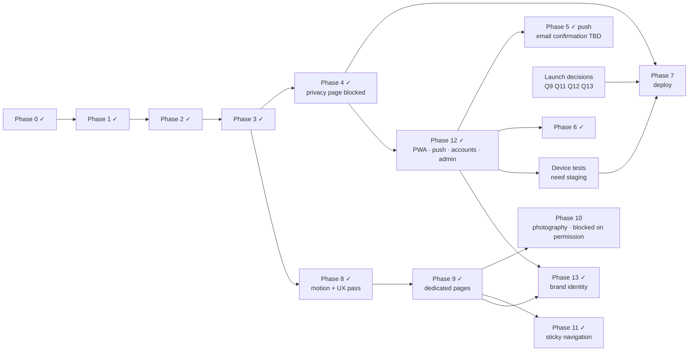

# 06 — Implementation Plan

**Last updated:** 2026-09-28
**Overall status:** Phases 0–6, 8, 9, 11, **12 (installable app, notifications, applicant accounts, admin platform)** and **13 (brand identity)** are **done**; 7 (launch) is in progress; 10 (photography) waits for permission. 265 automated tests pass, plus browser checks in real Chrome (service worker, offline, updates, a real push through Firebase Cloud Messaging) and a production-mode Docker run on real PostgreSQL. **Next:** choose an email provider and generate VAPID keys, deploy to the VPS with a staging origin, test on real iPhones and Android phones, and settle the launch content (privacy notice, retention, domain, contact email; see "Content needed").

Status labels: **Done** · **In progress** · **Not started** · **Blocked** (waiting on a decision) · **TBD** (scope not confirmed)

Related: [01-PRD](01-PRD.md) · [02-TRD](02-TRD.md) · [03-App-Flow](03-App-Flow.md) · [04-UI-UX-Design-Brief](04-UI-UX-Design-Brief.md) · [05-Backend-Schema](05-Backend-Schema.md) · [DEPLOYMENT](DEPLOYMENT.md)

---

## Snapshot

| Area | Status |
|---|---|
| Marketing site | ✅ Homepage (hero, What to expect, previews) plus dedicated `/about`, `/programme`, `/journey` and `/faq` pages with shared header, menu and footer; sticky navigation; responsive 320–1920 px, active-page navigation, accessible menu, optimised images, motion system |
| Application form (consent → 3 steps → review → success) | ✅ Validation, saved progress, route guards, clear errors, compact mobile progress, copyable reference |
| API + database | ✅ Fastify + PostgreSQL, migrations, rate limits, honeypot, duplicate protection |
| Programme team access | ✅ Admin platform at `/admin`: staff accounts with two-step verification and five roles; applicants (search, review, notes, assignment, explicit publication, corrections, deletion, audited CSV); accounts; cohorts; notification campaigns; announcements; staff; settings; audit history; dashboard |
| Applicants after applying | ✅ Optional account (email link): published status, messages, notification settings, devices, sessions, delete · ⏳ needs an email provider to switch on |
| Installable app + offline | ✅ Manifest, icons, service worker (offline public pages, private pages never cached), update prompt, install guidance per device · ⏳ real-device checks |
| Notifications | ✅ Web Push by topic with consent history, campaigns via a Postgres job queue and worker, neutral application-update alerts, in-app inbox · ⏳ needs VAPID keys; real-device checks |
| Deployment | ✅ Dockerfile, Compose (Caddy HTTPS, app, **worker**, Postgres), backups, bare-metal alternative, CI, verified locally with Docker · ⏳ not yet deployed to the VPS |
| Launch content | ⏳ Privacy notice, domain, contact email, cohort dates (see [01-PRD §8](01-PRD.md#8-open-questions)) |
| Brand | ✅ Official lockup in every header, menu, footer and the admin area; brand palette; favicons, app icons and social card from the brand mark ([04 §2](04-UI-UX-Design-Brief.md#brand-identity)) |
| Photography | ⏳ Prototype stock/AI photos still in place; authentic NYAYA (RISE) photos shortlisted, **awaiting permission** ([IMAGERY.md](IMAGERY.md)); hero images fixed |

## Phases

### Phase 0: Prototype import (**Done**)

| # | Task | Status |
|---|---|---|
| 0.1 | Unzip the Figma Make export | Done (2026-09-26) |
| 0.2 | Create the six core docs | Done (2026-09-26) |

### Phase 1: Project foundation (**Done**)

| # | Task | Status |
|---|---|---|
| 1.1 | Git repository | Done: private repository `E310-Tech-Team/nyaya-sop` (GitHub Actions CI in `.github/workflows/ci.yml`) |
| 1.2 | Move the 15 MB reference render out of `src/` | Done: `design/` (compressed copy committed, original ignored) |
| 1.3 | Hosting decision | Done: VPS (D-2) |
| 1.4 | Real metadata: title, description, OG image, favicons | Done |
| 1.5 | Self-host fonts; replace Figma font classes with tokens | Done (127 classes → `font-sans/display/serif`) |
| 1.6 | Design tokens in `@theme` | Done |
| 1.7 | Typecheck script + CI | Done (`pnpm check`, GitHub Actions). ESLint not added (strict TypeScript + tests instead) |
| 1.8 | Remove unused assets | Done (6 unused images dropped; `public/assets/` and `.figma/` removed) |

### Phase 2: Frontend architecture (**Done**)

| # | Task | Status |
|---|---|---|
| 2.1 | Router with a URL per screen | Done: React Router 8 |
| 2.2 | Shared components | Done: `SiteHeader`, `FormLayout`, `Fields`, `Buttons`, … |
| 2.3 | Single form store + saved draft | Done: context + reducer + `sessionStorage` |
| 2.4 | Base-path-aware assets | Done: images imported via Vite (hashed) |
| 2.5 | Remove interpolated Tailwind class names | Done |

### Phase 3: Form correctness, content & accessibility (**Done**)

| # | Task | Status |
|---|---|---|
| 3.1 | Shared validation (client + server) | Done: `src/shared/validation.ts` |
| 3.2 | Back on Step 1 | Done |
| 3.3 | Review screen | Done |
| 3.4 | Design/copy inconsistencies D1–D10 | Done except D2 (org-name variants kept; confirm) |
| 3.5 | Accessibility A1–A14 | Done: 0 axe violations on all screens |
| 3.6 | Full state list | Done (confirm "Outside Nigeria") |
| 3.7 | 16 px inputs on mobile | Done |

### Phase 4: Backend & submission (**Done**)

| # | Task | Status |
|---|---|---|
| 4.1 | Database schema + seed (first cohort, consent v1) | Done: `server/migrations/` |
| 4.2 | `POST /api/applications`: validation, normalisation, rate limit, honeypot, 409 duplicates | Done (CAPTCHA not added) |
| 4.3 | Frontend submit with every error state | Done |
| 4.4 | Accurate success copy + reference number | Done |
| 4.5 | Privacy notice page | **Blocked**: needs wording from the Programme team (Q9) |
| 4.6 | `GET /api/cohorts/current` + closed state | Done |
| 4.7 | CSV export for the Programme team | Done; since Phase 12 the audited admin export (`/api/admin/applicants/export.csv`, export permission); the old Basic-auth address only redirects signed-in exporters |

### Phase 5: Notifications (**Done** for push; email confirmation **TBD**)

| # | Task | Status |
|---|---|---|
| 5.1 | Applicant confirmation email (provider, sender domain with SPF/DKIM, template) | TBD (PRD F10). The email transport now exists (sign-in links, invitations); a confirmation template can use it |
| 5.2 | Web Push: topics, consent, campaigns, application-update alerts, inbox | Done (Phase 12) |

### Phase 6: Reviewer tools (**Done**, Phase 12)

| # | Task | Status |
|---|---|---|
| 6.1 | Reviewer login, list/filter, status updates, notes | Done: the admin platform |
| 6.2 | Cohort open/close UI | Done: Admin → Cohorts |

### Phase 7: Hardening & launch (**In progress**)

| # | Task | Status |
|---|---|---|
| 7.1 | Responsive fix 768–1280 px | Done: verified 320–1920 px |
| 7.2 | Image optimisation | Done: 11.6 MB → 1.3 MB WebP, lazy loading |
| 7.3 | Reduced motion | Done |
| 7.4 | Working nav / "See how it works" | Done |
| 7.5 | Analytics | Done: proportionate, anonymous first-party events only ([05 §8](05-Backend-Schema.md#8-analytics-retention-and-deletion)); UTM attribution captured with applications |
| 7.6 | Tests | Done: 264 Vitest tests in 14 files (unit, API/DB, auth, admin, push, jobs, service-worker policy, time zones, platform detection) + scripted Chrome checks · *Planned:* committed Playwright E2E, Lighthouse CI |
| 7.7 | SEO | Done: indexable, OG image, favicons (set `SITE_URL`) |
| 7.8 | Deployment artifacts | Done: Dockerfile, Compose + Caddy, backups, systemd/Nginx alternative, runbook |
| 7.9 | Verify the Docker image and stack | Done (2026-09-26): built and run locally against real PostgreSQL 17 through Caddy HTTPS; submissions, CSV export, backup/restore and graceful shutdown verified; re-verified the same day with the worker service, migrations 0003–0005 over existing data, owner bootstrap in the container and staff sign-in with two-step verification |
| 7.10 | Deploy to the VPS | **Ready**: one-command installer `deploy/install.sh` (2026-09-28; Hostinger VPS planned). Waiting on the VPS and domain (Q13) |
| 7.11 | Real-device QA (low-end Android, iOS Safari, VoiceOver/TalkBack), including install and push on iPhone/iPad 16.4+ and Android | Not started: needs the staging origin ([DEPLOYMENT](DEPLOYMENT.md#staging-and-device-testing)) |

### Phase 8: Motion & UX refinement (**Done**, 2026-09-26)

| # | Task | Status |
|---|---|---|
| 8.1 | Motion system: tokens, hero entrance, scroll reveals, drawer, button feedback, form-state transitions, Success choreography, reduced motion (CSS + JS) | Done: [04 §6](04-UI-UX-Design-Brief.md#6-motion), `src/lib/motion.ts` |
| 8.2 | Hero: at-a-glance summary + "Start my application" / "Explore the programme" | Done (primary is the light pill; stacked on phones) |
| 8.3 | "What to expect" section between the hero and the editorial sections | Done (single responsive tree, `.landing-scale`) |
| 8.4 | Participant journey hierarchy (number + name, duration/format, what happens, next) | Done: mobile timeline; desktop cascade kept (positions, sizes, route lines) |
| 8.5 | FAQ before the final CTA | Done: 7 native `
` items, verified copy only |
| 8.6 | Welcome: three groups, time estimate by the button, no delayed entrance | Done |
| 8.7 | Compact mobile form chrome + honest Review state | Done: 60 px header + one-row progress; first question ≈ 240 px higher on a 390 px phone |
| 8.8 | Saved-progress message (matches `sessionStorage`) | Done |
| 8.9 | Success: "not an offer" wording, Copy reference with announced result + manual fallback, no confirmation-email claim | Done |
| 8.10 | Programme copy in one place | Done: `src/config/programme.ts` |
| 8.12 | Motion upgrade: section choreography (groups on authored timelines), photography depth, Blueprint deck deal, directional Journey route lines, animated FAQ disclosure, transition-based menu that reverses mid-close, refined buttons/nav underline; reduced motion live; verified pixel-identical settled UI | Done (2026-09-26): [04 §6](04-UI-UX-Design-Brief.md#6-motion) |
| 8.13 | Hero simplified: eyebrow, "Discover your purpose. / Prepare to lead.", one sentence, one eligibility line, two CTAs; edition panel and checklist removed; "The Called Generation" kept as a caption; photograph higher on phones | Done (2026-09-26) |
| 8.11 | Fixes found while verifying | Done: 320 px horizontal scroll (Vision eyebrow); menu slide-in cancelled by focus scrolling its container; hero entrance replaying after keyboard focus left it; Success page scrollable sideways by focus/selection; header lockup clipped at 320 px; desktop Vision headline descenders clipped; stale Figma utilities in the CSS bundle (docs now excluded from Tailwind scanning) |

### Phase 9: Dedicated marketing pages (**Done**, 2026-09-26)

| # | Task | Status |
|---|---|---|
| 9.1 | Routes `/about`, `/programme`, `/journey`, `/faq` under one layout route (`MarketingLayout`): header stays mounted, each page and the footer re-arm scroll reveals; titles "About · School of Purpose" etc. | Done |
| 9.2 | Shared marketing chrome (`src/components/marketing/`): header, desktop nav (light on the homepage hero, dark on the other pages), phone/tablet menu, footer, page intro, apply band, CTA pills, "read more" link, eyebrow | Done |
| 9.3 | About: calling, Vision & Mission, **Who the programme serves**, Biblical Blueprint. Programme: Purpose Boot Camp, Doctrine of Purpose, **How the programme runs** (virtual training, merit selection, boot camp for selected participants with sponsorship, mentorship and community). Journey: applying set apart from being selected, six stages in order. FAQ: seven approved questions in three topic groups with links onwards | Done: verified copy only (`src/config/programme.ts`) |
| 9.4 | Homepage shortened: hero and What to expect kept; the long editorial sections replaced by four previews (ids `about`, `programme`, `journey`, `faq` kept, so old `/#…` links still land on the right topic); closing invitation kept; hero **Explore the programme** → `/programme` | Done |
| 9.5 | Active page: `NavLink` + `aria-current="page"` in the header nav, menu and footer; bold weight and a resting underline | Done |
| 9.6 | Fix found while verifying: the homepage hero's photograph and ring covered the desktop nav, so mouse clicks on Home/About/Programme/Journey/FAQ did nothing (present since the Figma export; keyboard worked) | Done: `pointer-events: none` on both layers; every link, button and FAQ question is now hit-tested at every width |
| 9.7 | Verification | Done: 5 pages × 7 widths automated (overflow, clipping, one `<h1>`, heading levels, active nav, links, images, duplicate ids, hit-testing); navigation incl. Back/Forward/refresh; menu; hash links; keyboard FAQ; skip link; reduced motion; axe 0 violations; all 49 application screen captures pixel-identical to before; contact links checked with and without `VITE_CONTACT_EMAIL` |

### Phase 10: Authentic photography (**Blocked** on permission)

| # | Task | Status |
|---|---|---|
| 10.1 | Audit the supporting photographs (hero, Blueprint paintings and artwork out of scope) | Done (2026-09-26): all are prototype stock/AI images; `journey-04` (invented Redemption City banner) and `journey-06` (invented summit banner) are the priority ([IMAGERY §2](IMAGERY.md#2-current-supporting-photographs)) |
| 10.2 | Find and verify official RCCG NYAYA photo sources | Done: websites, Instagram and Facebook checked; RISE (NYAYA's skills initiative) is the only source with suitable real photos ([IMAGERY §3](IMAGERY.md#3-sources-checked-2026-09-26)) |
| 10.3 | Shortlist candidates per section | Done: 7 candidates, all watermarked "RISE 30", none with published reuse terms ([IMAGERY §4](IMAGERY.md#4-candidates-awaiting-permission)) |
| 10.4 | Written permission and unwatermarked originals from NYAYA / RISE | **Blocked**: Programme team (C13) |
| 10.5 | Replace, crop per breakpoint, alt text, source record, verify | Not started ([IMAGERY §6](IMAGERY.md#6-adopting-an-approved-photo)) |

### Phase 11: Sticky navigation (**Done**, 2026-09-26)

| # | Task | Status |
|---|---|---|
| 11.1 | Marketing header sticky on every marketing page and width (`StickyHeader`, `position: sticky`); application pages unchanged | Done |
| 11.2 | Homepage desktop header moved out of the zoomed hero (it would have been trapped by the hero's clipping and height) into a sticky header laid out on the same 1440 px frame: identical at the top, 16 px sticky offset so the scrolled bar is 96 px | Done |
| 11.3 | Scrolled look from a 1 px IntersectionObserver sentinel: opaque burgundy, hairline + soft shadow, homepage nav switches to the dark tone (180 ms cross-fade, Apply pill keeps its size, arrows cross-faded); reduced motion instant | Done |
| 11.4 | Scroll offsets: `scroll-margin-top` on anchor targets and focusable content (header height + 16 px). `scroll-padding-top` was tried and rejected: focusing inside the sticky header made the page jump ≈ 450 px | Done |
| 11.5 | Menu: returns focus without scrolling; panel scrolls on short/landscape screens (its 615 px of content was cut off below ≈ 620 px tall); closes itself above 1280 px so a resize can't leave a hidden drawer holding the scroll lock | Done |
| 11.6 | Verification | Done: top of every page pixel-identical to before at 320–1024 px (desktop: sub-pixel antialiasing only, geometry identical); 67 sticky checks at 7 widths (both scroll directions, no layout jump, scaling at 1280 px, anchors and deep links, route changes, keyboard focus never under the header, menu at the top and mid-page, 375–480 px tall screens, resize with the menu open, skip link, reduced motion); earlier interaction suite and 35-combination sweep re-run; application screens 49/49 identical; axe 0 violations |

### Phase 12: Installable app, notifications, accounts and admin platform (**Done**, 2026-09-26)

Built in the brief's six working phases; each has its tests.

| # | Phase | What landed | Status |
|---|---|---|---|
| 12.1 | Architecture, schema, authentication | Migrations 0003–0005; staff accounts (scrypt + TOTP + recovery codes, lockout, invitations, reset), five roles checked on every route, applicant email-link sign-in, sessions + CSRF, audit trail, settings, analytics allowlist; `admin.js create-owner` bootstrap | Done · tests: `auth`, `admin` |
| 12.2 | PWA foundation, install guidance, offline | Manifest + icons, service worker built by `scripts/vite-pwa.ts`, caching policy (tested), offline page, update prompt, stale-asset handling, kill switch, `/install` with per-browser steps, in-app browser advice, install entries in footer and menu | Done · tests: `routing`, `install`; Chrome checks |
| 12.3 | Accounts, notification onboarding, preferences | `/account` area (overview, application with claiming, messages & notifications, settings), notification card on Success, `/notifications` settings with every state, topics, devices, inbox, `/updates` | Done · browser walk-through |
| 12.4 | Web Push, jobs, scheduling, delivery | SSRF-safe transport, VAPID with token reuse, encrypted payloads, subscription ownership and rotation, Postgres queue with leases and retries, worker (inline or separate), campaigns with frozen content and time zones, delivery re-checks, 404/410 deactivation, retry/expiry, reconciliation on app open | Done · tests: `push`, `jobs`, `time`; real FCM push in Chrome |
| 12.5 | Admin dashboard, applicant management, campaigns | Dashboard with truthful labels; applicants (search/filter/sort/pages, detail, notes, assignment, transitions, explicit publication, corrections, deletion, audited CSV); accounts; cohorts; campaign editor (preview, live counts, tests, schedule, confirmation, cancel); announcements; staff; settings with integration health; audit history; own security | Done · tests: `admin`; browser walk-through |
| 12.6 | Security, privacy, docs, final verification | Log privacy checks, account-deletion fix (FK + CHECK), dispatch race fixes, SQL parameter typing fix, docs 02–06 + DEPLOYMENT + AGENTS, Compose worker service, production-mode Docker run | Done |

**Verified vs not verified:** everything above is verified by automated tests and in desktop Chrome/Chromium. **Not yet verified:** real phones and tablets (iOS/iPadOS Home Screen install and push, Android Chrome and Samsung Internet), Safari on macOS, Firefox, Edge on Windows, screen readers, and axe-core on the new screens. **Not configured yet:** an SMTP provider (so applicant sign-in is off in production) and VAPID keys (so push is off) until they are set on the server.

### Phase 13: Brand identity (**Done**, 2026-09-28)

From the brand guideline ("School of Purpose 4.pdf": lockups, rationale, palette) and the 4× logo exports supplied with it.

| # | Task | Status |
|---|---|---|
| 13.1 | Brand masters | Done: moved out of `public/` (they would have shipped, 4 MB, spaces in the URLs) to [`design/brand/`](../design/brand/README.md) with clear names; two byte-identical copies dropped; README with the palette, rationale and usage rules |
| 13.2 | Official lockup instead of the "SOP" text monogram | Done: `BrandLockup` in the homepage and marketing headers, phone menu, footer, application header (cream on burgundy, colour on paper), admin sidebar and staff sign-in; offline page shows the mark |
| 13.3 | Favicons, app icons, notification badge | Done: `scripts/brand-assets.py` resizes the mark (favicon `.ico` + 32 px PNG, `any` and maskable 192/512, iOS 180 px, Android badge); `favicon.svg` and `scripts/generate-icons.mjs` retired |
| 13.4 | Brand palette | Done: `#841D26` / `#F3F0E6` / `#B69B63` replace the prototype's colours in the tokens, the Figma-export arbitrary values and `rgba()` tints, manifest, theme colour, offline page and emails. Hero photo and artwork files unchanged. Contrast recomputed ([04 §2](04-UI-UX-Design-Brief.md#brand-palette-adopted-2026-09-28)) |
| 13.5 | Social card | Done: new `og-image.jpg` captured from the production hero with the lockup; the old Figma crop still showed the prototype headline |
| 13.6 | Fix found while verifying | Done: the first service-worker install claimed the page and every first-time visitor was offered "A newer version of the site is available". The first claim is now silent; the real update flow was re-checked end to end |
| 13.7 | Verification | Done: `pnpm check` (265 tests); production build in headless Chrome, 30/30 (icons served and decoded at their sizes, installable, lockups precached, offline page, first visit silent, two-tab update flow); text-contrast scan of 13 pages at 390 and 1440 px (no failures); UI walk-through at 375, 1280 and 1440 px. **Not yet:** the new icons on real devices (Android maskable shape and status-bar badge, iOS Home Screen) |

## Content needed from the Programme team

The UX pass only uses facts already in the site copy. These need an owner's answer before they can be added:

| # | Question | Where it would appear |
|---|---|---|
| C1 | **Privacy notice** wording (Q9): what's collected, who sees it, retention (Q11), deletion requests | Link beside the consent checkbox; FAQ |
| C2 | **Public contact email** (Q12) | Set `VITE_CONTACT_EMAIL`: contact lines appear on the landing footer/FAQ, Welcome, Review errors and Success |
| C3 | **Response time** after applying | Success page, FAQ ("What happens after submitting") |
| C4 | Is admission to the **virtual training** selective? (The success copy says "If selected, your email will include virtual training details"; the journey says "Open to all RCCG young adults and youth aged 18–30".) The pages therefore say only that the Programme team reviews every application | What to expect, Journey ("Applying"), Programme, FAQ |
| C5 | Virtual training **schedule and platform**; attendance expectations | FAQ "How does virtual training work?" |
| C6 | Boot camp **dates**, full **location** details and anything sponsorship doesn't cover | FAQ "Where…" and "What does sponsorship cover?" |
| C7 | **Confirmation email** (F10): when it exists, remove "No confirmation email is sent" from Success and the FAQ | Success page, FAQ |
| C8 | What the **100-point merit system** assesses (criteria, weighting) and how results are communicated | Programme ("Merit-based selection"), Journey stage 03, FAQ |
| C9 | The **eight pillar communities**: their names and what each covers | Programme ("Mentorship and community"), Journey stage 06 |
| C10 | **Mentorship format**: how often groups meet, online or in person, group size | Programme, Journey stage 05 |
| C11 | **About the organisation**: anything beyond the vision and mission (history, leadership, how the School of Purpose relates to other RCCG YAYA programmes), and descriptions of the three spheres | About page |
| C12 | **Cohort facts**: number of places at the boot camp, application deadline and programme start date | Homepage, Programme, Journey, FAQ |
| C14 | **Email provider** and sender address (with SPF/DKIM on the domain) for sign-in links and staff invitations | `SMTP_URL`, `EMAIL_FROM` |
| C15 | **Contact for push services**: a monitored mailbox for `VAPID_SUBJECT` | Server configuration |
| C16 | **Staff list**: who gets which role (owner, programme admin, reviewer, communications, read-only) | Admin → Staff |
| C17 | **Retention periods** for applications, notes, audit history and consent records, and who handles deletion requests | Retention job, privacy notice ([05 §8](05-Backend-Schema.md#8-analytics-retention-and-deletion)) |
| C18 | Whether **Training reminders** will be used, and the wording of published statuses and messages | Notification topics, publication messages |
| C13 | **Photography permission**: written approval from NYAYA (or RISE) to use its event photos, the credit line required, and the original unwatermarked files; ideally also photos from a Redemption City youth event for the boot-camp slot | About, Programme, Journey (see [IMAGERY.md](IMAGERY.md)) |

## Next steps (in order)

1. **Content decisions:** privacy notice wording (Q9), retention periods (Q11, C17), contact email (Q12), email provider (C14), staff roles (C16), confirm "SOP"/org naming (Q8) and the state list (Q4), plus C3–C6.
2. **Deploy a staging origin** (e.g. `staging.<domain>` with its own database and VAPID keys) and run the device tests in [DEPLOYMENT](DEPLOYMENT.md#staging-and-device-testing): iPhone/iPad (Home Screen install + push), Android (Chrome, Samsung Internet), Safari on Mac, Firefox, Edge.
3. **Deploy production:** create the VPS, point DNS, then run `deploy/install.sh` ([DEPLOYMENT: Quick install](DEPLOYMENT.md#quick-install-one-command): it generates `APP_SECRET` and the VAPID keys on the server and creates the first owner) or follow [DEPLOYMENT §A](DEPLOYMENT.md#a-docker-compose-recommended); add `SMTP_URL`/`EMAIL_FROM`, back up `.env`, run the production checklist.
4. **Before announcing:** submit and delete a test application, set up nightly backups + off-site copies, add an uptime monitor, invite staff.
5. **Later:** confirmation email (5.1), committed Playwright E2E, Lighthouse CI, axe-core on the new screens, CAPTCHA if spam appears, identity-provider sign-in for staff if wanted.

## Dependency graph

## Decisions log

| ID | Date | Decision | Status |
|---|---|---|---|
| D-0 | 2026-09-26 | Use the Figma Make export as the codebase starting point | Decided |
| D-1 | 2026-09-26 | **Backend: self-hosted PostgreSQL on the VPS** (replaces the Supabase proposal), with a local database for development | Decided (user) |
| D-2 | 2026-09-26 | **Hosting: single VPS** (Linode or similar). Docker Compose with Caddy recommended; bare-metal systemd/Nginx documented | Decided (user: VPS); Compose recommended |
| D-3 | 2026-09-26 | Router: React Router 8 (declarative mode) | Decided |
| D-4 | 2026-09-26 | Plain git, no LFS (images are now small WebP files) | Decided |
| D-5 | 2026-09-26 | API: Fastify 5 serving both the site and `/api` from one process (same origin, no CORS) | Decided |
| D-6 | 2026-09-26 | Dev/test database: PGlite (in-process Postgres 17), so no local install is needed | Decided |
| D-7 | 2026-09-26 | Programme team access via password-protected CSV export first; dashboard later | Superseded by D-16/Phase 12 (individual staff accounts, roles, audited export) |
| D-8 | 2026-09-26 | Landing page 1280–1440 px: scale the fixed 1440 px design with CSS `zoom` rather than rebuilding it fluid | Decided (a fluid rebuild would remove the separate mobile/desktop trees; see 02 §9) |
| D-9 | 2026-09-26 | Motion with CSS keyframes/transitions + one IntersectionObserver hook; no animation library; content visible unless the hook arms the page | Decided |
| D-10 | 2026-09-26 | New landing sections (What to expect, FAQ) are single responsive trees scaled with `.landing-scale`, not new mobile/desktop duplicates | Decided |
| D-11 | 2026-09-26 | Programme facts shown in several places live in `src/config/programme.ts`; only verified site copy, no invented dates/criteria/response times | Decided |
| D-12 | 2026-09-26 | Motion may never change the settled UI: every entrance ends on the element's own style; checked with pixel comparisons of settled headless captures before/after | Decided |
| D-13 | 2026-09-26 | Hero hierarchy: eyebrow → two-line headline → one sentence → eligibility → two CTAs; practical details live in What to expect and the welcome screen | Decided (user) |
| D-14 | 2026-09-26 | Dedicated pages for About, Programme, Journey and FAQ (user brief); the homepage keeps short previews that link to them and keep the old section ids | Decided (user) |
| D-15 | 2026-09-26 | The existing editorial sections move unchanged onto the dedicated pages (keeping their desktop compositions); everything new is a fluid single tree scaled with `.landing-scale`, never a new fixed composition | Decided |

| D-16 | 2026-09-26 | Staff and applicant authentication built on maintained primitives (scrypt, otpauth, @fastify/cookie, Postgres sessions) rather than an auth framework: two populations, PGlite in dev/tests, schema in our migrations. SSO for staff can be added later | Decided |
| D-17 | 2026-09-26 | Web Push through our own SSRF-safe transport (allowlisted push services, public addresses only, no redirects); `web-push` only for VAPID and encryption | Decided |
| D-18 | 2026-09-26 | Background jobs in a PostgreSQL queue (SKIP LOCKED, leases, retries), no Redis; separate worker container in Compose, inline worker on bare metal | Decided |
| D-19 | 2026-09-26 | Hand-written service worker (no Workbox): public pages network-first with the cached shell offline; `/api`, account and admin pages never cached; updates wait for the person | Decided |
| D-20 | 2026-09-26 | Default `viewport-fit` (browser keeps content in the safe areas) instead of `cover`, so the existing design needs no per-section insets | Decided |
| D-21 | 2026-09-26 | Internal review status and the applicant-facing published status are separate; publishing is an explicit, previewed step; lock-screen text never reveals a decision | Decided (brief) |
| D-22 | 2026-09-26 | Analytics: an allowlist of anonymous events with coarse properties only; "observed installs" and "standalone launches" reported separately | Decided (brief) |
| D-23 | 2026-09-28 | The brand guideline's palette replaces the prototype's colours site-wide (tokens and arbitrary values). The hero photo and artwork files stay untouched | Decided (brand guideline) |
| D-24 | 2026-09-28 | Logos are the supplied raster artwork resized by `scripts/brand-assets.py` (Python + Pillow, outputs committed), never redrawn or traced; emails keep a text header, with no remote logo that would reveal when a sign-in email is opened | Decided |

## Doc maintenance

When a task lands, update its status here. If it changes the stack, flow, UI conventions or data model, also update [02](02-TRD.md), [03](03-App-Flow.md), [04](04-UI-UX-Design-Brief.md) or [05](05-Backend-Schema.md) in the same change.
